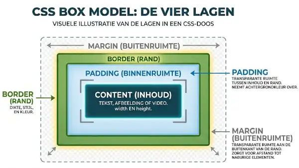

# Box Model & Randen

Elk HTML-element op een webpagina wordt door de browser behandeld als een rechthoekige doos of kader. Deze manier van kijken naar en berekenen van elementen noemen we het **<dfn title="Het kernconcept in CSS waarbij elk element wordt voorgesteld als een rechthoekige doos bestaande uit content, padding, border en margin">CSS Box Model</dfn>**. Begrijpen hoe dit model werkt is essentieel om marges, tussenruimte, randen en afmetingen op een webpagina nauwkeurig te beheren. Raadpleeg voor meer voorbeelden de [MDN documentatie over het Box Model](https://developer.mozilla.org/en-US/docs/Learn/CSS/Building_blocks/The_box_model).

## Leerdoelen

Na dit hoofdstuk kan je:

- De vier lagen van het CSS box model benoemen en uitleggen (`content`, `padding`, `border` en `margin`)
- De breedte en hoogte van een element instellen met `width` en `height`
- Het verschil uitleggen tussen een vaste breedte (`width`) en een flexibele maximale breedte (`max-width`)
- Elementen een minimale hoogte geven met `min-height` om tekstoverloop te voorkomen
- Binnenruimte instellen met `padding` en buitenruimte met `margin`
- De verkorte notatie (shorthand) voor 1, 2, 3 en 4 waarden correct toepassen
- Elementen horizontaal centreren met behulp van `margin: auto`
- Het fenomeen `margin collapse` (samenvallende marges) herkennen en verklaren
- Randen instellen met de `border` eigenschappen en hoeken afronden met `border-radius`
- Schaduwen toevoegen aan boxen met de `box-shadow` eigenschap
- Het verschil uitleggen tussen `box-sizing: content-box` en `box-sizing: border-box`
- De universele box-sizing reset toepassen in een stylesheet
- Omgaan met overlopende inhoud met behulp van de `overflow` eigenschap
- Het verschil uitleggen tussen `border` en `outline`

## De vier lagen van het Box Model

Elke doos in CSS bestaat van binnen naar buiten uit vier lagen:

1. **<dfn title="Het binnenste tekst-, afbeeldings- of videogedeelte van een element in het box model">Content (inhoud)</dfn>**: Het eigenlijke tekstblok, de afbeelding of video. De afmetingen worden bepaald door de inhoud zelf of door de eigenschappen `width` en `height`.
2. **<dfn title="De transparante binnenruimte tussen de inhoud en de rand van een element">Padding (binnenruimte)</dfn>**: De transparante ruimte tussen de inhoud en de rand. Padding neemt altijd de achtergrondkleur van het element over.
3. **<dfn title="De zichtbare omkadering rondom de padding en inhoud van een element">Border (rand)</dfn>**: De omranding die rond de padding en de inhoud ligt. Je kan hiervan de dikte, de stijl en de kleur bepalen.
4. **<dfn title="De transparante buitenruimte aan de buitenkant van de rand die afstand creëert tot omliggende elementen">Margin (buitenruimte)</dfn>**: De transparante ruimte aan de buitenkant van de rand. Marges zorgen voor afstand ten opzichte van naburige elementen.



::: tip Inspecteren in de browser
Open de browser DevTools (met F12 of rechtermuisklik -> **Inspecteren**). Onder het tabblad **Styles** of **Computed** vind je onderaan altijd een interactieve visualisatie van het box model van het geselecteerde element.
:::


De binnenste laag van het box model is de inhoud (content). Met CSS kan je de breedte en hoogte van deze doos nauwkeurig sturen.

### Breedte instellen: `width`, `max-width` en `min-width`

Standaard nemen blok-elementen (zoals `<div>`, `<p>` of `<h1>`) automatisch 100% van de beschikbare breedte van hun ouder in beslag.

- **`width`**: Legt een vaste breedte op. Een element met `width: 30rem` (480px) blijft altijd exact zo breed. Wordt het beeldscherm of het browservenster smaller dan 480px (bijvoorbeeld op een smartphone), dan past het element niet meer op het scherm en ontstaat er een vervelende horizontale schuifbalk.
- **`max-width`**: Bepaalt de **maximale** breedte. Het element wordt nooit breder dan de opgegeven waarde, maar als het scherm smaller wordt, krimpt het element netjes mee. Dit maakt `max-width` onmisbaar voor responsieve webpagina's.
- **`min-width`**: Bepaalt de **minimale** breedte. Het element kan nooit smaller worden dan deze waarde, zelfs niet als de inhoud of het venster kleiner wordt.

```css
/* Responsieve kaart: maximaal 36rem breed, maar krimpt mee op mobiel */
.kaart {
  width: 100%;
  max-width: 36rem;
}
```

### Hoogte instellen: `height`, `min-height` en `max-height`

Voor de hoogte hanteren browsers standaard `height: auto`. Dit betekent dat het element exact zo hoog wordt als nodig is om alle tekst en afbeeldingen daarin te omvatten.

- **`height`**: Dwingt een harde, vaste hoogte af (bijvoorbeeld `height: 10rem`). Let hier erg mee op: als er later meer tekst bijkomt, of als een bezoeker de lettergrootte vergroot in zijn browser, past de inhoud niet meer in de doos en ontstaat er een overloop (overflow).
- **`min-height`**: Garandeert een **minimale hoogte** (bijvoorbeeld `min-height: 12rem`). Heeft het element weinig inhoud, dan behoudt het toch een aangename hoogte. Komt er meer tekst bij, dan groeit het element vanzelf mee zonder dat er inhoud uitbreekt.
- **`max-height`**: Beperkt de maximale hoogte van een element. Erg nuttig in combinatie met `overflow-y: auto` om een scrollbaar venster te maken.

In het onderstaande interactieve voorbeeld zie je het cruciale verschil tussen een starre vaste breedte (`width`) in het eerste kader en een flexibele maximale breedte (`max-width`) in het tweede kader.  
(De overige box-eigenschappen in onderstaand voorbeeld komen later in dit hoofdstuk uitgebreid aan bod.)

<CodeSandbox
  title="Vaste breedte versus Maximale breedte"
  height="450px"
  highlightHtml=""
  highlightCss=""
  highlightJs=""
  activeCodeTab="css"
  css='/* Universele resetter */
* {
  box-sizing: border-box;
  margin: 0;
  padding: 0;
}
/* Basisinstellingen */
body {
  font-family: Verdana, Geneva, sans-serif;
  line-height: 1.5;
  padding: 1.5rem;
  background-color: #ffffff;
  background-image:
    linear-gradient(#e2e8f0 1px, transparent 1px),
    linear-gradient(90deg, #e2e8f0 1px, transparent 1px);
  background-size: 16px 16px;
  color: #222222;
}
/* Algemene opmaak voor beide kaders */
.kader {
  padding: 1rem;
  border: 2px solid #1e2d5a;
  background-color: #f8fafc;
  margin-bottom: 1.5rem;
}
/* Kader 1: Starre vaste breedte van 28rem (448px) */
.vaste-breedte {
  width: 28rem;
}
/* Kader 2: Flexibele maximale breedte van 28rem */
.flexibele-breedte {
  width: 100%;
  max-width: 28rem;
  background-color: #eff6ff;
  border-color: #2563eb;
}'
  html='<!DOCTYPE html>
<html lang="nl">
<head>
  <meta charset="UTF-8">
  <meta name="viewport" content="width=device-width, initial-scale=1.0">
  <title>Breedte en Max-width Demo</title>
  <link rel="stylesheet" href="stijl.css">
</head>
<body>
  <!-- Starre vaste breedte -->
  <div class="kader vaste-breedte">
    <h4>Star: width: 28rem</h4>
    <p>Dit kader blijft altijd exact 28rem (448px) breed. Maak het venster of de preview maar eens smaller: het kader breekt uit beeld.</p>
  </div>
  <!-- Flexibele maximale breedte -->
  <div class="kader flexibele-breedte">
    <h4>Flexibel: width: 100%; max-width: 28rem</h4>
    <p>Dit kader is nooit breder dan 28rem, maar krimpt vloeiend mee zodra het scherm smaller wordt. Ideaal voor smartphones en tablets.</p>
  </div>
</body>
</html>'
/>

## Binnenruimte: Padding

Met `padding` bepaal je hoeveel ademruimte er is tussen de inhoud van een element en zijn buitenrand. 

### Individuele zijden

Je kan elke zijde afzonderlijk instellen met specifieke eigenschappen:

```css
.kader {
  padding-top: 1.25rem;
  padding-right: 1rem;
  padding-bottom: 1.25rem;
  padding-left: 1rem;
}
```

### Korte notatie (Shorthand)

In de praktijk gebruik je vrijwel altijd de verkorte eigenschap `padding`. De waarden volgen de wijzers van de klok: **boven -> rechts -> onder -> links**.

| Aantal waarden | Voorbeeld | Betekenis |
|---|---|---|
| **1 waarde** | `padding: 1.5rem;` | Alle 4 zijden krijgen 1.5rem (24px) |
| **2 waarden** | `padding: 1rem 1.5rem;` | Boven en onder 1rem, links en rechts 1.5rem |
| **3 waarden** | `padding: 1rem 1.5rem 2rem;` | Boven 1rem, links en rechts 1.5rem, onder 2rem |
| **4 waarden** | `padding: 1rem 1.25rem 1.5rem 2rem;` | Boven 1rem, rechts 1.25rem, onder 1.5rem, links 2rem |

Hieronder zie je hoe padding direct zorgt voor leesbare en luchtige tekstblokken:

<CodeSandbox
  title="Padding instellen"
  height="420px"
  highlightHtml=""
  highlightCss=""
  highlightJs=""
  activeCodeTab="css"
  css='/* Universele resetter */
* {
  box-sizing: border-box;
  margin: 0;
  padding: 0;
}
/* Algemene paginastijl */
body {
  font-family: Verdana, Geneva, sans-serif;
  line-height: 1.5;
  padding: 1.5rem;
  background-color: #ffffff;
  color: #222222;
}
/* Stijl voor de voorbeeldboxen */
.box {
  background-color: #f8fafc;
  border: 2px solid #1e2d5a;
  margin-bottom: 1.5rem;
}
/* Zonder padding plakt de tekst tegen de rand */
.geen-padding {
  padding: 0;
}
/* Met padding ontstaat er ademruimte rondom */
.met-padding {
  padding: 1.25rem 1.5rem;
}'
  html='<!DOCTYPE html>
<html lang="nl">
<head>
  <meta charset="UTF-8">
  <meta name="viewport" content="width=device-width, initial-scale=1.0">
  <title>Padding Demo</title>
  <link rel="stylesheet" href="stijl.css">
</head>
<body>
  <!-- Element zonder padding -->
  <div class="box geen-padding">
    <p>Dit tekstblok heeft geen padding (padding: 0). De tekst raakt direct de donkerblauwe rand aan.</p>
  </div>
  <!-- Element met padding -->
  <div class="box met-padding">
    <p>Dit tekstblok heeft 1.25rem verticale en 1.5rem horizontale padding. Dit leest veel prettiger en oogt professioneel.</p>
  </div>
</body>
</html>'
/>

## Buitenruimte: Margin

Met `margin` bepaal je de witruimte aan de buitenkant van een element om afstand te houden van andere elementen op de pagina.

De eigenschappen en shorthand-volgorde werken identiek aan die van padding:

```css
.kader {
  margin-top: 1.25rem;
  margin-right: 1rem;
  margin-bottom: 1.25rem;
  margin-left: 1rem;
}
```

| Aantal waarden | Voorbeeld | Betekenis |
| --- | --- | --- |
| **1 waarde** | `margin: 1.5rem;` | Alle 4 zijden krijgen 1.5rem (24px) |
| **2 waarden** | `margin: 1rem 1.5rem;` | Boven en onder 1rem, links en rechts 1.5rem |
| **3 waarden** | `margin: 1rem 1.5rem 2rem;` | Boven 1rem, links en rechts 1.5rem, onder 2rem |
| **4 waarden** | `margin: 1rem 1.25rem 1.5rem 2rem;` | Boven 1rem, rechts 1.25rem, onder 1.5rem, links 2rem |

### Horizontaal centreren met `margin: auto`

Als een blok-element een vaste breedte heeft (`width` of `max-width`), kan je het horizontaal in het midden van de pagina of zijn oudercontainer plaatsen door de linker- en rechtermarge op `auto` te zetten:

```css
.container {
  width: 37.5rem; /* 600px */
  margin: 0 auto;
}
```

De browser verdeelt de resterende beschikbare horizontale ruimte gelijk over de linker- en rechtermarge.

<CodeSandbox
  title="Margin en Centreren"
  height="420px"
  highlightHtml=""
  highlightCss=""
  highlightJs=""
  activeCodeTab="css"
  css='/* Universele resetter */
* {
  box-sizing: border-box;
  margin: 0;
  padding: 0;
}
/* Algemene container */
body {
  font-family: Verdana, Geneva, sans-serif;
  background-color: #ffffff;
  padding: 1.5rem;
}
/* Gecentreerde box met een vaste breedte */
.gecentreerd {
  width: 20rem;
  margin: 2rem auto;
  padding: 1.25rem;
  background-color: #f5f5f7;
  border: 2px solid #EC6639;
  text-align: center;
  color: #1e2d5a;
}'
  html='<!DOCTYPE html>
<html lang="nl">
<head>
  <meta charset="UTF-8">
  <meta name="viewport" content="width=device-width, initial-scale=1.0">
  <title>Margin en Centreren</title>
  <link rel="stylesheet" href="stijl.css">
</head>
<body>
  <!-- Gecentreerde kaart -->
  <div class="gecentreerd">
    <h3>Thomas More Campus Geel</h3>
    <p>Dit kader heeft een breedte van 20rem (320px) en is gecentreerd met margin: 2rem auto.</p>
  </div>
</body>
</html>'
/>

### Samenvallende marges (Margin Collapse)

Bij verticale marges (boven en onder) van opeenvolgende blokelementen treedt een bijzonder verschijnsel op: **<dfn title="Het verschijnsel waarbij aangrenzende verticale marges niet bij elkaar worden opgeteld, maar samensmelten tot de grootste van de twee marges">margin collapse</dfn>** (samenvallende marges). Wanneer twee verticale marges elkaar raken in de normale stroom van het document, worden ze niet bij elkaar opgeteld, maar vallen ze samen in de grootste marge van de twee.

Stel:
- Blok 1 heeft `margin-bottom: 2rem;` (32px)
- Blok 2 er vlak onder heeft `margin-top: 1rem;` (16px)

In plaats van een totale afstand van 3rem (48px), is de resulterende tussenruimte **2rem** (32px): de grootste waarde krijgt voorrang.

In de onderstaande sandbox zie je dit effect gedemonstreerd op ruitjespapier. De ruitjesachtergrond maakt de marges en de onderlinge afstand tussen de kaders visueel direct telbaar:

<CodeSandbox
  title="Samenvallende marges (Margin Collapse)"
  height="460px"
  highlightHtml=""
  highlightCss=""
  highlightJs=""
  activeCodeTab="css"
  css='/* Ruitjesachtergrond op lijn 8 tot en met 11 om afstanden zichtbaar te maken */
/* De tekst binnen de blokken beschrijft de werking van de marges ;-) */
body {
  font-family: Verdana, Geneva, sans-serif;
  color: #222222;
  margin: 0;
  padding: 1.5rem;
  background-color: #ffffff;
  background-image:
    linear-gradient(#e2e8f0 1px, transparent 1px),
    linear-gradient(90deg, #e2e8f0 1px, transparent 1px);
  background-size: 16px 16px;
}
/* Titel */
h3 {
  margin: 0 0 1rem 0;
  color: #1e2d5a;
}
/* Algemene stijl voor de tekstblokken */
.box {
  padding: 1rem;
  border: 2px solid #333333;
  line-height: 1.4;
}
/* Eerste blok: oranje met een ondermarge van 2rem */
.box-1 {
  background-color: #ffd8cc;
  margin-bottom: 2rem;
}
/* Tweede blok: geel met een bovenmarge van 1rem en ondermarge van 2rem */
.box-2 {
  background-color: #fef9c3;
  margin-top: 1rem;
  margin-bottom: 2rem;
}
/* Derde blok: oranje met een bovenmarge van 1rem */
.box-3 {
  background-color: #ffd8cc;
  margin-top: 1rem;
}'
  html='<!DOCTYPE html>
<html lang="nl">
<head>
  <meta charset="UTF-8">
  <meta name="viewport" content="width=device-width, initial-scale=1.0">
  <title>Margin Collapse Demo</title>
  <link rel="stylesheet" href="stijl.css">
</head>
<body>
  <h3>Margin Collapse</h3>
  <!-- Blok 1 met margin-bottom: 2rem -->
  <div class="box box-1">
    <strong>Blok 1</strong> (margin-bottom: 2rem)<br>
    Dit blok duwt naar onder met een marge van 2rem (32px).
  </div>
  <!-- Blok 2 met margin-top: 1rem en margin-bottom: 2rem -->
  <div class="box box-2">
    <strong>Blok 2</strong> (margin-top: 1rem &amp; margin-bottom: 2rem)<br>
    De marge tussen Blok 1 en 2 telt niet op tot 3rem, maar valt samen naar 2rem.
  </div>
  <!-- Blok 3 met margin-top: 1rem -->
  <div class="box box-3">
    <strong>Blok 3</strong> (margin-top: 1rem)<br>
    Ook hier bedraagt de tussenruimte exact 2rem: de grootste marge wint altijd.
  </div>
</body>
</html>'
/>


## Randen: Border

De rand bevindt zich tussen de padding en de marge. Je kan de stijl, de dikte en de kleur van een rand volledig aanpassen.

### De drie basiseigenschappen

Om een rand zichtbaar te maken, zijn minstens een stijl en dikte nodig:

1. **`border-style`**: De stijl van de rand. Mogelijke waarden zijn:
   - `solid` (ononderbroken lijn)
   - `dashed` (stippellijn met streepjes)
   - `dotted` (stippellijn met ronde puntjes)
   - `double` (dubbele lijn)
   - `none` (geen rand)
2. **`border-width`**: De dikte van de rand, bijvoorbeeld in pixels (`1px`, `3px`) of trefwoorden (`thin`, `medium`, `thick`).
3. **`border-color`**: De kleur van de rand (HEX, RGB, HSL of een kleurnaam).

### Shorthand notatie

In plaats van drie regels code schrijf je dit bijna altijd beknopt in één eigenschap:

```css
/* Dikte, stijl en kleur in één notatie */
.kaart {
  border: 2px solid #EC6639;
}
```

De volgorde van de waarden maakt niet uit, maar gebruikelijk is **dikte -> stijl -> kleur**.

Je kan ook randen toekennen aan een specifieke zijde:
- `border-top: 4px solid #1e2d5a;`
- `border-bottom: 1px dashed #cccccc;`
- `border-left: 5px solid #EC6639;`
- `border-right: none;`

### Afgeronde hoeken: `border-radius`

Met de eigenschap `border-radius` maak je hoeken afgerond. Je stelt hiermee de straal (radius) van de afronding in.

- `border-radius: 8px;`: Maakt alle vier de hoeken licht afgerond.
- `border-radius: 50%;`: Maakt van een perfect vierkant element (gelijke breedte en hoogte) een volmaakte cirkel.
- Net zoals bij padding kan je 4 afzonderlijke waarden meegeven (linksboven, rechtsboven, rechtsonder, linksonder):
  ```css
  .badge {
    border-radius: 12px 0 12px 0;
  }
  ```

## Schaduwen: Box-shadow

Met de eigenschap `box-shadow` geef je diepte aan elementen door een schaduw toe te voegen rond het kader.

De eigenschap aanvaardt de volgende waarden in deze volgorde:

```css
.kaart {
  box-shadow: 4px 6px 12px 2px rgba(0, 0, 0, 0.15);
}
```

1. **Horizontale verschuiving (X-offset)**: positieve waarde schuift naar rechts, negatieve naar links.
2. **Verticale verschuiving (Y-offset)**: positieve waarde schuift naar onder, negatieve naar boven.
3. **Vervaging (Blur radius)** (optioneel): hoe hoger de waarde, hoe zachter en vager de schaduw uitwaaiert.
4. **Spreiding (Spread radius)** (optioneel): positieve waarde maakt de schaduw groter, negatieve kleiner.
5. **Kleur**: de kleur van de schaduw. Gebruik bij voorkeur een semi-transparante kleur zoals `rgba(0, 0, 0, 0.15)`.

::: tip Inwendige schaduw
Voeg je het trefwoord `inset` toe aan het begin of einde van de notatie, dan valt de schaduw aan de **binnenkant** van de rand in plaats van aan de buitenkant:
```css
.invoer {
  box-shadow: inset 0 2px 4px rgba(0, 0, 0, 0.1);
}
```
:::

## Voorbeeld randen en afrondingen

<CodeSandbox
  title="Randen en afronding"
  height="480px"
  highlightHtml=""
  highlightCss=""
  highlightJs=""
  activeCodeTab="css"
  css="/* Universele resetter */
* {
  box-sizing: border-box;
  margin: 0;
  padding: 0;
}
/* Ruitjesachtergrond om afmetingen en marges te visualiseren */
body {
  font-family: Verdana, Geneva, sans-serif;
  margin: 0;
  padding: 1rem;
  background-image:
    linear-gradient(#e2e8f0 1px, transparent 1px),
    linear-gradient(90deg, #e2e8f0 1px, transparent 1px);
  background-size: 16px 16px;
}
/* Infokaart met een opvallende linkerrand */
.info-kaart {
  background-color: #f1f5f9;
  border-left: 6px solid #10b981;
  padding: 1rem 2rem;
  margin-bottom: 2rem;
  line-height: 1.5;
}
/* Titel van de infokaart */
.info-kaart h4 {
  margin: 0 0 0.5rem 0;
  color: #1e2d5a;
}
/* Paragraaf in de kaart */
.info-kaart p {
  margin: 0;
  font-size: 0.9rem;
}
/* Ingelijste foto met afgeronde rand */
.fotokader {
  margin: 0;
}
/* De afbeelding zelf binnen het kader */
.fotokader img {
  border: 1px solid rgba(23, 22, 22, .5);
  background-color: #f3f5f7;
  border-radius: .5rem;
  box-shadow: 10px 10px 5px rgba(0, 0, 0, .5);
  padding: 1.5rem;
}
/* Het bijschrift onder de foto*/
.fotokader figcaption {
  font-size: 0.85rem;
  color: #475569;
  margin-top: 0.5rem;
}"
  html="<!DOCTYPE html>
<html lang=&quot;nl&quot;>
<head>
  <meta charset=&quot;UTF-8&quot;>
  <meta name=&quot;viewport&quot; content=&quot;width=device-width, initial-scale=1.0&quot;>
  <title>Randen en Border-radius</title>
  <link rel=&quot;stylesheet&quot; href=&quot;stijl.css&quot;>
</head>
<body>
  <!-- Infokaart met border-left -->
  <div class=&quot;info-kaart&quot;>
    <h4>Info</h4>
    <p>Randen hoeven niet rondom een element te lopen.
      Met een specifieke zijderand zoals border-left creëer je in een handomdraai een professioneel accent.
  </div>
  <!-- Ingeijste foto met figcaption -->
  <figure class=&quot;fotokader&quot;>
    
    <figcaption>© Anton Sulsky</figcaption>
  </figure>
</body>
</html>"
/>

## Box Sizing: Content-box versus Border-box

De manier waarop browsers de uiteindelijke breedte en hoogte van een element berekenen, zorgt zonder ingrijpen vaak voor verwarring en lay-outproblemen.

### Standaardgedrag: `box-sizing: content-box`

Standaard staat elk element ingesteld op `box-sizing: content-box`. Dit betekent dat de eigenschappen `width` en `height` **alleen slaan op het inhoudsgedeelte**.

Wanneer je `padding` en `border` toevoegt, telt de browser die op **bovenop** de ingestelde breedte:

```css
.doos {
  box-sizing: content-box;
  width: 300px;
  padding: 20px;
  border: 5px solid #1e2d5a;
}
```

De werkelijke totale breedte op het scherm is dan:
`300px (content) + 20px (links) + 20px (rechts) + 5px (links) + 5px (rechts) = 350px!`

Hierdoor passen twee kolommen van elk `width: 50%` met padding plots niet meer naast elkaar.

### De moderne oplossing: `box-sizing: border-box`

Met `box-sizing: border-box` veranderen de regels. De ingestelde `width` en `height` omvatten nu de **content én de padding én de border**:

```css
.doos {
  box-sizing: border-box;
  width: 300px;
  padding: 20px;
  border: 5px solid #1e2d5a;
}
```

De totale breedte op het scherm blijft exact **300px**. De browser knijpt de beschikbare inhoudsruimte automatisch in naar `300 - 40 - 10 = 250px`.

Hieronder vergelijken we beide instellingen visueel:

<CodeSandbox
  title="Content-box versus Border-box"
  height="460px"
  highlightHtml=""
  highlightCss=""
  highlightJs=""
  activeCodeTab="css"
  css="html {
  font-size: 14px;
}
body {
  font-family: Verdana, Geneva, sans-serif;
  margin: 0;
  padding: 1rem;
  line-height: 1.5;
  background-image:
    linear-gradient(#e2e8f0 1px, transparent 1px),
    linear-gradient(90deg, #e2e8f0 1px, transparent 1px);
  background-size: 16px 16px;
}
/*vette tekst */
.bold {
  font-weight: bold;
}
/* Beide boxen krijgen dezelfde width, padding en border */
.box {
  background-color: rgba(190, 241, 122, .5);
  border: 1rem solid rgba(255, 0, 0, .5);
  width: 20rem;
  padding: 1rem;
  margin: 1rem 0;
}
.box p {
  margin: 0;
}
/* Standaard model: wordt in totaal 332px breed */
.content-box {
  box-sizing: content-box;
}
/* Modern model: blijft exact 280px breed*/
.border-box {
  box-sizing: border-box;
}"
  html="<!DOCTYPE html>
<html lang=&quot;nl&quot;>
<head>
  <meta charset=&quot;UTF-8&quot;>
  <meta name=&quot;viewport&quot; content=&quot;width=device-width, initial-scale=1.0&quot;>
  <title>Box Sizing Vergelijking</title>
  <link rel=&quot;stylesheet&quot; href=&quot;stijl.css&quot;>
</head>
<body>
  <!-- Box met content-box -->
  <div class=&quot;box content-box&quot;>
    <p class=&quot;bold&quot;>box-sizing: content-box</p>
    <p>Breedte (20rem) + padding (2 x 1rem) + border ( 2 x 1rem) = 24rem werkelijke breedte.
  </div>
  <!-- Box met border-box -->
  <div class=&quot;box border-box&quot;>
    <p class=&quot;bold&quot;>box-sizing: border-box</p>
    <p>Totale breedte blijft exact 20rem. De padding en border zitten inbegrepen.
  </div>
</body>
</html>"
/>

### De universele reset voor elk project

Elke browser hanteert standaard eigen ingebouwde marges en binnenruimtes (user-agent stylesheet). Zo hebben koppen, alinea's en lijsten standaard verticale marges, en heeft het `<body>`-element in de meeste browsers standaard 8px marge rondom.

Om een blanco, voorspelbare startpositie te creëren en meteen het intuïtieve `border-box` model te activeren, begint vrijwel elke stylesheet met deze **universele CSS-reset**:

```css
* {
  box-sizing: border-box;
  margin: 0;
  padding: 0;
}
```

Met deze drie regels:
1. **`box-sizing: border-box;`**: Alle elementen rekenen padding en borders mee binnen hun opgegeven afmetingen.
2. **`margin: 0;` en `padding: 0;`**: Alle ongewenste, browserafhankelijke standaardmarges en opvullingen worden gewist. Vanaf dit punt bepaal je als ontwerper zelf bewust elke pixel of rem tussenruimte.

::: info Geavanceerde CSS: `::before` en `::after`
In gevorderde CSS-code zie je soms `*, *::before, *::after` staan. De toevoegingen `::before` en `::after` zijn pseudo-elementen waarmee je via CSS virtuele inhoud vóór of achter een element injecteert. In deze basiscursus gebruiken we die techniek niet en volstaat de universele selector `*`.
:::

## Overlopende inhoud: Overflow

Wanneer een element een vaste hoogte (`height`) of breedte (`width`) heeft en de tekst of afbeelding daarbinnen is te groot, loopt de inhoud uit het kader. Met de eigenschap `overflow` bepaal je wat er in dat geval moet gebeuren:

| Waarde | Gedrag |
|---|---|
| `visible` (standaard) | De inhoud loopt gewoon over de rand van het element heen naar buiten. |
| `hidden` | Alle inhoud die buiten het kader valt, wordt afgesneden en verborgen. |
| `scroll` | De browser voegt altijd schuifbalken toe, ook als de inhoud er wel in past. |
| `auto` | De browser voegt **alleen** een schuifbalk toe wanneer de inhoud effectief te groot is. |

Je kan ook gericht de horizontale overloop (`overflow-x`) of verticale overloop (`overflow-y`) instellen:

```css
.tekstvak {
  width: 18rem;
  height: 7.5rem;
  overflow-y: auto;
  border: 1px solid #cccccc;
  padding: 0.75rem;
}
```

In de onderstaande sandbox kan je het gedrag van de vier waarden rechtstreeks vergelijken:

<CodeSandbox
  title="Overflow mogelijkheden"
  height="500px"
  highlightHtml=""
  highlightCss=""
  highlightJs=""
  activeCodeTab="css"
  css='/* Universele resetter */
* {
  padding: 0;
  margin: 0;
  box-sizing: border-box;
}
/* Basisinstellingen */
html {
  font-size: 16px;
}
body {
  font-family: Verdana, Geneva, sans-serif;
  line-height: 1.5;
  padding: 1rem;
  background-color: lightcoral;
}
/* Titel bovenaan */
h3 {
  margin-bottom: 1rem;
  color: #1e2d5a;
}
/* Algemene box met vaste afmetingen */
.box {
  width: 100%;
  max-width: 22rem;
  height: 5.5rem;
  background-color: #ffffff;
  border: 2px solid #1e2d5a;
  padding: 0.75rem;
  margin-bottom: 2.5rem;
}
/* Koppen boven elk voorbeeld */
h4 {
  font-size: 0.95rem;
  margin-bottom: 0.35rem;
  color: #1e2d5a;
}
/* Paragraaftekst */
.box p {
  font-size: 0.85rem;
  color: #333333;
}
/* 1. Visible: tekst loopt over de rand heen */
.overflow-visible {
  overflow: visible;
}
/* 2. Hidden: tekst buiten het kader wordt afgekapt */
.overflow-hidden {
  overflow: hidden;
}
/* 3. Scroll: altijd schuifbalken zichtbaar */
.overflow-scroll {
  overflow: scroll;
}
/* 4. Auto: schuifbalk verschijnt enkel indien nodig */
.overflow-auto {
  overflow: auto;
}'
  html='<!DOCTYPE html>
<html lang="nl">
<head>
  <meta charset="UTF-8">
  <meta name="viewport" content="width=device-width, initial-scale=1.0">
  <title>Overflow Demo</title>
  <link rel="stylesheet" href="stijl.css">
</head>
<body>
  <h3>CSS Overflow Eigenschappen</h3>
  <!-- 1. Visible -->
  <h4>1. overflow: visible (standaard)</h4>
  <div class="box overflow-visible">
    <p>Deze tekst is te lang voor de vaste hoogte van 5.5rem. Bij visible loopt de inhoud ongehinderd buiten de randen van het kader en overlapt met onderliggende inhoud op de pagina.</p>
  </div>
  <!-- 2. Hidden -->
  <h4>2. overflow: hidden</h4>
  <div class="box overflow-hidden">
    <p>Deze tekst is ook te lang voor de vaste hoogte. Bij hidden snijdt de browser alle overlopende zinnen netjes af aan de rand; de rest van de tekst blijft onzichtbaar en onbereikbaar.</p>
  </div>
  <!-- 3. Scroll -->
  <h4>3. overflow: scroll</h4>
  <div class="box overflow-scroll">
    <p>Bij scroll toont het kader altijd schuifbalken (zowel horizontaal als verticaal), ongeacht of de tekst effectief te lang is of er perfect in past.</p>
  </div>
  <!-- 4. Auto -->
  <h4>4. overflow: auto</h4>
  <div class="box overflow-auto">
    <p>Auto is de meest gebruikte en gebruiksvriendelijke instelling. Alleen wanneer de tekst het kader overschrijdt, verschijnt er automatisch een handige verticale schuifbalk.</p>
  </div>
</body>
</html>'
/>


Naast `border` bestaat ook de eigenschap `outline` (omtrek). Hoewel ze visueel op elkaar lijken, is er een fundamenteel verschil in hoe het box model ermee omgaat:

- **`border`** maakt integraal deel uit van het box model. Een dikkere rand duwt omliggende elementen weg of neemt ruimte in.
- **`outline`** wordt getekend **bovenop** het element en neemt **geen enkele ruimte** in het box model in. Het heeft geen invloed op afmetingen of omliggende elementen.
- Outlines volgen in tegenstelling tot borders niet altijd de `border-radius` van het element.

```css
/* Typisch gebruik van outline bij interactieve focus */
button:focus {
  outline: 3px solid #EC6639;
  outline-offset: 2px;
}
```

<PageSummary>

### Syntaxis in een oogopslag

| Wat | Hoe | Voorbeeld |
|---|---|---|
| Afmetingen | `width` / `max-width` / `min-height` | `max-width: 36rem; min-height: 12rem;` |
| Binnenruimte | `padding: top right bottom left;` | `padding: 1rem 1.5rem;` (vert \| hor) |
| Buitenruimte | `margin: top right bottom left;` | `margin: 0 auto;` (horizontaal centreren) |
| Rand | `border: dikte stijl kleur;` | `border: 2px solid #1e2d5a;` |
| Afgeronde hoeken | `border-radius: waarde;` | `border-radius: 0.5rem;` |
| Box model reset | `box-sizing: border-box;` | `* { box-sizing: border-box; }` |
| Schaduw | `box-shadow: x y blur spreiding kleur;` | `box-shadow: 0 4px 12px rgba(0,0,0,0.1);` |
| Overloop | `overflow: visible \| hidden \| auto;` | `overflow-y: auto;` (scrollbalk indien nodig) |

### Regels en afspraken

- **Universele reset:** Plaats altijd bovenaan je stylesheet `* { box-sizing: border-box; margin: 0; padding: 0; }`. Hiermee tellen `padding` en `border` mee binnen de opgegeven `width`.
- **Responsieve breedte:** Gebruik bij voorkeur `max-width` in plaats van een vaste `width`. Zo schaalt een element netjes mee op kleinere schermen.
- **Klokwijzersymbool (TRBL):** Bij shorthands met 4 waarden begin je altijd bovenaan en draai je met de klok mee: **T**op, **R**ight, **B**ottom, **L**eft. Dit geldt identiek voor `margin` en `padding`:

| Aantal waarden | Voorbeeld | Betekenis |
|---|---|---|
| **1 waarde** | `padding: 1rem;` | Alle 4 de zijden gelijk (1rem) |
| **2 waarden** | `padding: 1rem 2rem;` | Boven/onder (1rem), links/rechts (2rem) |
| **3 waarden** | `padding: 1rem 2rem 3rem;` | Boven (1rem), links/rechts (2rem), onder (3rem) |
| **4 waarden** | `padding: 1rem 2rem 3rem 4rem;` | Top (1rem), Right (2rem), Bottom (3rem), Left (4rem) |

- **Horizontaal centreren:** Een blokelement met een ingestelde breedte centreer je met `margin: 0 auto;`.
- **Outline vs Border:** Gebruik `outline` voor interactieve focusindicatie (`:focus`), want een outline neemt geen ruimte in het box model in en verschuift je lay-out niet.

### Veelgemaakte fouten

- Vergeten dat zonder `border-box` de padding en rand bovenop de `width` worden opgeteld, waardoor elementen onverwacht breder worden en lay-outs breken.
- `margin: auto` toepassen op een element zonder expliciete `width` of `max-width` (het element neemt dan standaard al 100% breedte in en centreert niet).
- Een vaste `height` instellen op tekstblokken, waardoor langere teksten overlopen of afgesneden worden (`overflow: visible` of `hidden`).
- Verticaal centreren proberen af te dwingen met `margin: auto 0;` (dit werkt in normale documentstroom enkel horizontaal).
- Verrast worden door **margin collapse**: verticale marges tussen opeenvolgende blokelementen tellen niet bij elkaar op, maar smelten samen tot de hoogste waarde.

### Tips voor beginners

- Inspecteer het box model altijd in Google Chrome DevTools (`F12` -> tabblad **Elements** -> onderaan bij **Styles** of **Computed**). Daar zie je de gekleurde lagen van content, padding, border en margin live oplichten.
- Heb je een schuifbalk nodig bij lange inhoud? Kies altijd `overflow: auto` in plaats van `overflow: scroll`. Bij `auto` verschijnt de schuifbalk alleen wanneer de inhoud effectief te lang is.
- Onthoud het verschil: **padding** zit *binnen* het kader en kleurt mee met de achtergrond; **margin** zit *buiten* het kader en duwt andere elementen weg.

</PageSummary>

## Oefeningen


### Oefening 1: Informatiekaart met padding en afgeronde randen

Maak een stijl voor een aankondigingskaart van een lezing op **Thomas More Campus Geel**:

1. Maak een `div` met de klasse `nieuws-kaart` en voeg daarin een titel `<h3>`, een paragraaf met de datum en locatie, en een knop toe.
2. Geef de kaart een breedte van `360px` en centreer deze horizontaal op de pagina.
3. Stel de binnenruimte in op `25px` aan alle zijden.
4. Voeg een rand toe van `2px solid #1e2d5a` en rond de hoeken af met een radius van `10px`.
5. Voeg een subtiele schaduw toe met `box-shadow: 0 4px 12px rgba(0, 0, 0, 0.08)`.
6. Schakel overal `box-sizing: border-box` in zodat de breedte exact 360px blijft.

### Oefening 2: Notificatie-badges ontwerpen

Bouw twee verschillende melding-badges:

1. Badge 1 (Succes):
   - Witte achtergrond met een linkerrand van `6px solid #28a745` (geen randen aan de overige zijden).
   - Padding van `12px 16px`.
   - Lichte achtergrondkleur `#f4fbf6`.
2. Badge 2 (Belangrijk):
   - Een donkerblauwe achtergrond (`#1e2d5a`) met witte tekst.
   - Een volledige oranje rand (`2px solid #EC6639`).
   - Afgeronde hoeken met `border-radius: 20px`.
   - Horizontale en verticale padding zodat de tekst niet tegen de randen plakt.

### Oefening 3: Scrollbaar reglement met overflow

Maak een tekstkader voor de cursusafspraken:

1. Maak een `div` met een vaste breedte van `400px` en een vaste hoogte van `140px`.
2. Plaats hierin drie lange alinea's tekst.
3. Geef het kader een rand van `1px solid #d1d5db` en een binnenruimte van `15px`.
4. Stel `overflow-y: auto` in zodat er automatisch een nette verticale schuifbalk verschijnt waarmee de student door de tekst kan scrollen zonder dat deze uit het kader breekt.
