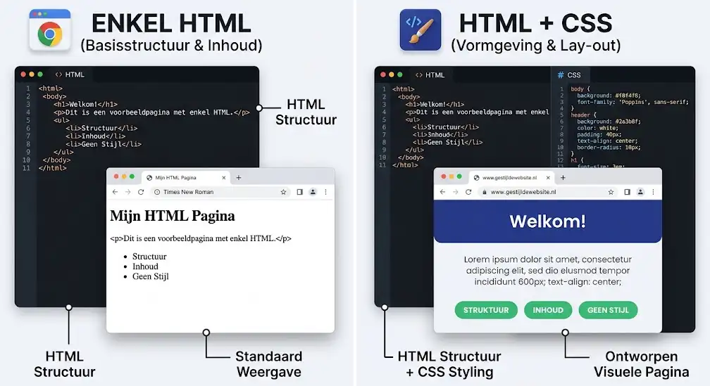
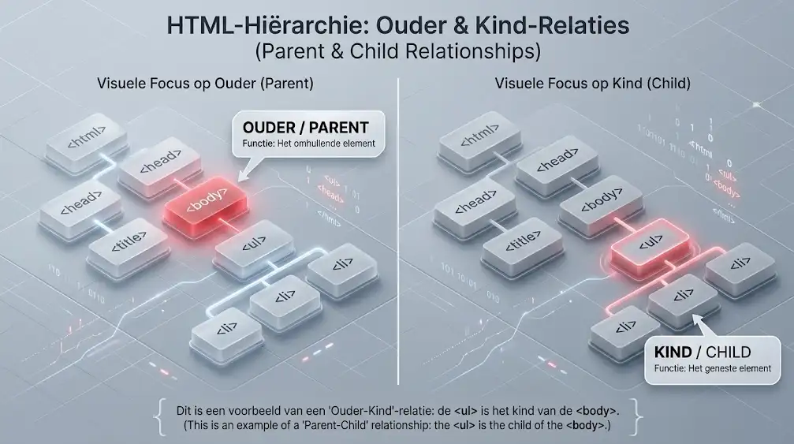
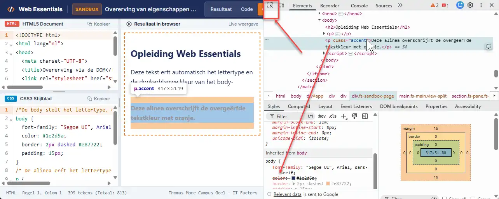

# Introductie in CSS3

In de vorige hoofdstukken heb je geleerd hoe je met HTML5 de inhoud en betekenis (semantiek) van een webpagina opbouwt. Een HTML-document zonder enige opmaak oogt echter sober: zwarte tekst op een witte achtergrond, standaard blauwe hyperlinks en elementen die recht onder elkaar staan. Om van die ruwe tekst een aantrekkelijke, overzichtelijke en professionele website te maken, gebruik je CSS3.

## Leerdoelen

Na dit hoofdstuk kan je:

- De rol van CSS beschrijven en het principe van scheiding van inhoud en vormgeving toelichten
- De anatomie van een CSS-stijlregel benoemen (selector, eigenschap, waarde, declaratieblok)
- De drie methoden om CSS toe te passen (extern, intern en inline) vergelijken en beargumenteren waarom externe stijlbladen de norm zijn
- Een extern CSS-bestand correct koppelen aan een HTML-pagina met het `<link>`-element
- Basisselectors toepassen (type-, class- en id-selectors) evenals gegroepeerde selectors en afstammingsselectors
- De werking van de cascade en prioriteitsregels bij stijlenconflicten uitleggen
- Het concept van overerving (inheritance) in de DOM-boom toelichten en bepalen welke eigenschappen wel of niet overerven
- De browser DevTools gebruiken om toegepaste, overschreven en overgeerfde CSS-stijlregels te inspecteren
- Je CSS-code controleren op fouten met behulp van de W3C CSS Validator

::: info CSS-eigenschappen en waarden in de voorbeelden
In dit inleidende hoofdstuk zie je al verschillende CSS-eigenschappen en waarden voorbijkomen in de voorbeelden en oefeningen (zoals `color`, `background-color` en `font-size`). We hebben deze voorbeelden nodig om de werking van CSS te kunnen demonstreren. Je hoeft deze specifieke eigenschappen nu nog niet vanbuiten te kennen; elk onderdeel (zoals lettertypen, kleuren, marges en kaders) wordt in de volgende hoofdstukken stap voor stap en tot in detail behandeld.
:::

## Wat is CSS?

CSS staat voor **Cascading Style Sheets** (stijlbladen in watervalvorm). Het is de officiële standaardtaal waarmee je het uiterlijk en de lay-out van HTML-elementen vastlegt. Browsers zoals Google Chrome, Mozilla Firefox, Safari en Microsoft Edge weten precies hoe ze CSS-instructies moeten interpreteren om letters, kleuren, marges en posities op het scherm te tekenen.

### Scheiding van inhoud en vormgeving

Het belangrijkste uitgangspunt van moderne webontwikkeling is de strikte scheiding van verantwoordelijkheden:

- **HTML (de inhoud en structuur):** Bepaalt wát er op de pagina staat. Je definieert titels, alinea's, lijsten, tabellen en afbeeldingen.
- **CSS (de presentatie en lay-out):** Bepaalt hóé die inhoud eruitziet. Je kiest kleuren, lettertypen, tussenafstanden, kaders en kolomindelingen.



Deze scheiding levert grote praktische voordelen op:

- **Centraal beheer en consistentie:** Koppel je hetzelfde CSS-bestand aan tientallen HTML-pagina's van een website, dan hebben al die pagina's meteen exact dezelfde huisstijl. Verander je later de primaire merkkleur in het CSS-bestand, dan wijzigt die kleur ogenblikkelijk op de hele website.
- **Efficiëntie en snellere laadtijden:** De browser downloadt het externe CSS-bestand eenmalig en bewaart dit in het tijdelijke geheugen (caching). Bij het doorklikken naar een volgende pagina hoeft alleen de nieuwe HTML geladen te worden.
- **Toegankelijkheid:** Schermlezers voor slechtzienden focussen puur op de betekenisvolle HTML-tekst zonder gehinderd te worden door visuele opmaakcodes.

### Webstandaarden en CSS3

Net zoals HTML wordt CSS gestandaardiseerd door het **World Wide Web Consortium (W3C)**. De geschiedenis van CSS kent een boeiende evolutie:

- **CSS1 (1996):** De allereerste specificatie met basale ondersteuning voor lettertypen, kleuren en marges.
- **CSS2 (1998):** Introductie van absolute positionering, media-types voor afdrukken en verbeterde tabellen.
- **CSS3 (vanaf 1999 tot heden):** In plaats van een enkel, log document werd CSS opgedeeld in tientallen afzonderlijke **modules** (zoals *Selectors*, *Color*, *Flexbox*, *Grid*, *Transforms* en *Transitions*). Elke module kan hierdoor zelfstandig evolueren en nieuwe versieniveaus krijgen. Er komt daarom nooit een centrale, monolithische "CSS4": nieuwe mogelijkheden worden continu als afzonderlijke features aan de bestaande modules toegevoegd.

::: warning Valideer je CSS
Net zoals bij HTML controleer je al je geschreven stijlbladen op syntaxfouten en naleving van de W3C-standaarden. Gebruik hiervoor de officiële [W3C CSS Validation Service](https://jigsaw.w3.org/css-validator/).
:::

## Waar schrijf je CSS?

Een webbrowser kan CSS-instructies op drie verschillende manieren ontvangen.

### 1. Externe stijlbladen (External CSS)

Bij een extern stijlblad schrijf je al je stijlen in een apart tekstbestand met de extensie `.css` (bijvoorbeeld `css/stijl.css`). In het `<head>`-gedeelte van elk HTML-bestand leg je een koppeling naar dit stijlblad met het `<link>`-element:

```html
<!DOCTYPE html>
<html lang="nl">
<head>
    <meta charset="UTF-8">
    <meta name="viewport" content="width=device-width, initial-scale=1.0">
    <title>Thomas More Campus Geel</title>
    <link rel="stylesheet" href="css/stijl.css">
</head>
<body>
    <h1>Welkom op Campus Geel</h1>
    <p>De IT Factory leidt studenten op tot gedreven IT-professionals.</p>
</body>
</html>
```

Het `<link>`-element kent twee cruciale attributen:

- `rel="stylesheet"`: Geeft aan de browser door dat het gekoppelde bestand een stijlblad is.
- `href="css/stijl.css"`: Het relatieve pad naar het CSS-bestand.

::: tip Sneltoets in PhpStorm
Typ in het `<head>`-gedeelte van je HTML-bestand de Emmet-afkorting `link:css` en druk op de `Tab`-toets. PhpStorm genereert meteen:

```html
<link rel="stylesheet" href="style.css">
```

Pas daarna enkel het pad in het `href`-attribuut aan naar jouw bestandslocatie (bijvoorbeeld `css/stijl.css`).
:::

### 2. Interne stijlbladen (Internal of Embedded CSS)

Je kan stijlen ook rechtstreeks in een HTML-pagina plaatsen met behulp van het `<style>`-element binnen het `<head>`-blok:

```html
<head>
    <meta charset="UTF-8">
    <meta name="viewport" content="width=device-width, initial-scale=1.0">
    <title>Voorbeeld met interne CSS</title>
    <style>
        h1 {
            color: #004080;
            text-align: center;
        }
    </style>
</head>
```

**Nadeel:** Deze stijlen zijn uitsluitend van toepassing op deze ene specifieke HTML-pagina. Moet je een website met meerdere pagina's beheren, dan ontstaat er dubbele code en verlies je het voordeel van centraal onderhoud. Interne CSS wordt in de praktijk vooral gebruikt voor snelle prototypes of HTML-e-mails.

### 3. Inline stijlen (Inline CSS)

Je kan CSS ook toekennen aan een individueel element via het `style`-attribuut:

```html
<h1 style="color: #004080; font-size: 28px;">Welkom op Campus Geel</h1>
```

**Nadeel:** Dit is een slechte programmeergewoonte. Je mengt de opmaak opnieuw rechtstreeks tussen de inhoud, waardoor je HTML vervuilt en onoverzichtelijk wordt. Bovendien kan je deze stijlregel onmogelijk hergebruiken voor andere koppen.

::: danger Gouden regel voor Web Essentials
In deze opleiding en al je projecten werken we **altijd met externe stijlbladen**. Interne en inline CSS worden in professionele webontwikkeling vermeden.
:::

## Anatomie van een CSS-stijlregel

Een CSS-bestand bestaat uit een reeks **stijlregels** (rulesets). Elke stijlregel vertelt de browser welk HTML-element geselecteerd moet worden en welke visuele eigenschappen dat element moet krijgen.

Bekijk het volgende voorbeeld:

```css
h2 {
    color: #e87722;
    background-color: #f5f5f5;
    margin-left: 20px;
}
```

Een stijlregel is opgebouwd uit vaste onderdelen:

```text
selector {
    eigenschap: waarde;
    eigenschap: waarde;
}
```

1. **Selector:** Geeft aan welk HTML-element (of welke groep elementen) wordt opgemaakt. In het voorbeeld hierboven is dat `h2`.
2. **Declaratieblok:** Alles wat tussen de accolades `{` en `}` staat.
3. **Declaratie:** Eén afzonderlijke stijlinstructie binnen het declaratieblok (bijvoorbeeld `color: #e87722;`). Een declaratie bestaat uit:
   - **Eigenschap (property):** Het kenmerk dat je wil aanpassen (zoals `color`, `font-size` of `margin-left`).
   - **Dubbele punt (`:`):** Scheidt de eigenschap van de waarde.
   - **Waarde (value):** De concrete instelling voor die eigenschap (zoals `#e87722`, `18px` of `center`).
   - **Puntkomma (`;`):** Sluit elke declaratie verplicht af. Vergeet je een puntkomma, dan kan de browser de daaropvolgende eigenschappen niet meer interpreteren.

| Onderdeel in voorbeeld | Benaming | Functie |
| --- | --- | --- |
| `h2` | Selector | Selecteert alle `<h2>`-tussentitels op de pagina. |
| `{ ... }` | Declaratieblok | Omvat alle declaraties die bij deze selector horen. |
| `color: #e87722;` | Declaratie | Maakt de tekstkleur warm oranje. |
| `background-color` | Eigenschap | Bepaalt de achtergrondkleur van het element. |
| `#f5f5f5` | Waarde | Een zachtgrijze hexadecimale kleurcode. |
| `;` | Afsluitteken | Geeft het einde van een declaratie aan. |

### Meervoudige waarden en aanhalingstekens

Sommige eigenschappen accepteren meerdere waarden na elkaar, gescheiden door een komma of een spatie:

- **Lettertypefamilies gescheiden door komma's:** Bij `font-family` geef je een lijst met voorkeurslettertypen op. De browser kiest het eerste lettertype dat op het systeem van de bezoeker geïnstalleerd staat:

  ```css
  body {
      font-family: Arial, Helvetica, sans-serif;
  }
  ```

- **Aanhalingstekens bij meerdelige namen:** Bevat de naam van een lettertype een spatie, dan plaats je die naam verplicht tussen dubbele of enkele aanhalingstekens:

  ```css
  p {
      font-family: "Times New Roman", Times, serif;
  }
  ```

In het onderstaande interactieve voorbeeld zie je hoe een externe stijlregel direct effect heeft op de HTML-elementen.

<CodeSandbox
  title="Anatomie van een CSS-stijlregel"
  height="450px"
  highlightHtml=""
  highlightCss=""
  highlightJs=""
  activeCodeTab="css"
  css='/*Tussentitel */
h2 {
  color: #e87722;
  background-color: #f8f9fa;
  padding: 10px;
  border-left: 4px solid #e87722;
}
/* Alinea opmaak */
p {
  color: #333333;
  font-size: 16px;
  line-height: 1.6;
}
/* Inleidende tekst*/
.intro {
  font-weight: bold;
  color: #1e2d5a;
}'
  html='<!DOCTYPE html>
<html lang="nl">
<head>
  <meta charset="UTF-8">
  <meta name="viewport" content="width=device-width, initial-scale=1.0">
  <title>Opleiding ICT</title>
  <link rel="stylesheet" href="stijl.css">
</head>
<body>
  <h2>Opleiding ICT op Campus Geel</h2>
  <p class="intro">Welkom bij de IT Factory van Thomas More.</p>
  <p>In deze cursus leer je hoe je professionele webpagina&#39;s ontwerpt en bouwt.</p>
</body>
</html>'
/>

## Basisselectors en combinaties

Om precies de juiste elementen van een pagina te stylen, biedt CSS verschillende types selectors aan.

### 1. De type selector (tag selector)

De type selector selecteert alle HTML-elementen van een bepaalde tagnaam.

```css
p {
    color: #333333;
}
```

Elke alinea (`<p>`) op de pagina krijgt met deze regel automatisch donkergrijze tekst.

### 2. De class selector

Met een klasse kan je een stijl toepassen op meerdere elementen, ongeacht hun tag. In HTML ken je een klasse toe met het `class`-attribuut. In CSS selecteer je een klasse door een punt (`.`) voor de klassenaam te plaatsen:

```css
.opvallend {
    color: #e87722;
    font-weight: bold;
}
```

```html
<p class="opvallend">Dit is een belangrijke mededeling voor studenten.</p>
<span class="opvallend">Nieuw bericht</span>
```

### 3. De id selector

Een `id` identificeert een uniek element op de webpagina. In HTML gebruik je het `id`-attribuut; in CSS spreek je een id aan met een hekje (`#`):

```css
#hoofdmenu {
    background-color: #1e2d5a;
}
```

```html
<nav id="hoofdmenu">
    <!-- Navigatielinks -->
</nav>
```

::: tip Gebruik klassen voor vormgeving
Hoewel id-selectors bestaan, is het een goede gewoonte om stijlen vrijwel altijd te baseren op klassen (`.klasse`). Klassen zijn herbruikbaar en houden de specificiteit van je stijlbladen laag en beheersbaar.
:::

### Selectors combineren

Je kan selectors op verschillende manieren combineren om je opmaak heel specifiek te richten:

#### Gegroepeerde selectors (met een komma)

Wil je meerdere elementen exact dezelfde eigenschappen geven? Scheid de selectors dan met een komma (`,`). Zo vermijd je dubbele code:

```css
h1, h2, h3 {
    color: #1e2d5a;
    font-family: "Segoe UI", Arial, sans-serif;
}
```

#### Element met specifieke klasse (zonder spatie)

Plaats je een klassenaam direct achter een tagnaam zonder tussenliggende spatie, dan selecteer je alleen elementen van dat tag-type die die specifieke klasse bezitten:

```css
p.belangrijk {
    color: #c0392b;
}
```

In dit geval krijgt alleen een `<p>` met de klasse `belangrijk` een rode kleur. Een `<h2 class="belangrijk">` wordt hierdoor **niet** beïnvloed.

#### Afstammingsselector (met een spatie)

Plaats je een spatie tussen twee selectors, dan selecteer je een element dat zich **binnen** een ander element bevindt (een afstammeling of descendant):

```css
article p {
    line-height: 1.8;
}
```

Deze stijlregel geldt uitsluitend voor alinea's (`p`) die binnen een `<article>`-element staan. Alinea's buiten het artikel blijven onaangeroerd.

| Selector | Voorbeeld | Betekenis |
| --- | --- | --- |
| Type selector | `h1` | Alle `<h1>`-elementen |
| Class selector | `.waarschuwing` | Elk element met `class="waarschuwing"` |
| ID selector | `#banner` | Het unieke element met `id="banner"` |
| Gegroepeerd | `h1, p` | Zowel `<h1>` als `<p>` |
| Element met klasse | `p.waarschuwing` | Alleen `<p>`-elementen met `class="waarschuwing"` |
| Afstammeling | `nav a` | Alle hyperlinks `<a>` die zich binnen een `<nav>` bevinden |

## De Cascade en stijlenconflicten

De letter **C** in CSS staat voor **Cascading** (als een waterval neervallend). Wanneer er meerdere stijlregels van toepassing zijn op hetzelfde element en dezelfde eigenschap, moet de browser beslissen welke regel wint.

### De drie bronnen van stijlen

Een HTML-document krijgt stijlen aangeleverd uit drie verschillende niveaus:

1. **Browserstijlen (User Agent Stylesheet):** Elke browser heeft een ingebouwd standaardstijlblad. Hierdoor toont een browser een `<h1>` standaard groot en vet, krijgt een `<ul>` een insprong met bolletjes, en heeft een `<body>` een kleine buitenmarge van 8 pixels.
2. **Bezoekersstijlen (User Stylesheet):** Bezoekers kunnen in hun browser instellingen opgeven, zoals een grotere minimumlettergrootte voor slechtzienden of een voorkeur voor donkere modus (*prefers-color-scheme*).
3. **Auteursstijlen (Author Stylesheet):** Dit zijn de CSS-bestanden die jij als webontwikkelaar schrijft.

De standaard prioriteit van hoog naar laag is:

1. **Webontwikkelaar (Author):** Jouw CSS overschrijft altijd de standaard browserstijlen.
2. **Bezoeker (User):** Gebruikersinstellingen.
3. **Browser (User Agent):** De standaardinstellingen van de browser vormen het vangnet.

### Conflicten bij gelijke prioriteit: de bronvolgorde

Wat gebeurt er als twee stijlregels in jouw CSS-bestand exact dezelfde selector en eigenschap bevatten?

```css
p {
    color: blue;
}

p {
    color: red;
}
```

Bij gelijke prioriteit en specificiteit geldt de eenvoudige regel: **de laatst gelezen regel wint**. De browser leest het bestand van boven naar beneden, waardoor de tekstkleur van de alinea uiteindelijk rood (`red`) wordt.

### De noodrem: `!important`

Je kan de normale prioriteit forceren door direct achter een waarde het trefwoord `!important` te plaatsen:

```css
p {
    color: green !important;
}
```

Een declaratie met `!important` overschrijft alle voorgaande en latere normale declaraties voor die eigenschap, ongeacht de bronvolgorde.

::: danger Gebruik `!important` nooit als snelle oplossing
In goed gestructureerde CSS heb je `!important` vrijwel nooit nodig. Wanneer je `!important` gebruikt om snel een hardnekkig stijlenconflict op te lossen, doorbreek je de natuurlijke werking van de cascade. Voor je het weet moet je overal `!important` toevoegen om eerdere regels weer te overrulen, waardoor je CSS ononderhoudbaar wordt. Gebruik het dus uitsluitend in uitzonderlijke situaties.
:::

Test in het onderstaande interactieve voorbeeld hoe de cascade en bronvolgorde werken:

<CodeSandbox
  title="De Cascade en bronvolgorde"
  height="450px"
  highlightHtml=""
  highlightCss=""
  highlightJs=""
  activeCodeTab="css"
  css='/*Eerste regel: blauw */
.bericht {
  color: #0056b3;
  background-color: #e6f0fa;
  padding: 12px;
  border-radius: 4px;
}
/* Tweede regel met dezelfde specificiteit: overschrijft de tekstkleur*/
.bericht {
  color: #8b0000;
}'
  html='<!DOCTYPE html>
<html lang="nl">
<head>
  <meta charset="UTF-8">
  <meta name="viewport" content="width=device-width, initial-scale=1.0">
  <title>De Cascade</title>
  <link rel="stylesheet" href="stijl.css">
</head>
<body>
  <div class="bericht">
    De tekstkleur is donkerrood omdat de laatste regel in het CSS-bestand wint van de eerste regel.
  </div>
</body>
</html>'
/>

## Overerving (Inheritance)

HTML-documenten bezitten een duidelijke boomstructuur: het **DOM** (Document Object Model). Elementen kunnen andere elementen omsluiten:

- Het omhullende element is het **ouderelement** (*parent*).
- Het ingesloten element is het **kindelement** (*child*).



In CSS geldt het principe van **overerving (inheritance)**: bepaalde eigenschappen die je instelt op een ouderelement, worden automatisch overgedragen op alle onderliggende kindelementen.

Stel dat je het lettertype instelt op het `<body>`-element:

```css
body {
    font-family: 'Segoe UI', Tahoma, Geneva, Verdana, sans-serif;
    color: #2c3e50;
}
```

Omdat alle koppen (`<h1>`), alinea's (`<p>`) en lijsten (`<ul>`) kinderen zijn van de `<body>`, nemen zij dit lettertype en deze tekstkleur automatisch over. Je hoeft `font-family` dus niet voor elk element afzonderlijk te herhalen.

### Welke eigenschappen erven wel of niet over?

Niet alle CSS-eigenschappen worden overgeerfd. Er is een logisch onderscheid:

- **Eigenschappen die wél overerven:** Voornamelijk eigenschappen die betrekking hebben op tekst en typografie:
  - `font-family`, `font-size`, `font-weight`, `font-style`
  - `color`
  - `line-height`
  - `text-align`, `text-transform`, `letter-spacing`
  - `list-style-type`
- **Eigenschappen die níét overerven:** Eigenschappen die horen bij de doos (*box model*) en lay-out van een element:
  - `margin` en `padding`
  - `border` (randen)
  - `background-color` en `background-image`
  - `width` en `height`

Dit onderscheid is vanzelfsprekend. Als je een kader (`border: 2px solid black;`) rond de `<body>` plaatst, wil je immers niet dat elke alinea, knop en afbeelding binnen die pagina plots ook een zwarte rand krijgt.

<CodeSandbox
  title="Overerving van eigenschappen via de DOM"
  height="460px"
  highlightHtml=""
  highlightCss=""
  highlightJs=""
  activeCodeTab="css"
  css='/*De body stelt het lettertype, de kleur en een rand in */
body {
  font-family: "Segoe UI", Arial, sans-serif;
  color: #1e2d5a;
  border: 2px dashed #e87722;
  padding: 15px;
}
/* De alinea erft het lettertype en de kleur, maar NIET de gestreepte rand */
p {
  line-height: 1.6;
}
/* We kunnen de overgeërfde kleur lokaal overschrijven voor een specifiek kind*/
.accent {
  color: #e87722;
  font-weight: bold;
}'
  html='<!DOCTYPE html>
<html lang="nl">
<head>
  <meta charset="UTF-8">
  <meta name="viewport" content="width=device-width, initial-scale=1.0">
  <title>Overerving via de DOM</title>
  <link rel="stylesheet" href="stijl.css">
</head>
<body>
  <h2>Opleiding Web Essentials</h2>
  <p>Deze tekst erft automatisch het lettertype en de donkerblauwe kleur van het body-element.</p>
  <p class="accent">Deze alinea overschrijft de overgeërfde tekstkleur met oranje.</p>
</body>
</html>'
/>

## Stijlen inspecteren met Browser DevTools

Wanneer een webpagina er niet uitziet zoals je verwacht, hoef je niet te gokken waar de fout zit. Moderne browsers beschikken over krachtige **ontwikkelaarshulpprogramma's** (DevTools).

1. Open je webpagina in Google Chrome, Microsoft Edge of Firefox.
2. Druk op de sneltoets `F12` (of klik met de rechtermuisknop op een element en kies **Inspecteren**).
3. Selecteer in het tabblad **Elements** het HTML-element dat je wil controleren.
4. Bekijk aan de rechterzijde het paneel **Styles**:
   - Hier zie je alle stijlregels die op het geselecteerde element van toepassing zijn, inclusief de bestandsnaam en het regelnummer waar de regel gedefinieerd is.
   - **Doorgestreepte eigenschappen:** Een eigenschap die met een zwarte lijn is doorgestreept, is overschreven door een andere regel met een hogere prioriteit of latere bronvolgorde.
   - **Overgeërfde stijlen:** Onder het kopje *Inherited from...* zie je precies welke eigenschappen het element heeft meegekregen van zijn ouders (zoals de `<body>`).



::: tip Live testen in DevTools
In het paneel *Styles* kan je stijlen tijdelijk aan- of uitvinken met selectievakjes, of direct nieuwe waarden intypen. Zo test je razendsnel een andere kleur of grotere lettergrootte zonder je codebestand in PhpStorm op te slaan en te herladen.
:::

## Handige Emmet-sneltoetsen in PhpStorm

In PhpStorm kan je CSS bijzonder snel schrijven met behulp van ingebouwde Emmet-afkortingen. Typ de afkorting binnen een declaratieblok en druk op `Tab`:

| Afkorting | Druk op `Tab` | Gegenereerde CSS-code |
| --- | --- | --- |
| `c#e87722` | `Tab` | `color: #e87722;` |
| `bgc#fff` | `Tab` | `background-color: #fff;` |
| `fz16` | `Tab` | `font-size: 16px;` |
| `fwb` | `Tab` | `font-weight: bold;` |
| `tac` | `Tab` | `text-align: center;` |
| `m20` | `Tab` | `margin: 20px;` |
| `p10` | `Tab` | `padding: 10px;` |
| `lh1.6` | `Tab` | `line-height: 1.6;` |

<PageSummary>

### Syntaxis in een oogopslag

| Wat | Hoe | Voorbeeld |
|---|---|---|
| CSS-stijlregel | `selector { eigenschap: waarde; }` | `h1 { color: #1e2d5a; }` |
| Extern stijlblad | `<link rel="stylesheet" href="pad/stijl.css">` | In de `<head>` van HTML |
| Type selector | `elementnaam { }` | `p { line-height: 1.6; }` |
| Class selector | `.klassenaam { }` | `.uitgelicht { font-weight: bold; }` |
| ID selector | `#idnaam { }` | `#hoofdmenu { color: #e87722; }` |
| Gegroepeerde selector | `sel1, sel2 { }` | `h1, h2, h3 { font-family: sans-serif; }` |
| Afstammingsselector | `ouder kind { }` | `article p { color: #333; }` |

### Regels en afspraken

- **Strikte scheiding:** HTML verzorgt de inhoud en structuur, CSS verzorgt de presentatie en lay-out. Schrijf stijlregels bij voorkeur altijd in een **extern `.css`-bestand**.
- **Koppeling in `<head>`:** Plaats de `<link rel="stylesheet" href="...">` altijd binnen het `<head>`-element van je HTML-document.
- **Herbruikbaarheid:** Gebruik klassen (`.klasse`) voor herbruikbare elementen en stijlen. Gebruik ID's (`#id`) uiterst spaarzaam wegens hun te hoge specificiteit.
- **Overerving:** Teksteigenschappen zoals `color`, `font-family` en `line-height` erven automatisch over van ouder naar kind. Lay-out eigenschappen (zoals `margin`, `padding` en `border`) erven **nooit** automatisch over.
- **De Cascade:** Bij botsende regels met gelijke specificiteit wint altijd de regel die **het laatst** in het stylesheet staat (bronvolgorde).

### Veelgemaakte fouten

- De punt (`.`) vergeten vóór een klassenaam in CSS, waardoor de browser zoekt naar een onbestaand HTML-element (bijv. `uitgelicht { }` in plaats van `.uitgelicht { }`).
- Een hash (`#`) in het HTML `class`-attribuut typen: schrijf in HTML `class="kaart"`, niet `class="#kaart"`.
- Het koppelteken of de puntkomma vergeten aan het einde van een CSS-declaratie, waardoor de volgende regel niet meer gelezen wordt.
- `id` meerdere keren gebruiken op dezelfde pagina (een ID moet uniek zijn in het HTML-document).
- Inline stijlen (`style="..."`) in HTML typen in plaats van een centrale regel in het externe CSS-stijlblad.

### Tips voor beginners

- Gebruik Google Chrome DevTools (`F12` of rechtermuisklik -> **Inspecteren**): doorgestreepte CSS-regels tonen direct aan welke stijlen zijn overschreven door een regel met hogere prioriteit of latere bronvolgorde.
- Gebruik in PhpStorm de Emmet-sneltoets `link:css` in de `<head>` van je HTML om de `<link>`-tag in één klap te genereren.
- Valideer je stijlblad regelmatig via de officiële **W3C CSS Validator** om verborgen typefouten of vergeten haakjes vroegtijdig op te sporen.

</PageSummary>

## Oefeningen


Oefen de theorie in met de onderstaande praktische opdrachten. Maak voor elke oefening een apart project of submap aan in PhpStorm.

### Oefening 1: Eerste externe stijlblad koppelen

Maak een webpagina voor een introductiedag op Thomas More Campus Geel.

**Stappen:**

1. Maak een HTML5-bestand aan met de naam `index.html`.
2. Voeg een hoofding `<h1>Welkom op Thomas More Campus Geel</h1>` toe, gevolgd door een subtitel `<h2>Departement IT Factory</h2>` en twee alinea's met toelichting.
3. Maak in dezelfde map een submap `css` aan, en creëer daarin het bestand `stijl.css`.
4. Koppel `css/stijl.css` in de `<head>` van je HTML-bestand met behulp van de Emmet-sneltoets `link:css`.
5. Open `css/stijl.css` en schrijf de volgende stijlregels:
   - Stel voor de `body` het lettertype in op `'Segoe UI', Arial, sans-serif` en geef de tekst een donkere kleur `#222222`.
   - Geef de `<h1>` een donkerblauwe kleur `#1e2d5a`.
   - Geef de `<h2>` een warme oranje kleur `#e87722`.
   - Geef alinea's een regelhoogte (*line-height*) van `1.6`.
6. Open de webpagina in je browser en controleer of de stijlen correct zichtbaar zijn.

### Oefening 2: Selectors en klassen toepassen

Breid de webpagina uit Oefening 1 verder uit met verschillende soorten selectors.

**Stappen:**

1. Voeg een lijst met drie campusevenementen toe (`<ul>` met drie `<li>`-items).
2. Geef het eerste evenement de klasse `class="uitgelicht"`.
3. Voeg onderaan de pagina een alinea toe met `class="belangrijk"`.
4. Schrijf in `css/stijl.css`:
   - Een gegroepeerde selector voor `h1, h2` die de tekst transformeert naar hoofdletters (`text-transform: uppercase;`).
   - Een class selector voor `.uitgelicht` met een achtergrondkleur `#fff3cd` en een vette tekststijl (`font-weight: bold;`).
   - Een element-specifieke class selector `p.belangrijk` met een rode tekstkleur `#c0392b` en een stippellijn onder de tekst (`text-decoration: underline dotted;`).
5. Open de DevTools (`F12`) in je browser en klik op de elementen om te controleren welke regels zijn toegepast.

### Oefening 3: De Cascade en overerving onderzoeken

In deze oefening leer je fouten opsporen en voorspellen welke CSS-regel wint.

**Gegeven HTML:**

```html
<div class="kader">
    <p class="tekst speciaal">Welke kleur krijgt deze zin?</p>
</div>
```

**Gegeven CSS:**

```css
body {
    color: black;
    font-family: Arial, sans-serif;
}

p {
    color: blue;
}

.tekst {
    color: orange;
}

.speciaal {
    color: green;
}

p.tekst {
    color: purple;
}
```

**Vragen:**

1. Welke kleur krijgt de zin volgens de regels van specificiteit en de cascade? Waarom wint die regel?
2. Welk lettertype krijgt de paragraaf, en via welk mechanisme ontvangt hij dit lettertype?
3. Typ deze code over in PhpStorm, open de pagina in je browser, inspecteer de alinea met `F12` en controleer welke stijlen zijn doorgestreept.
