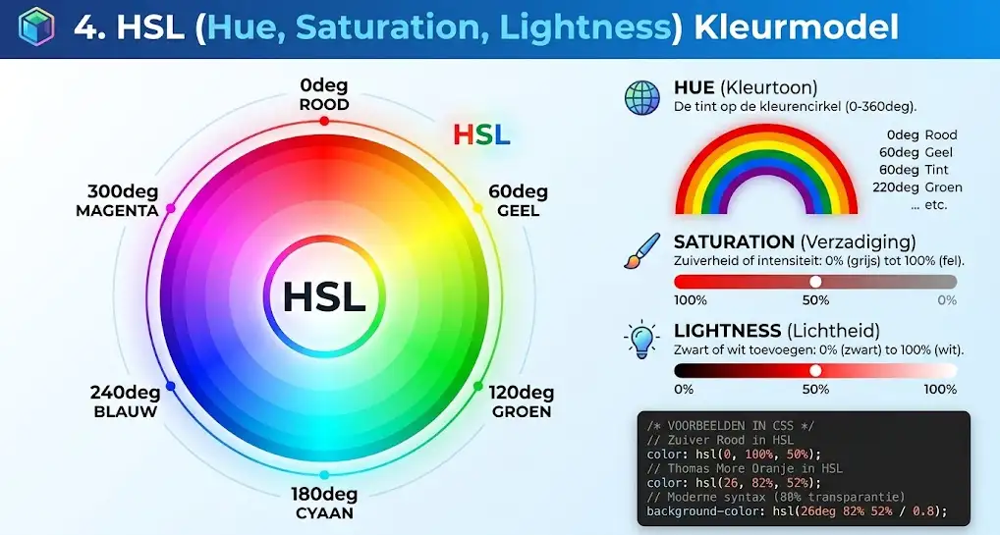
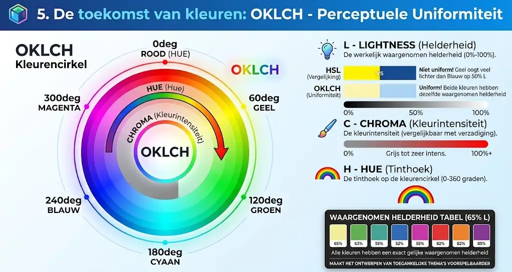
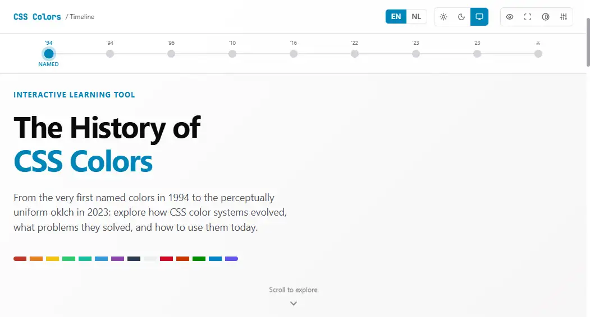

# Kleuren

## Leerdoelen

Na dit hoofdstuk kan je:

- De CSS-eigenschappen `color` en `background-color` doelgericht toepassen op teksten en blok-elementen
- Kleuren definiëren met verschillende CSS-kleursystemen (benoemde kleuren, hexadecimale codes, RGB, HSL en OKLCH)
- Transparantie en dekking instellen met behulp van het alfakanaal (`rgba()`, moderne spatiesyntax en 8-cijferige hex)
- De minimale WCAG-contrastratio van 4.5:1 controleren met browser DevTools voor optimale toegankelijkheid
- Hyperlinks en interactieve knoppen stylen in de correcte volgorde met behulp van het *LoVe Fears HAte*-principe


## Tekstkleur en achtergrondkleur

Om een webpagina visuele hiërarchie en identiteit te geven, bepaal je de kleuren van teksten en achtergronden. In CSS gebruik je hiervoor twee basiseigenschappen:

- **`color`**: bepaalt de voorgrondkleur van een element. Dit is voornamelijk de kleur van de tekst en eventuele inline-iconen.
- **`background-color`**: bepaalt de achtergrondkleur van het element. De achtergrond vult het volledige oppervlak van het element op.

```css
/* Voorbeeld: donkerblauwe tekst op een lichte achtergrond */
body {
  color: #1e2d5a;
  background-color: #f8fafc;
}
```

### De speciale waarden transparent en inherit

Naast concrete kleurwaarden kent CSS twee nuttige sleutelwoorden voor achtergronden:

- **`transparent`**: maakt de achtergrond volledig doorzichtig. Het achterliggende element schijnt erdoorheen. Dit is de standaardwaarde voor de meeste HTML-elementen.
- **`inherit`**: dwingt het element af om exact dezelfde achtergrondkleur over te nemen van zijn bovenliggende moederelement (*parent element*).

```css
p {
  color: #e87722;
  background-color: transparent;
}
```

### Live voorbeeld: Tekst- en achtergrondkleuren

In onderstaand voorbeeld zie je hoe `color` en `background-color` worden toegepast op koppen, alinea's en een informatiekader voor Thomas More Campus Geel.

```html
<!DOCTYPE html>
<html lang="nl">
<head>
  <meta charset="UTF-8">
  <meta name="viewport" content="width=device-width, initial-scale=1.0">
  <title>Kleuren Voorbeeld</title>
  <link rel="stylesheet" href="stijl.css">
</head>
<body>
  <h1>Thomas More Campus Geel</h1>
  <p class="inleiding">Welkom bij de opleiding Toegepaste Informatica.</p>
  <div class="infoblok">
    <h2>Belangrijke mededeling</h2>
    <p>De lessen webontwikkeling starten stipt in lokaal B102.</p>
  </div>
</body>
</html>
```

```css
/* Algemene paginastijl */
body {
  font-family: sans-serif;
  font-size: 16px;
  line-height: 1.5;
  color: #1e2d5a;
  background-color: #f8fafc;
}

/* Hoofdtitel in Thomas More oranje */
h1 {
  color: #e87722;
}

/* Inleidende alinea in zachter leisteengrijs */
.inleiding {
  font-size: 1.1rem;
  color: #64748b;
}

/* Informatieblok met lichte achtergrond en oranje rand */
.infoblok {
  background-color: #e2e8f0;
  color: #0f172a;
  /* padding en border worden later in het Box Model hoofdstuk in detail behandeld */
  padding: 16px;
  border-left: 4px solid #e87722;
}

/* Tussentitel binnen het informatieblok */
.infoblok h2 {
  color: #1e2d5a;
}
```

<CodeSandbox
  title="Basis tekst- en achtergrondkleuren"
  height="460px"
  activeCodeTab="css"
  css='/* Algemene paginastijl */
body {
  font-family: sans-serif;
  font-size: 16px;
  line-height: 1.5;
  color: #1e2d5a;
  background-color: #f8fafc;
}
/* Hoofdtitel in Thomas More oranje */
h1 {
  color: #e87722;
}
/* Inleidende alinea in zachter leisteengrijs */
.inleiding {
  font-size: 1.1rem;
  color: #64748b;
}
/* Informatieblok met lichte achtergrond en oranje rand */
.infoblok {
  background-color: #e2e8f0;
  color: #0f172a;
  /* padding en border worden later in het Box Model hoofdstuk in detail behandeld */
  padding: 16px;
  border-left: 4px solid #e87722;
}
/* Tussentitel binnen het informatieblok */
.infoblok h2 {
  color: #1e2d5a;
}'
  html='<!DOCTYPE html>
<html lang="nl">
<head>
  <meta charset="UTF-8">
  <meta name="viewport" content="width=device-width, initial-scale=1.0">
  <title>Kleuren Voorbeeld</title>
  <link rel="stylesheet" href="stijl.css">
</head>
<body>
  <h1>Thomas More Campus Geel</h1>
  <p class="inleiding">Welkom bij de opleiding Toegepaste Informatica.</p>
  <div class="infoblok">
    <h2>Belangrijke mededeling</h2>
    <p>De lessen webontwikkeling starten stipt in lokaal B102.</p>
  </div>
</body>
</html>'
/>


## Kleursystemen in CSS

Op beeldschermen ontstaan kleuren volgens het **additieve kleurensysteem**: door rood, groen en blauw licht in verschillende sterktes met elkaar te combineren, produceert het scherm miljoenen verschillende tinten. CSS biedt verschillende notatiewijzen om kleuren aan te duiden, van eenvoudige namen tot wiskundige kleurmodellen.

### 1. Benoemde kleuren (Named Colors)

CSS bevat 147 gestandaardiseerde kleurnamen in het Engels, zoals `red`, `blue`, `forestgreen`, `tomato` en `navy`.

```css
h1 {
  color: tomato;
  background-color: antiquewhite;
}
```

In onderstaande tabel zie je een greep uit de populairste benoemde CSS-kleuren:

| CSS Kleurnaam | Categorie | HEX Equivalent | Weergave |
|---|---|---|---|
| `tomato` | Rood / Oranje | `#ff6347` | <span style="display: inline-block; min-width: 90px; padding: 4px 10px; border-radius: 6px; background-color: tomato; color: #ffffff; font-weight: 600; text-align: center; border: 1px solid rgba(0,0,0,0.15);">tomato</span> |
| `crimson` | Dieprood | `#dc143c` | <span style="display: inline-block; min-width: 90px; padding: 4px 10px; border-radius: 6px; background-color: crimson; color: #ffffff; font-weight: 600; text-align: center; border: 1px solid rgba(0,0,0,0.15);">crimson</span> |
| `gold` | Geel / Goud | `#ffd700` | <span style="display: inline-block; min-width: 90px; padding: 4px 10px; border-radius: 6px; background-color: gold; color: #000000; font-weight: 600; text-align: center; border: 1px solid rgba(0,0,0,0.15);">gold</span> |
| `forestgreen` | Groen | `#228b22` | <span style="display: inline-block; min-width: 90px; padding: 4px 10px; border-radius: 6px; background-color: forestgreen; color: #ffffff; font-weight: 600; text-align: center; border: 1px solid rgba(0,0,0,0.15);">forestgreen</span> |
| `teal` | Blauwgroen | `#008080` | <span style="display: inline-block; min-width: 90px; padding: 4px 10px; border-radius: 6px; background-color: teal; color: #ffffff; font-weight: 600; text-align: center; border: 1px solid rgba(0,0,0,0.15);">teal</span> |
| `royalblue` | Helderblauw | `#4169e1` | <span style="display: inline-block; min-width: 90px; padding: 4px 10px; border-radius: 6px; background-color: royalblue; color: #ffffff; font-weight: 600; text-align: center; border: 1px solid rgba(0,0,0,0.15);">royalblue</span> |
| `navy` | Donkerblauw | `#000080` | <span style="display: inline-block; min-width: 90px; padding: 4px 10px; border-radius: 6px; background-color: navy; color: #ffffff; font-weight: 600; text-align: center; border: 1px solid rgba(0,0,0,0.15);">navy</span> |
| `rebeccapurple` | Paars | `#663399` | <span style="display: inline-block; min-width: 90px; padding: 4px 10px; border-radius: 6px; background-color: rebeccapurple; color: #ffffff; font-weight: 600; text-align: center; border: 1px solid rgba(0,0,0,0.15);">rebeccapurple</span> |
| `slategray` | Leisteengrijs | `#708090` | <span style="display: inline-block; min-width: 90px; padding: 4px 10px; border-radius: 6px; background-color: slategray; color: #ffffff; font-weight: 600; text-align: center; border: 1px solid rgba(0,0,0,0.15);">slategray</span> |

::: tip Beperking van kleurnamen
Hoewel kleurnamen handig zijn voor snelle prototypes en testen, gebruik je ze zelden in professionele projecten. Ze bieden immers geen exacte controle over de huisstijl van een bedrijf of organisatie.
:::

### 2. Hexadecimale notatie (HEX)

De hexadecimale notatie is de meest gebruikte manier om kleuren te noteren in CSS. Een hex-code begint altijd met een hekje (`#`), gevolgd door 6 hexadecimale cijfers: twee voor Rood, twee voor Groen en twee voor Blauw (`#RRGGBB`).

In het hexadecimale talstelsel tel je van `0` tot `f` (`0, 1, 2, 3, 4, 5, 6, 7, 8, 9, a, b, c, d, e, f`):
- `00` betekent geen enkel licht (0% intensiteit)
- `ff` betekent maximale intensiteit (100% intensiteit, oftewel waarde 255)

::: info Hoofdletters of kleine letters
In CSS zijn hexadecimale kleurcodes niet hoofdlettergevoelig (*case-insensitive*). Je mag dus zowel `#ffffff` als `#FFFFFF`, of `#e87722` als `#E87722` schrijven. In de praktijk worden kleine letters het vaakst gehanteerd als uniforme standaard in codebases.
:::

| Kleur | HEX-code | Rood (RR) | Groen (GG) | Blauw (BB) | Weergave |
|---|---|---|---|---|---|
| Rood | `#ff0000` | Maximaal (`ff`) | Geen (`00`) | Geen (`00`) | <span style="display: inline-block; min-width: 90px; padding: 4px 10px; border-radius: 6px; background-color: #ff0000; color: #ffffff; font-weight: 600; text-align: center; border: 1px solid rgba(0,0,0,0.15);">#ff0000</span> |
| Groen (lime) | `#00ff00` | Geen (`00`) | Maximaal (`ff`) | Geen (`00`) | <span style="display: inline-block; min-width: 90px; padding: 4px 10px; border-radius: 6px; background-color: #00ff00; color: #000000; font-weight: 600; text-align: center; border: 1px solid rgba(0,0,0,0.15);">#00ff00</span> |
| Blauw | `#0000ff` | Geen (`00`) | Geen (`00`) | Maximaal (`ff`) | <span style="display: inline-block; min-width: 90px; padding: 4px 10px; border-radius: 6px; background-color: #0000ff; color: #ffffff; font-weight: 600; text-align: center; border: 1px solid rgba(0,0,0,0.15);">#0000ff</span> |
| Wit | `#ffffff` | Maximaal (`ff`) | Maximaal (`ff`) | Maximaal (`ff`) | <span style="display: inline-block; min-width: 90px; padding: 4px 10px; border-radius: 6px; background-color: #ffffff; color: #000000; font-weight: 600; text-align: center; border: 1px solid #cbd5e1;">#ffffff</span> |
| Zwart | `#000000` | Geen (`00`) | Geen (`00`) | Geen (`00`) | <span style="display: inline-block; min-width: 90px; padding: 4px 10px; border-radius: 6px; background-color: #000000; color: #ffffff; font-weight: 600; text-align: center; border: 1px solid rgba(255,255,255,0.2);">#000000</span> |
| TM Oranje | `#e87722` | Hoog (`e8`) | Midden (`77`) | Laag (`22`) | <span style="display: inline-block; min-width: 90px; padding: 4px 10px; border-radius: 6px; background-color: #e87722; color: #ffffff; font-weight: 600; text-align: center; border: 1px solid rgba(0,0,0,0.15);">#e87722</span> |
| TM Marineblauw | `#1e2d5a` | Laag (`1e`) | Laag/Midden (`2d`) | Gemiddeld (`5a`) | <span style="display: inline-block; min-width: 90px; padding: 4px 10px; border-radius: 6px; background-color: #1e2d5a; color: #ffffff; font-weight: 600; text-align: center; border: 1px solid rgba(0,0,0,0.15);">#1e2d5a</span> |

#### Verkorte 3-teken notatie

Wanneer de twee cijfers van elk afzonderlijk kleurkanaal identiek zijn (`#RRGGBB`), mag je elk paar herleiden tot één enkel teken (`#RGB`). De browser verdubbelt elk teken bij het interpreteren automatisch:

| 6-teken HEX (`#RRGGBB`) | 3-teken HEX (`#RGB`) | Kleur | Weergave |
|---|---|---|---|
| `#ffffff` | `#fff` | Wit | <span style="display: inline-block; min-width: 80px; padding: 4px 10px; border-radius: 6px; background-color: #fff; color: #000000; font-weight: 600; text-align: center; border: 1px solid #cbd5e1;">#fff</span> |
| `#000000` | `#000` | Zwart | <span style="display: inline-block; min-width: 80px; padding: 4px 10px; border-radius: 6px; background-color: #000; color: #ffffff; font-weight: 600; text-align: center; border: 1px solid rgba(255,255,255,0.2);">#000</span> |
| `#ff0000` | `#f00` | Rood | <span style="display: inline-block; min-width: 80px; padding: 4px 10px; border-radius: 6px; background-color: #f00; color: #ffffff; font-weight: 600; text-align: center; border: 1px solid rgba(0,0,0,0.15);">#f00</span> |
| `#00ff00` | `#0f0` | Groen (lime) | <span style="display: inline-block; min-width: 80px; padding: 4px 10px; border-radius: 6px; background-color: #0f0; color: #000000; font-weight: 600; text-align: center; border: 1px solid rgba(0,0,0,0.15);">#0f0</span> |
| `#0000ff` | `#00f` | Blauw | <span style="display: inline-block; min-width: 80px; padding: 4px 10px; border-radius: 6px; background-color: #00f; color: #ffffff; font-weight: 600; text-align: center; border: 1px solid rgba(0,0,0,0.15);">#00f</span> |
| `#ffff00` | `#ff0` | Geel | <span style="display: inline-block; min-width: 80px; padding: 4px 10px; border-radius: 6px; background-color: #ff0; color: #000000; font-weight: 600; text-align: center; border: 1px solid rgba(0,0,0,0.15);">#ff0</span> |
| `#ff9900` | `#f90` | Oranje | <span style="display: inline-block; min-width: 80px; padding: 4px 10px; border-radius: 6px; background-color: #f90; color: #ffffff; font-weight: 600; text-align: center; border: 1px solid rgba(0,0,0,0.15);">#f90</span> |
| `#336699` | `#369` | Staalblauw | <span style="display: inline-block; min-width: 80px; padding: 4px 10px; border-radius: 6px; background-color: #369; color: #ffffff; font-weight: 600; text-align: center; border: 1px solid rgba(0,0,0,0.15);">#369</span> |

::: tip Wanneer kan je niet verkorten?
De verkorte notatie is enkel mogelijk als **alle drie** de kleurparen dubbele tekens bevatten. Bij Thomas More oranje (`#e87722`) zijn de paren `e8`, `77` en `22`. Omdat het rode kanaal `e8` uit twee verschillende tekens bestaat, kan je deze code niet inkorten en moet je steeds de volledige 6 tekens schrijven.
:::

#### Transparantie met 8-cijferige HEX (#RRGGBBAA)

Aan een hex-code kan je twee extra tekens toevoegen voor het **alfakanaal** (de dekking of doorzichtigheid). De eerste 6 tekens bepalen zoals gewoonlijk de kleur (`#RRGGBB`), en de laatste 2 tekens bepalen de doorzichtigheid (`AA`):
- `00` staat voor 0% dekking (volledig transparant, 0 in decimaal)
- `80` staat voor ongeveer 50% dekking (128 in decimaal)
- `ff` staat voor 100% dekking (volledig dekkend, 255 in decimaal)

In onderstaande tabel zie je hetzelfde rood (`#ff0000`) met afnemende alfawaarden, weergegeven op een dambordpatroon om de transparantie zichtbaar te maken:

| 8-teken HEX | Alfawaarde (AA) | Dekking | Toelichting | Weergave |
|---|---|---|---|---|
| `#ff0000ff` | `ff` (255) | 100% | Volledig dekkend rood | <span style="display: inline-block; min-width: 105px; border-radius: 6px; overflow: hidden; border: 1px solid rgba(0,0,0,0.15); background-image: linear-gradient(45deg, #cbd5e1 25%, transparent 25%), linear-gradient(-45deg, #cbd5e1 25%, transparent 25%), linear-gradient(45deg, transparent 75%, #cbd5e1 75%), linear-gradient(-45deg, transparent 75%, #cbd5e1 75%); background-size: 8px 8px; background-position: 0 0, 0 4px, 4px -4px, -4px 0px;"><span style="display: block; padding: 4px 8px; background-color: #ff0000ff; color: #ffffff; font-weight: 600; text-align: center;">#ff0000ff</span></span> |
| `#ff0000cc` | `cc` (204) | 80% | Heel licht doorschijnend | <span style="display: inline-block; min-width: 105px; border-radius: 6px; overflow: hidden; border: 1px solid rgba(0,0,0,0.15); background-image: linear-gradient(45deg, #cbd5e1 25%, transparent 25%), linear-gradient(-45deg, #cbd5e1 25%, transparent 25%), linear-gradient(45deg, transparent 75%, #cbd5e1 75%), linear-gradient(-45deg, transparent 75%, #cbd5e1 75%); background-size: 8px 8px; background-position: 0 0, 0 4px, 4px -4px, -4px 0px;"><span style="display: block; padding: 4px 8px; background-color: #ff0000cc; color: #ffffff; font-weight: 600; text-align: center;">#ff0000cc</span></span> |
| `#ff000099` | `99` (153) | 60% | Duidelijk doorschijnend | <span style="display: inline-block; min-width: 105px; border-radius: 6px; overflow: hidden; border: 1px solid rgba(0,0,0,0.15); background-image: linear-gradient(45deg, #cbd5e1 25%, transparent 25%), linear-gradient(-45deg, #cbd5e1 25%, transparent 25%), linear-gradient(45deg, transparent 75%, #cbd5e1 75%), linear-gradient(-45deg, transparent 75%, #cbd5e1 75%); background-size: 8px 8px; background-position: 0 0, 0 4px, 4px -4px, -4px 0px;"><span style="display: block; padding: 4px 8px; background-color: #ff000099; color: #ffffff; font-weight: 600; text-align: center;">#ff000099</span></span> |
| `#ff000080` | `80` (128) | 50% | Half transparant | <span style="display: inline-block; min-width: 105px; border-radius: 6px; overflow: hidden; border: 1px solid rgba(0,0,0,0.15); background-image: linear-gradient(45deg, #cbd5e1 25%, transparent 25%), linear-gradient(-45deg, #cbd5e1 25%, transparent 25%), linear-gradient(45deg, transparent 75%, #cbd5e1 75%), linear-gradient(-45deg, transparent 75%, #cbd5e1 75%); background-size: 8px 8px; background-position: 0 0, 0 4px, 4px -4px, -4px 0px;"><span style="display: block; padding: 4px 8px; background-color: #ff000080; color: #ffffff; font-weight: 600; text-align: center;">#ff000080</span></span> |
| `#ff000066` | `66` (102) | 40% | Meer dan half doorzichtig | <span style="display: inline-block; min-width: 105px; border-radius: 6px; overflow: hidden; border: 1px solid rgba(0,0,0,0.15); background-image: linear-gradient(45deg, #cbd5e1 25%, transparent 25%), linear-gradient(-45deg, #cbd5e1 25%, transparent 25%), linear-gradient(45deg, transparent 75%, #cbd5e1 75%), linear-gradient(-45deg, transparent 75%, #cbd5e1 75%); background-size: 8px 8px; background-position: 0 0, 0 4px, 4px -4px, -4px 0px;"><span style="display: block; padding: 4px 8px; background-color: #ff000066; color: #ffffff; font-weight: 600; text-align: center;">#ff000066</span></span> |
| `#ff000033` | `33` (51) | 20% | Zeer transparant | <span style="display: inline-block; min-width: 105px; border-radius: 6px; overflow: hidden; border: 1px solid rgba(0,0,0,0.15); background-image: linear-gradient(45deg, #cbd5e1 25%, transparent 25%), linear-gradient(-45deg, #cbd5e1 25%, transparent 25%), linear-gradient(45deg, transparent 75%, #cbd5e1 75%), linear-gradient(-45deg, transparent 75%, #cbd5e1 75%); background-size: 8px 8px; background-position: 0 0, 0 4px, 4px -4px, -4px 0px;"><span style="display: block; padding: 4px 8px; background-color: #ff000033; color: #0f172a; font-weight: 600; text-align: center;">#ff000033</span></span> |
| `#ff00001a` | `1a` (26) | 10% | Nauwelijks zichtbare gloed | <span style="display: inline-block; min-width: 105px; border-radius: 6px; overflow: hidden; border: 1px solid rgba(0,0,0,0.15); background-image: linear-gradient(45deg, #cbd5e1 25%, transparent 25%), linear-gradient(-45deg, #cbd5e1 25%, transparent 25%), linear-gradient(45deg, transparent 75%, #cbd5e1 75%), linear-gradient(-45deg, transparent 75%, #cbd5e1 75%); background-size: 8px 8px; background-position: 0 0, 0 4px, 4px -4px, -4px 0px;"><span style="display: block; padding: 4px 8px; background-color: #ff00001a; color: #0f172a; font-weight: 600; text-align: center;">#ff00001a</span></span> |
| `#ff000000` | `00` (0) | 0% | Volledig onzichtbaar | <span style="display: inline-block; min-width: 105px; border-radius: 6px; overflow: hidden; border: 1px solid rgba(0,0,0,0.15); background-image: linear-gradient(45deg, #cbd5e1 25%, transparent 25%), linear-gradient(-45deg, #cbd5e1 25%, transparent 25%), linear-gradient(45deg, transparent 75%, #cbd5e1 75%), linear-gradient(-45deg, transparent 75%, #cbd5e1 75%); background-size: 8px 8px; background-position: 0 0, 0 4px, 4px -4px, -4px 0px;"><span style="display: block; padding: 4px 8px; background-color: #ff000000; color: #0f172a; font-weight: 600; text-align: center;">#ff000000</span></span> |


### 3. RGB en RGBA

In plaats van hexadecimale getallen kan je de waarden voor rood, groen en blauw ook decimaal noteren met `rgb()`. Elk kleurkanaal krijgt een waarde tussen `0` en `255`, of een percentage van `0%` tot `100%`:


In onderstaande tabel zie je de belangrijkste basiskleuren in het decimale RGB-stelsel:

| Kleur | Decimale RGB-code | Rood | Groen | Blauw | Weergave |
|---|---|---|---|---|---|
| Rood | `rgb(255, 0, 0)` | 255 | 0 | 0 | <span style="display: inline-block; min-width: 90px; padding: 4px 10px; border-radius: 6px; background-color: rgb(255, 0, 0); color: #ffffff; font-weight: 600; text-align: center; border: 1px solid rgba(0,0,0,0.15);">Rood</span> |
| Groen (lime) | `rgb(0, 255, 0)` | 0 | 255 | 0 | <span style="display: inline-block; min-width: 90px; padding: 4px 10px; border-radius: 6px; background-color: rgb(0, 255, 0); color: #000000; font-weight: 600; text-align: center; border: 1px solid rgba(0,0,0,0.15);">Groen</span> |
| Blauw | `rgb(0, 0, 255)` | 0 | 0 | 255 | <span style="display: inline-block; min-width: 90px; padding: 4px 10px; border-radius: 6px; background-color: rgb(0, 0, 255); color: #ffffff; font-weight: 600; text-align: center; border: 1px solid rgba(0,0,0,0.15);">Blauw</span> |
| Geel | `rgb(255, 255, 0)` | 255 | 255 | 0 | <span style="display: inline-block; min-width: 90px; padding: 4px 10px; border-radius: 6px; background-color: rgb(255, 255, 0); color: #000000; font-weight: 600; text-align: center; border: 1px solid rgba(0,0,0,0.15);">Geel</span> |
| Wit | `rgb(255, 255, 255)` | 255 | 255 | 255 | <span style="display: inline-block; min-width: 90px; padding: 4px 10px; border-radius: 6px; background-color: rgb(255, 255, 255); color: #000000; font-weight: 600; text-align: center; border: 1px solid #cbd5e1;">Wit</span> |
| Zwart | `rgb(0, 0, 0)` | 0 | 0 | 0 | <span style="display: inline-block; min-width: 90px; padding: 4px 10px; border-radius: 6px; background-color: rgb(0, 0, 0); color: #ffffff; font-weight: 600; text-align: center; border: 1px solid rgba(255,255,255,0.2);">Zwart</span> |
| TM Oranje | `rgb(232, 119, 34)` | 232 | 119 | 34 | <span style="display: inline-block; min-width: 90px; padding: 4px 10px; border-radius: 6px; background-color: rgb(232, 119, 34); color: #ffffff; font-weight: 600; text-align: center; border: 1px solid rgba(0,0,0,0.15);">TM Oranje</span> |
| TM Marineblauw | `rgb(30, 45, 90)` | 30 | 45 | 90 | <span style="display: inline-block; min-width: 90px; padding: 4px 10px; border-radius: 6px; background-color: rgb(30, 45, 90); color: #ffffff; font-weight: 600; text-align: center; border: 1px solid rgba(0,0,0,0.15);">TM Blauw</span> |

#### Transparantie met het alfakanaal

Met `rgba()` voeg je een vierde waarde toe voor de dekking (de alfawaarde). Deze waarde loopt van `0.0` (volledig transparant) tot `1.0` (volledig dekkend):

::: info Moderne spatiesyntax (CSS Color Module Level 4)
In moderne CSS mag je `rgb()` ook schrijven met spaties in plaats van komma's, waarbij je de optionele alfawaarde scheidt met een schuine streep (`/`):

- `background-color: rgb(232, 119, 34, 0.5);`
- `background-color: rgb(232 119 34 / 0.5);`

Beide notatiewijzen worden vandaag door alle browsers ondersteund.
:::

In onderstaande tabel zie je hoe Thomas More oranje (`rgb(232, 119, 34)`) met verschillende dekkingsgraden oogt op een dambordpatroon:

| Klassieke RGBA | Moderne spatiesyntax | Dekking | Toelichting | Weergave |
|---|---|---|---|---|
| `rgba(232, 119, 34, 1.0)` | `rgb(232 119 34 / 100%)` | 100% | Volledig dekkend | <span style="display: inline-block; min-width: 105px; border-radius: 6px; overflow: hidden; border: 1px solid rgba(0,0,0,0.15); background-image: linear-gradient(45deg, #cbd5e1 25%, transparent 25%), linear-gradient(-45deg, #cbd5e1 25%, transparent 25%), linear-gradient(45deg, transparent 75%, #cbd5e1 75%), linear-gradient(-45deg, transparent 75%, #cbd5e1 75%); background-size: 8px 8px; background-position: 0 0, 0 4px, 4px -4px, -4px 0px;"><span style="display: block; padding: 4px 8px; background-color: rgba(232, 119, 34, 1.0); color: #ffffff; font-weight: 600; text-align: center;">100%</span></span> |
| `rgba(232, 119, 34, 0.8)` | `rgb(232 119 34 / 80%)` | 80% | Lichte doorzichtigheid | <span style="display: inline-block; min-width: 105px; border-radius: 6px; overflow: hidden; border: 1px solid rgba(0,0,0,0.15); background-image: linear-gradient(45deg, #cbd5e1 25%, transparent 25%), linear-gradient(-45deg, #cbd5e1 25%, transparent 25%), linear-gradient(45deg, transparent 75%, #cbd5e1 75%), linear-gradient(-45deg, transparent 75%, #cbd5e1 75%); background-size: 8px 8px; background-position: 0 0, 0 4px, 4px -4px, -4px 0px;"><span style="display: block; padding: 4px 8px; background-color: rgba(232, 119, 34, 0.8); color: #ffffff; font-weight: 600; text-align: center;">80%</span></span> |
| `rgba(232, 119, 34, 0.6)` | `rgb(232 119 34 / 60%)` | 60% | Duidelijk doorschijnend | <span style="display: inline-block; min-width: 105px; border-radius: 6px; overflow: hidden; border: 1px solid rgba(0,0,0,0.15); background-image: linear-gradient(45deg, #cbd5e1 25%, transparent 25%), linear-gradient(-45deg, #cbd5e1 25%, transparent 25%), linear-gradient(45deg, transparent 75%, #cbd5e1 75%), linear-gradient(-45deg, transparent 75%, #cbd5e1 75%); background-size: 8px 8px; background-position: 0 0, 0 4px, 4px -4px, -4px 0px;"><span style="display: block; padding: 4px 8px; background-color: rgba(232, 119, 34, 0.6); color: #ffffff; font-weight: 600; text-align: center;">60%</span></span> |
| `rgba(232, 119, 34, 0.4)` | `rgb(232 119 34 / 40%)` | 40% | Zacht doorschijnend | <span style="display: inline-block; min-width: 105px; border-radius: 6px; overflow: hidden; border: 1px solid rgba(0,0,0,0.15); background-image: linear-gradient(45deg, #cbd5e1 25%, transparent 25%), linear-gradient(-45deg, #cbd5e1 25%, transparent 25%), linear-gradient(45deg, transparent 75%, #cbd5e1 75%), linear-gradient(-45deg, transparent 75%, #cbd5e1 75%); background-size: 8px 8px; background-position: 0 0, 0 4px, 4px -4px, -4px 0px;"><span style="display: block; padding: 4px 8px; background-color: rgba(232, 119, 34, 0.4); color: #ffffff; font-weight: 600; text-align: center;">40%</span></span> |
| `rgba(232, 119, 34, 0.2)` | `rgb(232 119 34 / 20%)` | 20% | Subtiele achtergrondtint | <span style="display: inline-block; min-width: 105px; border-radius: 6px; overflow: hidden; border: 1px solid rgba(0,0,0,0.15); background-image: linear-gradient(45deg, #cbd5e1 25%, transparent 25%), linear-gradient(-45deg, #cbd5e1 25%, transparent 25%), linear-gradient(45deg, transparent 75%, #cbd5e1 75%), linear-gradient(-45deg, transparent 75%, #cbd5e1 75%); background-size: 8px 8px; background-position: 0 0, 0 4px, 4px -4px, -4px 0px;"><span style="display: block; padding: 4px 8px; background-color: rgba(232, 119, 34, 0.2); color: #0f172a; font-weight: 600; text-align: center;">20%</span></span> |
| `rgba(232, 119, 34, 0.0)` | `rgb(232 119 34 / 0%)` | 0% | Volledig transparant | <span style="display: inline-block; min-width: 105px; border-radius: 6px; overflow: hidden; border: 1px solid rgba(0,0,0,0.15); background-image: linear-gradient(45deg, #cbd5e1 25%, transparent 25%), linear-gradient(-45deg, #cbd5e1 25%, transparent 25%), linear-gradient(45deg, transparent 75%, #cbd5e1 75%), linear-gradient(-45deg, transparent 75%, #cbd5e1 75%); background-size: 8px 8px; background-position: 0 0, 0 4px, 4px -4px, -4px 0px;"><span style="display: block; padding: 4px 8px; background-color: rgba(232, 119, 34, 0.0); color: #0f172a; font-weight: 600; text-align: center;">0%</span></span> |

### 4. HSL (Hue, Saturation, Lightness)

Het HSL-model is vaak veel intuïtiever voor ontwerpers en ontwikkelaars dan RGB, omdat je kleuren aanpast zoals een mens erover nadenkt:

1. **Hue (Kleurtoon)**: De tint op de kleurencirkel, uitgedrukt in graden van `0` tot `360`:
   - `0deg` = Rood
   - `60deg` = Geel
   - `120deg` = Groen
   - `180deg` = Cyaan
   - `240deg` = Blauw
   - `300deg` = Magenta
2. **Saturation (Verzadiging)**: De zuiverheid of intensiteit van de kleur, van `0%` (volledig grijs) tot `100%` (zeer fel en intens).
3. **Lightness (Lichtheid)**: Hoeveel wit of zwart er aan de kleur is toegevoegd, van `0%` (volledig zwart) via `50%` (de pure kleur) tot `100%` (volledig wit).



In onderstaande tabel zie je hoe de kleurencirkel verloopt bij een vaste lichtheid van 50%, waarbij je het verschil ziet tussen maximale verzadiging (100%) en een zachtere, meer gedempte verzadiging (50%):

| Kleurtoon (Hue) | Kleurnaam | HSL (100% verzadiging) | Weergave (100%) | HSL (50% verzadiging) | Weergave (50%) |
|---|---|---|---|---|---|
| `0deg` / `360deg` | Rood | `hsl(0, 100%, 50%)` | <span style="display: inline-block; min-width: 80px; padding: 4px 8px; border-radius: 6px; background-color: hsl(0, 100%, 50%); color: #ffffff; font-weight: 600; text-align: center; border: 1px solid rgba(0,0,0,0.15);">100% fel</span> | `hsl(0, 50%, 50%)` | <span style="display: inline-block; min-width: 80px; padding: 4px 8px; border-radius: 6px; background-color: hsl(0, 50%, 50%); color: #ffffff; font-weight: 600; text-align: center; border: 1px solid rgba(0,0,0,0.15);">50% zacht</span> |
| `30deg` | Oranje | `hsl(30, 100%, 50%)` | <span style="display: inline-block; min-width: 80px; padding: 4px 8px; border-radius: 6px; background-color: hsl(30, 100%, 50%); color: #ffffff; font-weight: 600; text-align: center; border: 1px solid rgba(0,0,0,0.15);">100% fel</span> | `hsl(30, 50%, 50%)` | <span style="display: inline-block; min-width: 80px; padding: 4px 8px; border-radius: 6px; background-color: hsl(30, 50%, 50%); color: #ffffff; font-weight: 600; text-align: center; border: 1px solid rgba(0,0,0,0.15);">50% zacht</span> |
| `60deg` | Geel | `hsl(60, 100%, 50%)` | <span style="display: inline-block; min-width: 80px; padding: 4px 8px; border-radius: 6px; background-color: hsl(60, 100%, 50%); color: #000000; font-weight: 600; text-align: center; border: 1px solid rgba(0,0,0,0.15);">100% fel</span> | `hsl(60, 50%, 50%)` | <span style="display: inline-block; min-width: 80px; padding: 4px 8px; border-radius: 6px; background-color: hsl(60, 50%, 50%); color: #000000; font-weight: 600; text-align: center; border: 1px solid rgba(0,0,0,0.15);">50% zacht</span> |
| `120deg` | Groen | `hsl(120, 100%, 50%)` | <span style="display: inline-block; min-width: 80px; padding: 4px 8px; border-radius: 6px; background-color: hsl(120, 100%, 50%); color: #000000; font-weight: 600; text-align: center; border: 1px solid rgba(0,0,0,0.15);">100% fel</span> | `hsl(120, 50%, 50%)` | <span style="display: inline-block; min-width: 80px; padding: 4px 8px; border-radius: 6px; background-color: hsl(120, 50%, 50%); color: #000000; font-weight: 600; text-align: center; border: 1px solid rgba(0,0,0,0.15);">50% zacht</span> |
| `180deg` | Cyaan | `hsl(180, 100%, 50%)` | <span style="display: inline-block; min-width: 80px; padding: 4px 8px; border-radius: 6px; background-color: hsl(180, 100%, 50%); color: #000000; font-weight: 600; text-align: center; border: 1px solid rgba(0,0,0,0.15);">100% fel</span> | `hsl(180, 50%, 50%)` | <span style="display: inline-block; min-width: 80px; padding: 4px 8px; border-radius: 6px; background-color: hsl(180, 50%, 50%); color: #000000; font-weight: 600; text-align: center; border: 1px solid rgba(0,0,0,0.15);">50% zacht</span> |
| `240deg` | Blauw | `hsl(240, 100%, 50%)` | <span style="display: inline-block; min-width: 80px; padding: 4px 8px; border-radius: 6px; background-color: hsl(240, 100%, 50%); color: #ffffff; font-weight: 600; text-align: center; border: 1px solid rgba(0,0,0,0.15);">100% fel</span> | `hsl(240, 50%, 50%)` | <span style="display: inline-block; min-width: 80px; padding: 4px 8px; border-radius: 6px; background-color: hsl(240, 50%, 50%); color: #ffffff; font-weight: 600; text-align: center; border: 1px solid rgba(0,0,0,0.15);">50% zacht</span> |
| `280deg` | Paars | `hsl(280, 100%, 50%)` | <span style="display: inline-block; min-width: 80px; padding: 4px 8px; border-radius: 6px; background-color: hsl(280, 100%, 50%); color: #ffffff; font-weight: 600; text-align: center; border: 1px solid rgba(0,0,0,0.15);">100% fel</span> | `hsl(280, 50%, 50%)` | <span style="display: inline-block; min-width: 80px; padding: 4px 8px; border-radius: 6px; background-color: hsl(280, 50%, 50%); color: #ffffff; font-weight: 600; text-align: center; border: 1px solid rgba(0,0,0,0.15);">50% zacht</span> |
| `320deg` | Roze / Magenta | `hsl(320, 100%, 50%)` | <span style="display: inline-block; min-width: 80px; padding: 4px 8px; border-radius: 6px; background-color: hsl(320, 100%, 50%); color: #ffffff; font-weight: 600; text-align: center; border: 1px solid rgba(0,0,0,0.15);">100% fel</span> | `hsl(320, 50%, 50%)` | <span style="display: inline-block; min-width: 80px; padding: 4px 8px; border-radius: 6px; background-color: hsl(320, 50%, 50%); color: #ffffff; font-weight: 600; text-align: center; border: 1px solid rgba(0,0,0,0.15);">50% zacht</span> |

::: tip Waarom HSL handig is
Wil je van een kleur een lichtere tint maken voor een achtergrond, of een donkerdere tint voor een rand? In HSL verander je enkel het derde getal (`lightness`), terwijl de kleurtoon (`hue`) en verzadiging (`saturation`) exact hetzelfde blijven.
:::

In onderstaande tabel zie je hoe je voor Thomas More oranje (`hue: 26`, `saturation: 82%`) eenvoudig een harmonieus palet aanmaakt door uitsluitend de lichtheid (`lightness`) aan te passen:

| Lichtheid (Lightness) | HSL-code | Toepassing | Weergave |
|---|---|---|---|
| `90%` | `hsl(26, 82%, 90%)` | Zeer lichte achtergrondtint | <span style="display: inline-block; min-width: 90px; padding: 4px 10px; border-radius: 6px; background-color: hsl(26, 82%, 90%); color: #0f172a; font-weight: 600; text-align: center; border: 1px solid rgba(0,0,0,0.15);">90%</span> |
| `75%` | `hsl(26, 82%, 75%)` | Zacht pastel oranje | <span style="display: inline-block; min-width: 90px; padding: 4px 10px; border-radius: 6px; background-color: hsl(26, 82%, 75%); color: #0f172a; font-weight: 600; text-align: center; border: 1px solid rgba(0,0,0,0.15);">75%</span> |
| `52%` | `hsl(26, 82%, 52%)` | Standaard TM oranje | <span style="display: inline-block; min-width: 90px; padding: 4px 10px; border-radius: 6px; background-color: hsl(26, 82%, 52%); color: #ffffff; font-weight: 600; text-align: center; border: 1px solid rgba(0,0,0,0.15);">52%</span> |
| `35%` | `hsl(26, 82%, 35%)` | Donker oranje (bv. rand of hover) | <span style="display: inline-block; min-width: 90px; padding: 4px 10px; border-radius: 6px; background-color: hsl(26, 82%, 35%); color: #ffffff; font-weight: 600; text-align: center; border: 1px solid rgba(0,0,0,0.15);">35%</span> |
| `20%` | `hsl(26, 82%, 20%)` | Diep chocoladebruin | <span style="display: inline-block; min-width: 90px; padding: 4px 10px; border-radius: 6px; background-color: hsl(26, 82%, 20%); color: #ffffff; font-weight: 600; text-align: center; border: 1px solid rgba(0,0,0,0.15);">20%</span> |

### 5. OKLCH (perceptuele uniformiteit)

Traditionele kleurmodellen zoals sRGB en HSL hebben een belangrijk wiskundig nadeel: ze zijn niet **perceptueel uniform**. Dit betekent dat voor het menselijk oog een gele kleur met een `lightness` van `50%` veel feller en lichter oogt dan een diepblauwe kleur met diezelfde `50%` lichtheid.



Om dit probleem op te lossen introduceerde CSS **OKLCH**:
- **L (Lightness)**: De werkelijk waargenomen helderheid (0% tot 100%).
- **C (Chroma)**: De kleurintensiteit (vergelijkbaar met verzadiging).
- **H (Hue)**: De tinthoek op de kleurencirkel (0 tot 360 graden).

In OKLCH heeft elke kleur met dezelfde `lightness` exact dezelfde visuele helderheid voor het menselijk oog. Dit maakt het ontwerpen van toegankelijke thema's en harmonieuze kleurenschema's veel voorspelbaarder.

In onderstaande tabel zie je acht verschillende kleuren in OKLCH die allemaal exact dezelfde waargenomen helderheid van 65% hebben:

| OKLCH-code | Tinthoek (Hue) | Kleurbeschrijving | Weergave |
|---|---|---|---|
| `oklch(65% 0.20 25deg)` | `25deg` | Roodkoraal | <span style="display: inline-block; min-width: 90px; padding: 4px 10px; border-radius: 6px; background-color: oklch(65% 0.20 25deg); color: #ffffff; font-weight: 600; text-align: center; border: 1px solid rgba(0,0,0,0.15);">Rood</span> |
| `oklch(65% 0.18 55deg)` | `55deg` | Amberoranje | <span style="display: inline-block; min-width: 90px; padding: 4px 10px; border-radius: 6px; background-color: oklch(65% 0.18 55deg); color: #ffffff; font-weight: 600; text-align: center; border: 1px solid rgba(0,0,0,0.15);">Oranje</span> |
| `oklch(65% 0.16 100deg)` | `100deg` | Zachtgeel | <span style="display: inline-block; min-width: 90px; padding: 4px 10px; border-radius: 6px; background-color: oklch(65% 0.16 100deg); color: #000000; font-weight: 600; text-align: center; border: 1px solid rgba(0,0,0,0.15);">Geel</span> |
| `oklch(65% 0.18 145deg)` | `145deg` | Frisgroen | <span style="display: inline-block; min-width: 90px; padding: 4px 10px; border-radius: 6px; background-color: oklch(65% 0.18 145deg); color: #000000; font-weight: 600; text-align: center; border: 1px solid rgba(0,0,0,0.15);">Groen</span> |
| `oklch(65% 0.15 200deg)` | `200deg` | Cyaanblauw | <span style="display: inline-block; min-width: 90px; padding: 4px 10px; border-radius: 6px; background-color: oklch(65% 0.15 200deg); color: #000000; font-weight: 600; text-align: center; border: 1px solid rgba(0,0,0,0.15);">Cyaan</span> |
| `oklch(65% 0.19 260deg)` | `260deg` | Helderblauw | <span style="display: inline-block; min-width: 90px; padding: 4px 10px; border-radius: 6px; background-color: oklch(65% 0.19 260deg); color: #ffffff; font-weight: 600; text-align: center; border: 1px solid rgba(0,0,0,0.15);">Blauw</span> |
| `oklch(65% 0.22 310deg)` | `310deg` | Paarsviolet | <span style="display: inline-block; min-width: 90px; padding: 4px 10px; border-radius: 6px; background-color: oklch(65% 0.22 310deg); color: #ffffff; font-weight: 600; text-align: center; border: 1px solid rgba(0,0,0,0.15);">Paars</span> |
| `oklch(65% 0.22 350deg)` | `350deg` | Framboosroze | <span style="display: inline-block; min-width: 90px; padding: 4px 10px; border-radius: 6px; background-color: oklch(65% 0.22 350deg); color: #ffffff; font-weight: 600; text-align: center; border: 1px solid rgba(0,0,0,0.15);">Roze</span> |

Voor een interactieve historische tijdlijn van alle CSS-kleursystemen kan je ook een kijkje nemen op de webapp [CSS Colors Timeline](https://css-colors-timeline.netlify.app/).




## Kleurcontrast en Toegankelijkheid

Een van de belangrijkste aspecten bij het ontwerpen van websites is **toegankelijkheid** (*accessibility*). Tekst moet vlot leesbaar zijn voor iedereen, inclusief mensen met verminderd zicht, kleurenblindheid, of gebruikers die hun smartphone buiten in fel zonlicht bekijken.

### De WCAG AA-standaard

De internationale richtlijnen voor webtoegankelijkheid (WCAG) stellen duidelijke minimumeisen aan het contrast tussen de tekstkleur (`color`) en de achtergrondkleur (`background-color`):

- **Voor normale tekst (kleiner dan 24px, of vetgedrukt kleiner dan 18.5px)**: een minimale contrastverhouding van **4.5:1** (WCAG AA-norm).
- **Voor grote tekst (vanaf 24px, of vetgedrukt vanaf 18.5px)**: een minimale contrastverhouding van **3:1**.

```css
/* GOED: Donkerblauw op wit heeft een contrastratio van ruim 12:1 (voldoet ruimschoots aan AA) */
p {
  color: #1e2d5a;
  background-color: #ffffff;
}

/* SLECHT: Lichtgrijs op wit heeft een contrastratio van slechts 2:1 (onleesbaar!) */
p {
  color: #cbd5e1;
  background-color: #ffffff;
}
```

### Contrast controleren in Google Chrome DevTools

Je hoeft contrastverhoudingen niet zelf handmatig te berekenen. De ingebouwde browser DevTools helpen je hierbij:

1. Open de pagina in Chrome en druk op `F12` (of klik met de rechtermuisknop en kies **Inspecteren**).
2. Selecteer een tekstelement in het elementenvenster.
3. Kijk in het tabblad **Styles** naar de eigenschap `color`.
4. Klik op het kleine **gekleurde vierkantje** naast de kleurwaarde om de kleurenkiezer van de browser te openen.
5. Onderaan het paneel zie je de sectie **Contrast ratio**:
   - Een **groen vinkje** geeft aan dat jouw kleurcombinatie voldoet aan de WCAG AA-standaard.
   - Een **rood uitroepteken** betekent dat het contrast te laag is. Chrome toont tevens twee kromme lijnen op het kleurvlak waarmee je met één klik een kleur kiest die wél voldoende contrast biedt.

## Interactieve Kleurenomzetter

Gebruik onderstaande interactieve tool om een kleur te kiezen of een hex-code in te voeren. De tool toont direct alle behandelde representaties (HEX, RGB, HSL, OKLCH en benoemde namen) met een handige knop om de gewenste CSS-code naar jouw klembord te kopiëren.

<ColorConverter />

## Kleuren en Hyperlinks

Wanneer een bezoeker een webpagina gebruikt, kan een hyperlink zich in verschillende interactieve toestanden (*states*) bevinden. In CSS geef je deze toestanden vorm met behulp van **pseudo-klassen**:

- **`:link`**: een gewone hyperlink die de gebruiker nog niet heeft bezocht.
- **`:visited`**: een hyperlink die de gebruiker in deze browser reeds eerder heeft geopend.
- **`:focus`**: de link op het moment dat een bezoeker er via het toetsenbord (met de `Tab`-toets) naartoe navigeert.
- **`:hover`**: het moment dat de bezoeker met de muisaanwijzer over de link beweegt.
- **`:active`**: het moment dat de bezoeker de link met de muisknop indrukt of op het touchscreen aantikt.

### Het ezelsbruggetje: LoVe Fears HAte (LVFHA)

De volgorde waarin je deze pseudo-klassen in jouw CSS-bestand noteert is uiterst belangrijk. Door de werking van het CSS-cascadeerprincipe overschrijven latere regels immers eerdere regels met dezelfde specificiteit.

Gebruik het handige ezelsbruggetje **LoVe Fears HAte**:
1. **L**ink (`:link`)
2. **V**isited (`:visited`)
3. **F**ocus (`:focus`)
4. **H**over (`:hover`)
5. **A**ctive (`:active`)

```css
/* 1. Algemene opmaak en niet-bezochte link */
a:link {
  color: #1e2d5a;
  text-decoration: none;
}

/* 2. Bezochte link (vaak iets gedempter van kleur) */
a:visited {
  color: #475569;
}

/* 3. Focus (toetsenbordnavigatie via Tab-toets) */
a:focus {
  color: #1e2d5a;
  background-color: #fef08a;
}

/* 4. Hover (muisaanwijzer zweeft boven de link) */
a:hover {
  color: #e87722;
  text-decoration: underline;
}

/* 5. Active (link wordt op dit eigenste moment ingedrukt) */
a:active {
  color: #c2410c;
}
```

### Live voorbeeld: Hyperlinks stylen

In onderstaande sandbox kan je met de muis over de link bewegen en met de linkermuisknop ingedrukt houden om de overgang tussen `:hover` en `:active` te ervaren.

```html
<!DOCTYPE html>
<html lang="nl">
<head>
  <meta charset="UTF-8">
  <meta name="viewport" content="width=device-width, initial-scale=1.0">
  <title>Link Kleuren</title>
  <link rel="stylesheet" href="stijl.css">
</head>
<body>
  <div class="kaart">
    <h2>Thomas More ICT Opleidingen</h2>
    <p>Ontdek alles over programmeren, netwerken en cloud engineering in Geel.</p>
    <a href="https://www.thomasmore.be" class="cta-link">Bezoek de campuswebsite</a>
  </div>
</body>
</html>
```

```css
/* Pagina-achtergrond en algemene tekstkleur */
body {
  font-family: sans-serif;
  font-size: 16px;
  line-height: 1.5;
  background-color: #f1f5f9;
  color: #0f172a;
}

/* Witte kaart met donkerblauwe bovenrand */
.kaart {
  background-color: #ffffff;
  color: #0f172a;
  /* padding en border worden later in het Box Model hoofdstuk in detail behandeld */
  padding: 24px;
  border-top: 4px solid #1e2d5a;
}

/* 1. Niet-bezochte link (:link) */
.cta-link:link {
  color: #1e2d5a;
  font-weight: bold;
  text-decoration: none;
}

/* 2. Reeds bezochte link (:visited) */
.cta-link:visited {
  color: #334155;
}

/* 3. Focus via toetsenbordnavigatie (:focus) */
.cta-link:focus {
  color: #0f172a;
  background-color: #fed7aa;
}

/* 4. Muisaanwijzer boven link (:hover) */
.cta-link:hover {
  color: #e87722;
  text-decoration: underline;
}

/* 5. Link ingedrukt (:active) */
.cta-link:active {
  color: #9a3412;
}
```

<CodeSandbox
  title="Interactieve linkstijlen met het LVFHA-principe"
  height="450px"
  activeCodeTab="css"
  css='/* Pagina-achtergrond en algemene tekstkleur */
body {
  font-family: sans-serif;
  font-size: 16px;
  line-height: 1.5;
  background-color: #f1f5f9;
  color: #0f172a;
}
/* Witte kaart met donkerblauwe bovenrand */
.kaart {
  background-color: #ffffff;
  color: #0f172a;
  /* padding en border worden later in het Box Model hoofdstuk in detail behandeld */
  padding: 24px;
  border-top: 4px solid #1e2d5a;
}
/* 1. Niet-bezochte link (:link) */
.cta-link:link {
  color: #1e2d5a;
  font-weight: bold;
  text-decoration: none;
}
/* 2. Reeds bezochte link (:visited) */
.cta-link:visited {
  color: #334155;
}
/* 3. Focus via toetsenbordnavigatie (:focus) */
.cta-link:focus {
  color: #0f172a;
  background-color: #fed7aa;
}
/* 4. Muisaanwijzer boven link (:hover) */
.cta-link:hover {
  color: #e87722;
  text-decoration: underline;
}
/* 5. Link ingedrukt (:active) */
.cta-link:active {
  color: #9a3412;
}'
  html='<!DOCTYPE html>
<html lang="nl">
<head>
  <meta charset="UTF-8">
  <meta name="viewport" content="width=device-width, initial-scale=1.0">
  <title>Link Kleuren</title>
  <link rel="stylesheet" href="stijl.css">
</head>
<body>
  <div class="kaart">
    <h2>Thomas More ICT Opleidingen</h2>
    <p>Ontdek alles over programmeren, netwerken en cloud engineering in Geel.</p>
    <a href="https://www.thomasmore.be" class="cta-link">Bezoek de campuswebsite</a>
  </div>
</body>
</html>'
/>


## PhpStorm en Emmet sneltoetsen

In PhpStorm kan je met behulp van Emmet-afkortingen binnen enkele toetsaanslagen kleureigenschappen toevoegen aan jouw stijlblad:

| Emmet-instructie | Druk op | Resulterende CSS | Toelichting |
|---|---|---|---|
| `c` | `Tab` | `color: #000;` | Standaard tekstkleur zwart |
| `bgc` | `Tab` | `background-color: #fff;` | Standaard achtergrondkleur wit |
| `c:r` | `Tab` | `color: rgb(0, 0, 0);` | Tekstkleur in decimaal RGB-formaat |
| `c:ra` | `Tab` | `color: rgba(0, 0, 0, 0.5);` | Tekstkleur met alfakanaal |
| `bgc:t` | `Tab` | `background-color: transparent;` | Transparante achtergrond |


## Oefeningen

### Oefening 1: Kleurenpalet voor Thomas More Campus Geel

1. Maak een HTML-pagina met een hoofdtitel (`<h1>`), een ondertitel (`<h2>`) en drie alinea's (`<p>`).
2. Koppel een extern stijlblad `stijl.css`.
3. Stel de algemene pagina-achtergrondkleur in op zachtgrijs (`#f8fafc`) en de algemene tekstkleur op donkergrijs (`#334155`).
4. Pas de drie verschillende notatiesystemen toe op de tekst:
   - Geef de `<h1>` de Thomas More oranje kleur via de **hexadecimale notatie**: `#e87722`.
   - Geef de `<h2>` de Thomas More marineblauwe kleur via de **RGB-notatie**: `rgb(30, 45, 90)`.
   - Geef de alinea's een leisteengrijze tint via de **HSL-notatie**: `hsl(215, 16%, 47%)`.
5. Controleer in de browser DevTools of jouw tekstkleuren voldoende contrast bieden ten opzichte van de achtergrond.

### Oefening 2: Notificatiekaart met transparantie (RGBA)

1. Bouw een meldingsblok (`<div class="alert-info">`) met een waarschuwingstitel en een korte informatieve tekst over lokaalwijzigingen op Campus Geel.
2. Geef de tekst een diepe marineblauwe kleur (`#1e2d5a`).
3. Geef de achtergrond van het blok via `rgba()` of de moderne spatiesyntax een lichte, 15% dekkende tint van het Thomas More oranje: `rgba(232, 119, 34, 0.15)`.
4. Voeg een rand toe aan de linkerkant via `border-left: 5px solid #e87722;` *(let op: borders worden later in detail behandeld)*.
5. Verifieer dat de achtergrond zacht en subtiel oogt zonder dat de leesbaarheid van de tekst in het gedrang komt.

### Oefening 3: Interactieve navigatieknoppen met LoVe Fears HAte

1. Maak een ongeordende lijst (`<ul>`) met drie navigatielinks: "Home", "Campussen" en "Contact".
2. Schrijf de CSS-regels voor de links in de exacte volgorde van het *LoVe Fears HAte*-principe:
   - `:link`: tekstkleur marineblauw `#1e2d5a`, geen onderlijning (`text-decoration: none`).
   - `:visited`: gedempte kleur `#475569`.
   - `:focus`: gele achtergrondkleur `#fef08a` met tekstkleur `#0f172a` voor duidelijke zichtbaarheid bij toetsenbordnavigatie.
   - `:hover`: oranje tekstkleur `#e87722` met een onderlijning (`text-decoration: underline`).
   - `:active`: donkeroranje tekstkleur `#c2410c`.
3. Test jouw pagina in de browser door met de `Tab`-toets door de links te lopen en door met de muis over de links te bewegen en erop te klikken.
