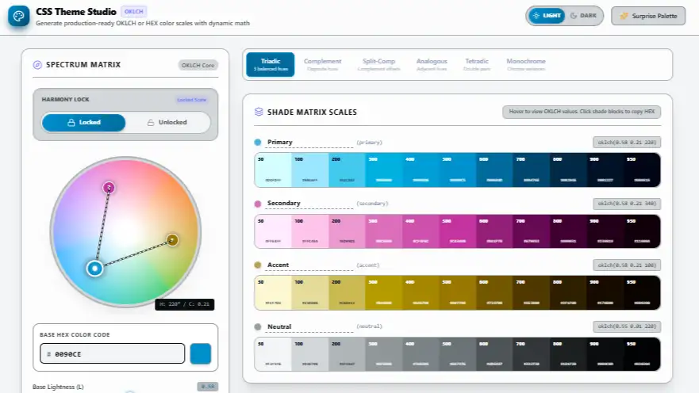

# CSS Variabelen

Naarmate een website groeit, groeit ook de hoeveelheid CSS-code. Bepaalde waarden, zoals de merkkleur van je organisatie, achtergrondtinten, vaste lettertypefamilies of standaard tussenruimtes, komen vaak tientallen keren terug op verschillende plaatsen in je stijlblad.

Wanneer de huisstijl verandert, moet je zonder variabelen al die regels handmatig opsporen en aanpassen. Dit is tijdrovend en foutgevoelig. Met **CSS Variabelen** (officieel *CSS Custom Properties*) sla je waarden op één centrale plek op en hergebruik je ze overal in je stijlblad.

## Leerdoelen

Na dit hoofdstuk kan je:

- Het nut en de voordelen van CSS Variabelen toelichten (consistentie, onderhoudbaarheid en het DRY-principe: *Don't Repeat Yourself*)
- CSS-variabelen globaal declareren met de `--naam`-syntaxis in de `:root`-pseudoklasse
- Variabelen oproepen en hergebruiken met de functie `var()`
- Een terugvalwaarde (fallback) voorzien in de `var()`-functie
- Het verschil uitleggen tussen een globaal bereik (`:root`) en een lokaal bereik
- Lokale variabelen overschrijven om modulaire componentvarianten te ontwerpen
- Eenvoudige berekeningen maken met variabelen via de `calc()`-functie

## Waarom CSS Variabelen?

In traditionele CSS herhaal je waarden telkens opnieuw:

```css
/* Zonder variabelen: dezelfde kleurcode staat overal herhaald */
h1 {
  color: #EC6639;
}

.knop {
  background-color: #EC6639;
  border: 2px solid #EC6639;
}

.kaart-rand {
  border-top: 4px solid #EC6639;
}
```

Als Thomas More beslist om de oranje merkkleur lichtjes aan te passen, moet je elk van die regels apart wijzigen. Met CSS Variabelen definieer je de kleur één keer en roep je die overal op:

```css
/* Met variabelen: de kleur staat op één centrale plek */
:root {
  --tm-oranje: #EC6639;
}

h1 {
  color: var(--tm-oranje);
}

.knop {
  background-color: var(--tm-oranje);
  border: 2px solid var(--tm-oranje);
}

.kaart-rand {
  border-top: 4px solid var(--tm-oranje);
}
```

Wijzig je nu de waarde in `:root`, dan past de hele website zich ogenblikkelijk aan.

## Syntaxis: Declareren en Oproepen

Het werken met CSS-variabelen verloopt altijd in twee stappen: declareren en oproepen.

### 1. Een variabele declareren: `--naam`

De naam van een CSS-variabele begint **altijd verplicht met twee koppeltekens (`--`)**:

```css
--hoofdkleur: #1e2d5a;
--accentkleur: #EC6639;
--basis-ruimte: 1rem;
--hoofd-font: Verdana, Geneva, sans-serif;
```

::: warning Hoofdlettergevoelig
CSS-variabelen zijn hoofdlettergevoelig (case-sensitive). `--merkkleur`, `--Merkkleur` en `--MERKKLEUR` zijn drie verschillende variabelen. Maak er een vaste gewoonte van om altijd kleine letters en koppeltekens te gebruiken (kebab-case).
:::

### 2. Een variabele oproepen: `var()`

Om de opgeslagen waarde te gebruiken als instelling voor een CSS-eigenschap, gebruik je de functie `var()`:

```css
p {
  color: var(--hoofdkleur);
  font-family: var(--hoofd-font);
}

.banner {
  padding: var(--basis-ruimte);
  border: 2px solid var(--accentkleur);
}
```

### Terugvalwaarde (Fallback)

Soms kan het gebeuren dat een variabele niet geladen of gedefinieerd is. In de `var()`-functie kan je als tweede parameter een **terugvalwaarde** meegeven, gescheiden door een komma:

```css
.badge {
  /* Als --badge-kleur niet bestaat, gebruikt de browser #1e2d5a */
  background-color: var(--badge-kleur, #1e2d5a);
}
```

## Bereik (Scope): Globaal versus Lokaal

Waar je een variabele declareert, bepaalt in welke elementen van de webpagina je die variabele kan gebruiken. Dit noemen we het **bereik** of de **scope**.

### Globaal bereik: `:root`

In veruit de meeste gevallen declareer je je variabelen in de `:root`-pseudoklasse:

```css
:root {
  --kleur-primair: #1e2d5a;
  --kleur-accent: #EC6639;
  --kleur-achtergrond: #f8fafc;
  --rand-radius: 0.5rem;
}
```

De selector `:root` verwijst naar het hoogste element in de HTML-structuur (het `<html>`-element). Variabelen die je hier declareert, worden **geërfd door elk HTML-element** op de pagina. Ze zijn dus overal beschikbaar.

### Lokaal bereik: Binnen een specifieke selector

Wanneer je een variabele declareert binnen een specifieke selector (bijvoorbeeld een klasse), is die variabele **alleen geldig binnen dat element en zijn kind-elementen**:

```css
.speciale-sectie {
  --tekst-kleur: #d97706;
  color: var(--tekst-kleur);
}

/* Buiten .speciale-sectie is --tekst-kleur niet bekend */
p {
  color: var(--tekst-kleur, #333333); /* Valt terug op #333333 */
}
```

Hieronder zie je in een interactieve sandbox hoe centraal themabeheer met `:root` in de praktijk werkt:

<CodeSandbox
  title="Themabeheer met CSS Variabelen in :root"
  height="480px"
  highlightHtml=""
  highlightCss=""
  highlightJs=""
  css="/*Universele resetter*/
- {
  box-sizing: border-box;
  margin: 0;
  padding: 0;
}
/*Centrale variabelen in :root */
:root {
  --hoofdkleur: #1e2d5a;
  --accentkleur: #EC6639;
  --achtergrond: #f8fafc;
  --tekstkleur: #222222;
  --basis-padding: 1.25rem;
  --kaart-radius: 0.5rem;
}
/* Basisopmaak van de pagina */
body {
  font-family: Verdana, Geneva, sans-serif;
  line-height: 1.5;
  padding: 1.5rem;
  background-color: #ffffff;
  color: var(--tekstkleur);
}
/* Informatiekaart voor Campus Geel */
.kaart {
  width: 100%;
  max-width: 24rem;
  background-color: var(--achtergrond);
  border: 2px solid var(--hoofdkleur);
  border-radius: var(--kaart-radius);
  padding: var(--basis-padding);
}
/* Titel binnen de kaart */
.kaart h3 {
  color: var(--hoofdkleur);
  margin-bottom: 0.5rem;
}
/* Knop binnen de kaart*/
.knop {
  margin-top: 1rem;
  padding: 0.5rem 1rem;
  background-color: var(--accentkleur);
  color: #ffffff;
  border: none;
  border-radius: var(--kaart-radius);
  font-size: 0.9rem;
}"
  html="<!DOCTYPE html>
<html lang=&quot;nl&quot;>
<head>
  <meta charset=&quot;UTF-8&quot;>
  <meta name=&quot;viewport&quot; content=&quot;width=device-width, initial-scale=1.0&quot;>
  <title>CSS Variabelen Demo</title>
  <link rel=&quot;stylesheet&quot; href=&quot;stijl.css&quot;>
</head>
<body>
  <!-- Kaart van Thomas More Campus Geel -->
  <div class=&quot;kaart&quot;>
    <h3>Thomas More Campus Geel</h3>
    <p>Ontdek onze IT-opleidingen en ervaar praktijkgericht onderwijs op onze groene campus.</p>
    <button class=&quot;knop&quot;>Meer informatie</button>
  </div>
</body>
</html>"
/>

::: tip Zelf experimenteren in de sandbox
Pas in het tabblad `CSS` van de bovenstaande sandbox de waarden in `:root` eens aan. Verander bijvoorbeeld `--accentkleur` naar een andere kleur of verhoog `--kaart-radius` naar `1.5rem`. Je ziet meteen hoe zowel de kaart als de knop automatisch mee veranderen!
:::

## Modulaire Componenten: Variabelen Overschrijven

Een van de krachtigste toepassingen van CSS-variabelen is het ontwerpen van **modulaire componenten** met stijlvarianten.

Stel dat je knoppen wil ontwerpen: een gewone knop, een succesknop en een waarschuwingsknop. In plaats van alle eigenschappen (`padding`, `border-radius`, `font-family`) telkens te herhalen, definieer je een basisknop met variabelen. De specifieke varianten hoeven alleen de kleurvariabele te overschrijven:

```css
/* Basisknop met lokale variabelen */
.knop {
  --knop-bg: #1e2d5a;
  --knop-tekst: #ffffff;
  
  background-color: var(--knop-bg);
  color: var(--knop-tekst);
  padding: 0.6rem 1.2rem;
  border: 2px solid var(--knop-bg);
  border-radius: 0.35rem;
}

/* Variant 1: Oranje accentknop */
.knop-accent {
  --knop-bg: #EC6639;
}

/* Variant 2: Groene succesknop */
.knop-succes {
  --knop-bg: #10b981;
}

/* Variant 3: Omlijnde knop (outline) */
.knop-omlijnd {
  --knop-bg: transparent;
  --knop-tekst: #1e2d5a;
  border-color: #1e2d5a;
}
```

In de onderstaande sandbox zie je dit principe in actie:

<CodeSandbox
  title="Componentvarianten via variabelen"
  height="440px"
  highlightHtml=""
  highlightCss="21-23,36,40,44-46"
  highlightJs=""
  activeCodeTab="css"
  css='/* Universele resetter */
* {
  box-sizing: border-box;
  margin: 0;
  padding: 0;
}
/* Paginastijl */
body {
  font-family: Verdana, Geneva, sans-serif;
  line-height: 1.5;
  padding: 1.5rem;
  background-color: #f8fafc;
}
/* Titel */
h3 {
  margin-bottom: 1.25rem;
  color: #1e2d5a;
}
/* Basisknop */
.knop {
  --bg-kleur: #1e2d5a;
  --tekst-kleur: #ffffff;
  --rand-kleur: var(--bg-kleur);

  background-color: var(--bg-kleur);
  color: var(--tekst-kleur);
  border: 2px solid var(--rand-kleur);
  border-radius: 0.4rem;
  padding: 0.6rem 1.2rem;
  margin-right: 0.5rem;
  margin-bottom: 0.75rem;
  font-size: 0.9rem;
}
/* Primaire variant */
.knop-primair {
  --bg-kleur: #EC6639;
}
/* Succes variant */
.knop-succes {
  --bg-kleur: #10b981;
}
/* Subtiele omlijnde variant */
.knop-omlijnd {
  --bg-kleur: transparent;
  --tekst-kleur: #1e2d5a;
  --rand-kleur: #1e2d5a;
}'
  html='<!DOCTYPE html>
<html lang="nl">
<head>
  <meta charset="UTF-8">
  <meta name="viewport" content="width=device-width, initial-scale=1.0">
  <title>Knoppen Varianten</title>
  <link rel="stylesheet" href="stijl.css">
</head>
<body>
  <h3>Knopvarianten met CSS Variabelen</h3>
  <button class="knop">Standaard</button>
  <button class="knop knop-primair">Inschrijven</button>
  <button class="knop knop-succes">Bevestigen</button>
  <button class="knop knop-omlijnd">Annuleren</button>
</body>
</html>'
/>

## Rekenen met Variabelen: `calc()`

CSS beschikt over een ingebouwde rekenfunctie: `calc()`. Met `calc()` kan je optellen (`+`), aftrekken (`-`), vermenigvuldigen (`*`) en delen (`/`).

In combinatie met CSS-variabelen kan je hiermee consistente, dynamische verhoudingen opbouwen:

```css
:root {
  --basis-ruimte: 1rem;
}

/* Dubbele binnenruimte op grotere panelen */
.groot-paneel {
  padding: calc(var(--basis-ruimte) * 2); /* 2rem */
}

/* Halve marge tussen compacte elementen */
.compact-element {
  margin-bottom: calc(var(--basis-ruimte) / 2); /* 0.5rem */
}
```

::: warning Spaties rond rekenoperatoren
Bij optellen (`+`) en aftrekken (`-`) binnen `calc()` zijn **spaties aan weerszijden verplicht**:
- Goed: `calc(100% - 2rem)`
- Fout: `calc(100%-2rem)` (de browser herkent dit als een foutieve waarde)
:::

## Goede Gewoontes en Naamgeving

Om je stylesheet overzichtelijk en onderhoudbaar te houden, pas je best deze richtlijnen toe:

1. **Gebruik betekenisvolle, semantische namen:**
   - Goed: `--kleur-primair`, `--kleur-achtergrond`, `--tekst-gedempt`
   - Vermijd: `--oranje`, `--blauwe-knop` (als je beslist om het kleurenthema te wijzigen naar groen, klopt de variabelenaam `--oranje` niet meer!)
2. **Groepeer je variabelen bovenaan in `:root`:**
   Plaats al je themavariabelen overzichtelijk bij elkaar in het begin van je externe stylesheet, gerangschikt per categorie (kleuren, typografie, tussenruimtes, afrondingen).
3. **Schrijf consequent in kleine letters:**
   Gebruik `kebab-case` met duidelijke streepjes, bijvoorbeeld `--kaart-padding-groot`.

::: tip Handige webapp: CSS Theme Studio
Wil je snel een consistent kleurenpalet met CSS-variabelen genereren op basis van twee of meerdere basiskleuren? Met de interactieve webapp [CSS Theme Studio](https://css-theme-studio.netlify.app/) genereer je automatisch harmonieuze kleurgradaties en exporteer je direct kant-en-klare `:root`-variabelen voor je project.


:::


### Oefening 1: Een campus-huisstijl opzetten in `:root`

Bouw een centraal kleurenpalet voor de studentenraad van **Thomas More Campus Geel**:

1. Maak een `:root`-blok en definieer daarin de volgende variabelen:
   - `--campus-blauw: #1e2d5a;`
   - `--campus-oranje: #EC6639;`
   - `--campus-grijs: #f1f5f9;`
   - `--campus-radius: 0.75rem;`
2. Maak een `div` met de klasse `aankondiging`:
   - Gebruik `--campus-grijs` als achtergrondkleur.
   - Gebruik een linkerrand van `6px solid var(--campus-oranje)`.
   - Rond de overige hoeken af met `--campus-radius`.
   - Geef de titel binnenin de kleur `var(--campus-blauw)`.

### Oefening 2: Modulaire infokaarten met kleurvarianten

Ontwerp een herbruikbare notificatiekaart met variabelen:

1. Maak een basisklasse `.melding` met de variabelen:
   - `--accent-kleur: #1e2d5a;`
   - `--accent-bg: #f8fafc;`
2. Geef de basiskaart een padding van `1rem`, een achtergrondkleur `var(--accent-bg)` en een rand van `2px solid var(--accent-kleur)`.
3. Maak twee aanvullende modifier-klassen die **enkel** de twee variabelen overschrijven:
   - `.melding-succes`: overschrijft `--accent-kleur` naar `#10b981` en `--accent-bg` naar `#ecfdf5`.
   - `.melding-gevaar`: overschrijft `--accent-kleur` naar `#ef4444` en `--accent-bg` naar `#fef2f2`.
4. Plaats in je HTML drie alinea's met elk een andere variant en controleer of de opmaak automatisch mee verandert.

### Oefening 3: Dynamische tussenruimtes met `calc()`

1. Declareer in `:root` de variabele `--spatiëring: 1rem;`.
2. Maak een artikelcontainer `.artikel`:
   - Binnenruimte (padding): bereken met `calc()` de dubbele waarde van de spatiëring.
   - Ondermarge (`margin-bottom`): bereken met `calc()` anderhalve keer de waarde (`* 1.5`).
   - Rand (`border`): een dunne grijze rand met een radius berekend als de helft van de spatiëring (`/ 2`).
3. Pas vervolgens in `:root` de waarde van `--spatiëring` aan naar `1.25rem` en stel vast hoe alle tussenruimtes en afrondingen perfect in verhouding meeschalen.

