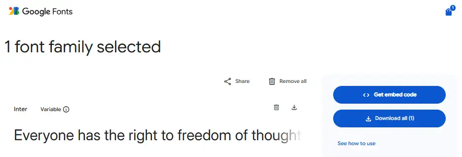
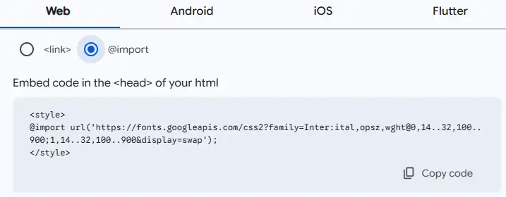
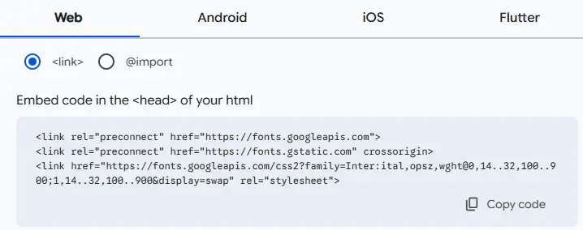

# Webfonts en Iconen

## Leerdoelen

Na dit hoofdstuk kan je:

- Uitleggen wat het voordeel is van een webfont tegenover standaardsysteemlettertypen
- De werking van de moderne Google Fonts CSS2 API met variabele lettertypen (Variable Fonts) en optische schaling (Optical Sizing) toelichten
- De afweging maken tussen koppelen via een HTML `<link>`-tag (laadsnelheid) en een CSS `@import`-regel (centraal beheer)
- De parameter `display=swap` in een Google Fonts koppeling verklaren in relatie tot de gebruikerservaring
- Font Awesome via een CDN integreren en pictogrammen oproepen met de juiste CSS-klassen
- Lucide Icons via een CDN koppelen en gebruiken op een webpagina
- Pictogrammen vormgeven met CSS-eigenschappen zoals `font-size`, `color` en `transition`
- Rekening houden met webtoegankelijkheid (WCAG) door decoratieve iconen te voorzien van `aria-hidden="true"`
- Emmet-sneltoetsen in PhpStorm toepassen om externe koppelingen en icoon-elementen snel te coderen


In het vorige hoofdstuk heb je geleerd hoe je tekst vormgeeft met standaard systeemlettertypen zoals Arial, Segoe UI en Georgia. Die systeemfonts hebben echter een grote beperking: ze worden enkel getoond wanneer ze toevallig al op de computer of smartphone van de bezoeker geïnstalleerd staan.

Wil je dat jouw website een unieke merkidentiteit uitstraalt en er op elk besturingssysteem (Windows, macOS, Android en iOS) identiek uitziet? Dan maak je gebruik van **webfonts** en **icon fonts**. In dit hoofdstuk ontdek je hoe je lettertypen van Google Fonts en pictogrammen van Font Awesome en Lucide eenvoudig koppelt en stijlt met CSS.


## Waarom Webfonts?

Een **webfont** is een lettertypebestand dat op een webserver staat en door de webbrowser van de bezoeker automatisch wordt gedownload tijdens het laden van de pagina.


- **Traditioneel systeemfont:**
Browser zoekt lettertype op de computer van de bezoeker -> Gevonden? Toon lettertype. Niet gevonden? Toon fallback.

- **Modern webfont:**
Browser downloadt lettertypebestand via het internet -> Lettertype wordt direct getoond op elk apparaat.

### De voordelen van webfonts

- **Consistente weergave:** Jouw titels en alinea's zien er op een Linux-laptop exact hetzelfde uit als op een iPhone of Windows-pc.
- **Sterke visuele identiteit:** Je bent niet gebonden aan de twintig standaardfonts die al sinds de jaren negentig op computers staan.
- **Geen installatie nodig voor de bezoeker:** De browser regelt het downloaden en cachen op de achtergrond.

::: tip Beperk het aantal lettertypen en gewichten
Elk lettertype en elk gewicht (zoals normaal, halfvet of vet) is een afzonderlijk bestand dat de browser moet downloaden. Gebruik op een website maximaal twee verschillende lettertypefamilies (bijvoorbeeld een karaktervol lettertype voor titels en een neutraal, goed leesbaar lettertype voor alinea's) en laad enkel de gewichten in die je werkelijk gebruikt.
:::


## Google Fonts en de Moderne CSS2 API

**Google Fonts** is de populairste en meest gebruikte lettertypebibliotheek op het internet. De dienst is volledig gratis, biedt meer dan 1500 open-source lettertypen en levert de bestanden via een wereldwijd netwerk van snelle servers (een Content Delivery Network of CDN).

Sinds de introductie van de **Google Fonts CSS2 API** (`/css2`) is de manier waarop webfonts werken fundamenteel vernieuwd. Waar je vroeger voor elke dikte een afzonderlijk bestand moest downloaden, levert Google Fonts vandaag standaard **variabele lettertypen (*Variable Fonts*)** met ingebouwde **optische schaling (*Optical Sizing*)**.

### Wat zijn variabele lettertypen (Variable Fonts)?

Bij traditionele lettertypen was elk gewicht een apart bestand:
- Wilde je een dunne variant (gewicht 300), een normale variant (400) en een vette kop (700)? Dan moest de browser drie afzonderlijke fontbestanden over het netwerk downloaden.
- Wilde je een subtiel tussenliggend gewicht (zoals 550)? Dat bestond simpelweg niet.

Een **variabel lettertype** lost dit op door alle mogelijke diktes samen te brengen in **één enkel compact bestand**:
- In plaats van losse bestanden bevat het fontbestand een vloeiend bereik van gewichten, meestal van ultradun (`100`) tot extra vet (`900`).
- Je kan in CSS niet alleen de standaardgewichten instellen, maar letterlijk elke gewenste waarde: `font-weight: 450;`, `font-weight: 550;` of `font-weight: 620;`.

### Wat is optische schaling (Optical Sizing: `opsz`)?

In de traditionele boekdrukkunst goot een letterzetter kleine letters voor krantenkolommen fysiek anders dan grote letters voor uithangborden:
- **Kleine letters (bv. 10pt of 12pt):** kregen dikkere stammen, wijdere binnenruimtes (*counters*) en ruimere spatiëring zodat de inkt niet dichtliep en de tekst haarscherp leesbaar bleef.
- **Grote letters (bv. 36pt of 72pt):** kregen juist fijne lijntjes, scherpe schreven en een hoog contrast tussen dik en dun om elegant en verfijnd te ogen.

De moderne Google Fonts CSS2 API brengt deze eeuwenoude techniek automatisch naar het web via de as **Optical Sizing (`opsz`)**:
- Wanneer je een variabel font inlaadt met `opsz`, past de browser de verhoudingen van de letters **volledig automatisch** aan op basis van de ingestelde `font-size`.
- Een kleine lettergrootte (zoals `13px`) wordt automatisch getoond met stevigere lijnen voor een rustige leesbaarheid, terwijl een grote kop van `40px` automatisch strakker en geraffineerder getoond wordt.
- In alle moderne webbrowsers staat dit standaard ingeschakeld via de CSS-eigenschap `font-optical-sizing: auto;`.

### De opbouw van een moderne Google Fonts URL

Wanneer je vandaag een lettertype zoals *Inter* selecteert:
* bezoek eerst [https://fonts.google.com/specimen/Inter](https://fonts.google.com/specimen/Inter)
* klik op de **Get font** knop
* daarna op het **Winkelmandje icoon** bovenaan rechts
* en tot slot op **Get Embedded code**

Dan genereert Google een link die er als volgt uitziet:



Genereert Google een link die er als volgt uitziet:

```text
https://fonts.googleapis.com/css2?family=Inter:ital,opsz,wght@0,14..32,100..900;1,14..32,100..900&display=swap
```

Deze URL bevat alle geavanceerde mogelijkheden in één compacte notatie:

| Onderdeel in de URL | Betekenis en functie |
|---|---|
| `/css2` | Geeft aan dat je de moderne v2 API van Google Fonts gebruikt. |
| `family=Inter` | De naam van de gekozen lettertypefamilie. |
| `:ital,opsz,wght` | De actieve assen van het variabele lettertype, verplicht in alfabetische volgorde: cursief (`ital`), optische schaling (`opsz`) en gewicht (`wght`). |
| `@0,14..32,100..900` | Rechtopstaande tekst (`ital: 0`), met automatische optische schaling tussen 14px en 32px (`opsz: 14..32`), en alle gewichten van 100 tot 900 (`wght: 100..900`). |
| `;1,14..32,100..900` | Cursieve tekst (`ital: 1`), met exact hetzelfde bereik voor optische schaling en gewichten. |
| `&display=swap` | Zorgt dat de browser direct tekst toont in een reservelettertype en vloeiend wisselt zodra het webfont geladen is (geen onzichtbare tekst of FOIT). |


## Koppelen: `@import` in CSS versus `<link>` in HTML

Google toont in zijn interface twee manieren om een lettertype in te sluiten: via de HTML `<link>`-tag of via de CSS `@import`-regel. Welke methode geniet de voorkeur, en waarom?

Beide methoden zijn volwaardig en hebben elk een heel specifiek voordeel:

### Koppelen in CSS via `@import` (Beste voor centraal beheer)



Als je meerdere webpagina's hebt (bijvoorbeeld `index.html`, `opleiding.html`, `contact.html` en `projecten.html`) die allemaal hetzelfde stijlblad `stijl.css` delen, is `@import` bijzonder aantrekkelijk:

```css
/* stijl.css - verplicht helemaal op regel 1 */
@import url('https://fonts.googleapis.com/css2?family=Inter:ital,opsz,wght@0,14..32,100..900;1,14..32,100..900&family=Poppins:wght@600;700&display=swap');

body {
  font-family: 'Inter', sans-serif;
}

h1, h2, h3 {
  font-family: 'Poppins', sans-serif;
}
```

#### Het grote voordeel van `@import`: Centraal beheer (DRY)
- **Eén enkele plek:** Je hoeft de koppeling slechts op één centrale plaats te beheren, namelijk bovenaan jouw CSS-bestand.
- **Eenvoudig wisselen:** Beslis je later om een ander lettertype te gebruiken, dan pas je één regel aan in `stijl.css` en jouw **volledige website** verandert onmiddellijk mee. Je hoeft niet door tientallen HTML-bestanden te bladeren om overal `<link>`-tags te vervangen.
- **Plaatsingsregel:** Een `@import`-regel moet altijd verplicht op de **allereerste regel** van je CSS-bestand staan, vóór alle andere stijlregels.

### Koppelen in HTML via `<link>` (Beste voor maximale laadsnelheid)



Waarom raadt Google in zijn interface dan toch de HTML `<link>`-methode aan? Dat heeft te maken met pure netwerkprestaties en laadtijd:

```html
<head>
  <meta charset="UTF-8">
  <meta name="viewport" content="width=device-width, initial-scale=1.0">
  <title>Mijn Webpagina</title>

  <!-- 1. Snellere verbinding opzetten naar de Google fontservers -->
  <link rel="preconnect" href="https://fonts.googleapis.com">
  <link rel="preconnect" href="https://fonts.gstatic.com" crossorigin>

  <!-- 2. Het lettertypebestand parallel downloaden -->
  <link href="https://fonts.googleapis.com/css2?family=Inter:ital,opsz,wght@0,14..32,100..900;1,14..32,100..900&family=Poppins:wght@600;700&display=swap" rel="stylesheet">

  <!-- 3. Jouw eigen stijlblad -->
  <link rel="stylesheet" href="stijl.css">
</head>
```

#### Waarom `<link>` technisch sneller is: Het vermijden van een waterval
- **Parallel downloaden:** Zodra de browser de HTML-pagina binnenkrijgt, ziet hij de `<link>`-tags meteen in de `<head>` staan. De browser kan het lettertypebestand onmiddellijk en gelijktijdig (parallel) met jouw eigen stylesheet downloaden.
- **Snellere handshake met `preconnect`:** De twee regels met `rel="preconnect"` geven de browser de opdracht om alvast de DNS-opzoeking en beveiligde TLS-verbinding naar `fonts.googleapis.com` en `fonts.gstatic.com` uit te voeren nog vóór de rest van de pagina verwerkt is.
- **Het nadeel van `@import` (de waterval):** Bij `@import` ontstaat een kettingreactie. De browser moet eerst `index.html` ophalen, dan `stijl.css` downloaden en ontcijferen, ontdekt dán pas de `@import`-regel, haalt dán pas het CSS-bestand van Google op, en downloadt pas daarna het eigenlijke fontbestand. Op een trage mobiele verbinding kan dit een merkbare vertraging opleveren bij het eerste tonen van de pagina (*Largest Contentful Paint*).

::: tip Welke methode kies je in de praktijk?
- **Voor schoolprojecten, oefeningen en kleinere websites:** Kies gerust voor **`@import` in CSS**. Het voordeel van centraal beheer op één centrale plek weegt in deze fase ruimschoots op tegen de fractie van een seconde laadtijdverschil.
- **Voor grote, professionele productiewebsites:** Kies voor **`<link>` in HTML** met `preconnect` voor maximale prestaties en een optimale score in Google PageSpeed Insights.
:::


## Het lettertype toepassen in CSS

Zodra het variabele lettertype gekoppeld is, pas je het toe met `font-family`. Dankzij de CSS2 API kan je nu elk denkbaar gewicht kiezen:

```css
h1 {
  font-family: 'Poppins', sans-serif;
  font-weight: 700;
}

body {
  font-family: 'Inter', sans-serif;
  /* Normale lopende tekst */
  font-weight: 400;
  /* Optische schaling staat standaard automatisch aan: */
  font-optical-sizing: auto;
}

/* Een iets steviger gewicht voor een tussenkop zonder meteen 'bold' te zijn: */
.subtitel {
  font-weight: 550;
}
```

### Interactief voorbeeld: Webfonts en typografie in actie

In de onderstaande simulator experimenteer je interactief met moderne Google Fonts v2 (*Inter*, *Roboto*, *Poppins*) én klassieke systeemlettertypen (*Verdana*, *Arial*, *Georgia*, *Trebuchet MS*, *Consolas*) in combinatie met alle typografische eigenschappen die je in dit en het vorige hoofdstuk hebt geleerd.

Kies een lettertype uit de keuzelijst, wissel tussen de hoofdtitel (`<h1>`) en de alinea (`<p>`), en ontdek direct:
- Hoe vlot variabele gewichten (`font-weight`) traploos meeschalen bij Google Fonts v2 ten opzichte van vaste stappen bij systeemfonts;
- Waarom lettertypen bij exact dezelfde `font-size` toch merkbaar groter of compacter ogen (door verschillen in x-hoogte en letterbreedte);
- Waarom `font-variant: small-caps` wél direct werkt bij klassieke systeemlettertypen, maar weggelaten is uit de geoptimaliseerde bestanden van Google Fonts;
- Welke CSS-code er live gegenereerd wordt voor jouw instellingen.

<GoogleFontsSimulator />


## Iconen op het web: Font Awesome via CDN

Naast tekstuele lettertypen heb je op websites vaak nood aan kleine grafische symbolen: een telefoontje, een envelop, een locatieprikker of social-media logo's. In plaats van voor elk symbool een afzonderlijke afbeelding in te laden, gebruik je een **icon font**.

Een icon font bevat geen letters zoals A of B, maar vector-pictogrammen. Omdat een icoonfont technisch gezien een lettertype is, kan je de grootte en kleur ervan eenvoudig bepalen met vertrouwde CSS-eigenschappen zoals `font-size` en `color`.

### Font Awesome koppelen via CDN

De bekendste icoonbibliotheek is **Font Awesome**. Je kan de gratis versie van [Font Awesome](https://fontawesome.com/icons ) eenvoudig inladen via een betrouwbare CDN (zoals cdnjs) door de onderstaande `@import`-regel bovenaan jouw CSS-bestand te plaatsen:

```css
@import url('https://cdnjs.cloudflare.com/ajax/libs/font-awesome/7.3.1/css/all.min.css');
```

Je kan dezelfde link ook als een `<link>`-tag in de `<head>` van jouw HTML opnemen:

```html
<link rel="stylesheet" href="https://cdnjs.cloudflare.com/ajax/libs/font-awesome/7.3.1/css/all.min.css">
```

### Pictogrammen oproepen in HTML

Font Awesome pictogrammen plaats je in HTML standaard met het `<i>`-element (afkorting voor *icon*). Aan dat element geef je twee CSS-klassen mee:

1. **De stijlklasse:**
   - `fa-solid`: voor volle, gevulde pictogrammen (zoals een gesloten envelop of huis).
   - `fa-regular`: voor omlijnde pictogrammen.
   - `fa-brands`: voor bedrijfs- en merknamen (zoals GitHub, LinkedIn of YouTube).
2. **De pictogramklasse:** de specifieke naam van het gewenste icoon, voorafgegaan door `fa-`.

```html
<!-- Een open huis-icoon -->
<i class="fa-regular fa-house"></i>

<!-- Een open e-mail envelop -->
<i class="fa-regular fa-envelope"></i>

<!-- Een gevuld huis-icoon -->
<i class="fa-solid fa-house"></i>

<!-- Een gevuld e-mail envelop -->
<i class="fa-solid fa-envelope"></i>

<!-- Een locatieprikker -->
<i class="fa-solid fa-location-dot"></i>

<!-- Een telefoon -->
<i class="fa-solid fa-phone"></i>

<!-- Een GitHub-icoon -->
<i class="fa-brands fa-github"></i>

<!-- Een WhatsApp icoon -->
<i class="fa-brands fa-whatsapp"></i>
```

### Interactief voorbeeld: Font Awesome via CDN

In dit voorbeeld zie je hoe Font Awesome iconen worden geïmporteerd in CSS en de iconen uit bovenstaand voorbeeld worden weergegeven.


```css
@import url('https://cdnjs.cloudflare.com/ajax/libs/font-awesome/7.3.1/css/all.min.css');
@import url('https://fonts.googleapis.com/css2?family=Segoe+UI:wght@400;600;700&display=swap');

body {
  font-family: 'Segoe UI', Tahoma, Geneva, Verdana, sans-serif;
  background-color: #f8fafc;
  color: #334155;
}

i {
  color: #e87722;
}
```

<CodeSandbox
  title="Font Awesome via CDN"
  height="480px"
  activeCodeTab="css"
  css="@import url('https://cdnjs.cloudflare.com/ajax/libs/font-awesome/7.3.1/css/all.min.css');
@import url('https://fonts.googleapis.com/css2?family=Segoe+UI:wght@400;600;700&display=swap');

body {
  font-family: 'Segoe UI', Tahoma, Geneva, Verdana, sans-serif;
  font-size: 16px;
}

h1 {
  font-size: 1.5rem;
}

i {
  color: #eb6363ff;
  font-size: 2rem;
}"
  html="<!DOCTYPE html>
<html lang=&quot;nl&quot;>
<head>
  <meta charset=&quot;UTF-8&quot;>
  <title>Font Awesome Voorbeeld</title>
  <link rel=&quot;stylesheet&quot; href=&quot;stijl.css&quot;>
</head>
<body>
  <h1>Font Awesome Voorbeeld</h1>
  <i class=&quot;fa-regular fa-house&quot;></i>
  <i class=&quot;fa-regular fa-envelope&quot;></i>
  <i class=&quot;fa-solid fa-house&quot;></i>
  <i class=&quot;fa-solid fa-envelope&quot;></i>
  <i class=&quot;fa-solid fa-location-dot&quot;></i>
  <i class=&quot;fa-solid fa-phone&quot;></i>
  <i class=&quot;fa-brands fa-github&quot;></i>
  <i class=&quot;fa-brands fa-whatsapp&quot;></i>
</body>
</html>"
/>


## Moderne Iconen: Lucide Icons via CDN

Waar Font Awesome vaak gevulde, robuuste vormen hanteert, kiezen veel moderne webapplicaties en dashboards voor **Lucide Icons**. [Lucide](https://lucide.dev/icons/) is een open-source collectie van elegante, minimalistische lijniconen (*outline icons*) die allemaal dezelfde subtiele lijndikte hebben.

### Lucide Icons koppelen via CDN

Je kan de lettertypeversie van Lucide direct in jouw CSS importeren via het officiële jsDelivr CDN:

```css
@import url('https://cdn.jsdelivr.net/npm/lucide-static@latest/font/lucide.min.css');
```

### Pictogrammen oproepen in HTML

In Lucide beginnen alle icoonklassen met het voorvoegsel `icon-`, gevolgd door de naam van het symbool:

```html
<!-- E-mail envelop -->
<i class="icon-mail"></i>

<!-- Telefoonhoorn -->
<i class="icon-phone"></i>

<!-- Locatie speld -->
<i class="icon-map-pin"></i>

<!-- Vinkje ter bevestiging -->
<i class="icon-check"></i>

<!-- Zoekvergrootglas -->
<i class="icon-search"></i>

<!-- Kalender -->
<i class="icon-calendar"></i>
```

### Interactief voorbeeld: Lucide Icons in actie

Bekijk in dit voorbeeld hoe de strakke Lucide lijniconen gebruikt worden:

```css
@import url('https://cdn.jsdelivr.net/npm/lucide-static@latest/font/lucide.min.css');
@import url('https://fonts.googleapis.com/css2?family=Plus+Jakarta+Sans:ital,wght@0,200..800;1,200..800&display=swap');

body {
  font-family: &quot;Plus Jakarta Sans&quot;, sans-serif;
  font-optical-sizing: auto;
  font-size: 16px;
}

h1 {
  font-weight: 600;
  font-size: 1.5rem;
}

i {
  color: #e87722;
  font-size: 2rem !important;
}
```

<CodeSandbox
  title="Lucide Icons via CDN"
  height="480px"
  activeCodeTab="css"
  css="@import url('https://cdn.jsdelivr.net/npm/lucide-static@latest/font/lucide.min.css');
@import url('https://fonts.googleapis.com/css2?family=Plus+Jakarta+Sans:ital,wght@0,200..800;1,200..800&display=swap');

body {
  font-family: &quot;Plus Jakarta Sans&quot;, sans-serif;
  font-optical-sizing: auto;
  font-size: 16px;
}

h1 {
  font-weight: 600;
  font-size: 1.5rem;
}

i {
  color: #e87722;
  font-size: 2rem !important;
}"
  html="<!DOCTYPE html>
<html lang=&quot;nl&quot;>
<head>
  <meta charset=&quot;UTF-8&quot;>
  <title>Lucide Icons Voorbeeld</title>
  <link rel=&quot;stylesheet&quot; href=&quot;stijl.css&quot;>
</head>
<body>
  <h1>Lucide Voorbeelden</h1>
  <i class=&quot;icon-mail&quot;></i>
  <i class=&quot;icon-phone&quot;></i>
  <i class=&quot;icon-map-pin&quot;></i>
  <i class=&quot;icon-check&quot;></i>
  <i class=&quot;icon-search&quot;></i>
  <i class=&quot;icon-calendar&quot;></i>
</body>
</html>"
/>


## Toegankelijkheid (WCAG) bij iconen

Wanneer je iconen gebruikt op een webpagina, moet je rekening houden met bezoekers die gebruikmaken van een schermlezer (*screen reader*). Er zijn twee situaties die je altijd moet onderscheiden:

### Decoratieve iconen (met zichtbare tekst ernaast)

Staat er naast het icoon al een duidelijke tekst voor ziende bezoekers (bijvoorbeeld een envelopje voor het woord "Contact")? Dan is het pictogram puur **decoratief**.

Als je niets doet, zal een schermlezer proberen het teken uit te spreken of een onbegrijpelijke tekenreeks voorlezen. Voeg daarom altijd het attribuut `aria-hidden="true"` toe aan het icoon-element:

```html
<!-- GOED: Schermlezer negeert het icoon en leest netjes enkel de tekst voor -->
<a href="mailto:info@thomasmore.be">
  <i class="fa-solid fa-envelope" aria-hidden="true"></i> E-mail ons
</a>
```

### Functionele iconen (zonder zichtbare tekst)

Bestaat een knop of hyperlink uitsluitend uit een pictogram (bijvoorbeeld een vergrootglas voor een zoekbalk of een kruisje om een venster te sluiten)? Dan is het pictogram **functioneel**.

Een blinde bezoeker weet in dat geval niet wat de knop doet. Je lost dit op door een `aria-label` toe te kennen aan het interactieve ouder-element:

```html
<!-- GOED: De knop heeft een duidelijke betekenis voor schermlezers -->
<button type="button" aria-label="Zoeken in de website">
  <i class="fa-solid fa-magnifying-glass" aria-hidden="true"></i>
</button>

<!-- GOED: Social-media link zonder zichtbare tekst -->
<a href="https://github.com" aria-label="Volg ons op GitHub">
  <i class="fa-brands fa-github" aria-hidden="true"></i>
</a>
```

::: tip De gouden regel voor iconen
Onthoud deze eenvoudige regel: heeft het icoon al zichtbare tekst naast zich? Voeg `aria-hidden="true"` toe aan het `<i>`-element. Staat het icoon helemaal alleen in een link of knop? Voeg `aria-label="..."` toe aan de link of knop, én zet `aria-hidden="true"` op het `<i>`-element.
:::


## Oefeningen

### Oefening 1: Typografie upgraden met Google Fonts

1. Maak een HTML-pagina aan met een hoofdtitel (`<h1>`), een subtitel (`<h2>`) en twee alinea's (`<p>`).
2. Surf naar Google Fonts en zoek twee passende lettertypen:
   - Een karaktervol lettertype voor de titels (bijvoorbeeld *Montserrat*, *Raleway* of *Oswald*).
   - Een rustig, schreefloos lettertype voor de alinea's (bijvoorbeeld *Open Sans*, *Inter* of *Roboto*).
3. Koppel de lettertypen via de `<link>`-methode in de `<head>` van jouw HTML-document. Vergeet de twee `rel="preconnect"` regels niet.
4. Stel in jouw CSS-bestand de juiste `font-family` regels in voor de titels en de alinea's. Zorg voor een correcte fallback familie (zoals `sans-serif`).
5. Controleer in de browser of de lettertypen correct geladen worden.

### Oefening 2: Contactkaart voor Campus Geel met Font Awesome

1. Maak een contactkaart aan voor Thomas More Campus Geel met het adres **Kleinhoefstraat 4, 2440 Geel**.
2. Koppel Font Awesome via de CDN-link bovenaan jouw CSS-bestand (`@import url('https://cdnjs.cloudflare.com/ajax/libs/font-awesome/7.3.1/css/all.min.css');`).
3. Voeg de volgende items toe, telkens met het bijbehorende Font Awesome icoon:
   - Locatie: `fa-solid fa-location-dot`
   - Telefoonnummer: `fa-solid fa-phone`
   - E-mailadres: `fa-solid fa-envelope`
   - Website of opleiding: `fa-solid fa-globe` of `fa-solid fa-graduation-cap`
4. Zorg ervoor dat alle decoratieve iconen voorzien zijn van `aria-hidden="true"`.
5. Geef de iconen via CSS een eigen kleur (bijvoorbeeld oranje `#e87722`), stel een geschikte `font-size` in en lijn de tekst netjes uit.
6. Voeg onderaan twee knoppen toe voor sociale media (bijvoorbeeld GitHub en LinkedIn) en voorzie deze van een correct `aria-label`.

