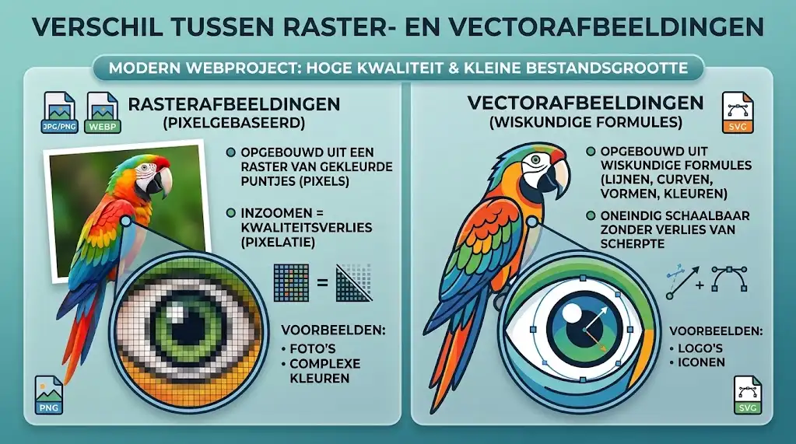

# Afbeeldingen

Afbeeldingen maken een website visueel aantrekkelijk, verduidelijken complexe uitleg en versterken de huisstijl van een merk. Tegelijk kunnen slecht gekozen of te zware afbeeldingen een surfer mateloos frustreren door trage laadtijden of verspringende pagina-inhoud. In dit hoofdstuk leer je hoe je afbeeldingen technisch correct, performant en toegankelijk integreert.

## Leerdoelen

Na dit hoofdstuk kan je:

- Afbeeldingen invoegen in een webpagina met het ``-element
- De verplichte attributen `src` en `alt` correct en toegankelijk toepassen
- De afmetingen van een afbeelding vastleggen met `width` en `height` om lay-outverschuivingen te voorkomen
- Het `loading="lazy"`-attribuut gebruiken om de laadtijd van webpagina's te optimaliseren
- De belangrijkste afbeeldingsformaten voor het web vergelijken (WebP, SVG, PNG, JPEG) en het juiste formaat kiezen
- Het verschil uitleggen tussen document-relatieve paden en absolute paden
- Afbeeldingen semantisch groeperen en voorzien van een bijschrift met `<figure>` en `<figcaption>`
- Een favicon toevoegen aan de `<head>` van een webpagina met `<link>` en het verschil uitleggen tussen `favicon.ico`, PNG en SVG
- De beeldverhouding van afbeeldingen bewaken met behulp van AspectSnap en Photo Edit Pro

## Het ``-element

Om een afbeelding op een webpagina te tonen, gebruik je het ``-element (image).

```html

```

Het ``-element heeft een aantal specifieke eigenschappen:

- **Leeg element (void element):** Een ``-tag heeft geen sluitingstag (`</img>` bestaat niet). Het element bevat immers geen tekstinhoud, maar laadt een extern bestand in.
- **Inline-element:** Standaard gedraagt een afbeelding zich als een inline-element. Ze blijft in de tekststroom staan en begint niet automatisch op een nieuwe regel.
- **Vervangend element (replaced element):** De uiteindelijke afmetingen en inhoud van het element worden bepaald door het externe bestand waarnaar je verwijst.

Plaats een ``-element bij voorkeur binnen een passend blokelement, zoals een alinea (`<p>`) of een semantische `<figure>`.

::: tip Sneltoets in PhpStorm
Typ `img` en druk op de `Tab`-toets. PhpStorm genereert automatisch `` en plaatst de cursor meteen tussen de aanhalingstekens van het `src`-attribuut.
:::

## Essentiële attributen van ``

Een afbeelding functioneert pas goed als je de juiste attributen meegeeft:

| Attribuut | Verplicht? | Beschrijving |
| --- | --- | --- |
| `src` | Verplicht | Verwijst naar de bron (source) van het afbeeldingsbestand. |
| `alt` | Verplicht | Bevat een alternatieve tekst voor schermlezers of wanneer het bestand niet kan laden. |
| `width` | Aanbevolen | De intrinsieke breedte van de afbeelding in pixels (zonder 'px'). |
| `height` | Aanbevolen | De intrinsieke hoogte van de afbeelding in pixels (zonder 'px'). |
| `loading` | Aanbevolen | Bepaalt wanneer de browser de afbeelding inlaadt (`lazy` of `eager`). |
| `title` | Optioneel | Toont een tooltip wanneer de bezoeker met de muis over de afbeelding beweegt. |

### Het `src`-attribuut

Het attribuut `src` staat voor *source* (bron). Hier vul je het adres in waar het afbeeldingsbestand te vinden is. Dit kan een relatief pad zijn naar een bestand binnen je eigen projectmap, of een absolute internetkoppeling naar een externe server.

```html

```

### Het `alt`-attribuut en toegankelijkheid

Het attribuut `alt` staat voor *alternative text* (alternatieve tekst). Dit attribuut is een verplicht onderdeel van de HTML-standaard en dient drie doelen:

1. **Toegankelijkheid (screenreaders):** Blinde en slechtziende bezoekers gebruiken een schermlezer die de pagina voorleest. De schermlezer leest de tekst van het `alt`-attribuut voor zodat de gebruiker weet wat er te zien is.
2. **Trage of haperende verbindingen:** Wanneer een afbeelding door een netwerkfout of een verkeerd pad niet geladen kan worden, toont de browser de alternatieve tekst op de plaats van de ontbrekende afbeelding.
3. **Zoekmachineoptimalisatie (<abbr title="Search Engine Optimization: technieken om webpagina's hoger te laten scoren in zoekmachines">SEO</abbr>):** Zoekmachines zoals Google kunnen beelden niet direct interpreteren en baseren zich op de `alt`-tekst om te begrijpen wat de afbeelding voorstelt.

::: tip Richtlijnen voor een sterke alt-tekst

- **Wees beknopt en beschrijvend:** Omschrijf wat er te zien is en waarom de afbeelding relevant is in de context van de alinea.
- **Vermijd overbodige woorden:** Schrijf niet "Foto van..." of "Afbeelding met...", want een schermlezer kondigt automatisch al aan dat het om een grafisch element gaat.
- **Decoratieve afbeeldingen:** Heeft een afbeelding louter een visuele functie (zoals een decoratief lijntje, een abstract patroon of een achtergrondvorm)? Gebruik dan een leeg attribuut: `alt=""`. De schermlezer weet dan dat het element mag worden overgeslagen. Laat het attribuut echter nooit weg, want zonder `alt`-attribuut zal de schermlezer vaak de ruwe bestandsnaam oplezen.
:::

```html
<!-- Goed: duidelijke beschrijving van de inhoud -->


<!-- Goed: decoratieve afbeelding wordt genegeerd door screenreaders -->


<!-- Fout: te vaag en dubbele vermelding -->

```

### De attributen `width` en `height`

Geef bij elke `` altijd de breedte en hoogte mee in pixels, maar **zonder** de toevoeging `px`:

```html

```

Waarom is dit belangrijk?

Wanneer een webpagina laadt, downloadt de browser eerst de HTML-tekst en pas daarna de zware afbeeldingsbestanden. Als de browser de afmetingen van de afbeeldingen niet kent, weet hij tijdens het opbouwen van de pagina niet hoeveel witruimte hij moet reserveren.

Zodra de afbeelding even later binnenkomt, moet de browser de hele pagina plotseling herberekenen en omlaag schuiven. Dit verschijnsel heet **<abbr title="Cumulative Layout Shift: een prestatie-maatstaf die meet hoeveel zichtbare inhoud onverwacht verschuift tijdens het laden van de pagina">Cumulative Layout Shift (CLS)</abbr>** en is bijzonder storend voor gebruikers die al aan het lezen waren.

Door `width` en `height` in de HTML vast te leggen, kan de browser vooraf de exacte beeldverhouding en benodigde ruimte reserveren. De pagina bouwt daardoor rustig en stabiel op.

::: info Hoe vind je de exacte afmetingen van een afbeelding?

- **In PhpStorm:** Beweeg je muisaanwijzer over de bestandsnaam van de afbeelding in je projectverkenner of in je HTML-code. PhpStorm toont een miniatuur met de exacte breedte en hoogte in pixels.
- **In Google Chrome:** Sleep het afbeeldingsbestand rechtstreeks in een leeg tabblad van Google Chrome. In de titelbalk van het tabblad zie je direct de afmetingen tussen haakjes staan (bijvoorbeeld `800x450`).
:::

### Luie laadtijd: `loading="lazy"`

Webpagina's bevatten vaak meerdere afbeeldingen, waarvan een deel pas zichtbaar wordt wanneer de bezoeker naar beneden scrollt (de inhoud *onder de vouw* of *below the fold*).

Met het attribuut `loading="lazy"` vertel je de browser om de afbeelding pas te downloaden wanneer ze bijna in het zichtveld van de bezoeker verschijnt:

```html

```

De voordelen van luie laadtijd:

- De initiële pagina laadt merkbaar sneller.
- Bezoekers op mobiele toestellen besparen aanzienlijk op hun mobiele databundel wanneer ze niet helemaal naar beneden scrollen.

::: warning Uitzondering voor afbeeldingen bovenaan de pagina
Plaats `loading="lazy"` **nooit** op de belangrijkste afbeelding die direct bij het openen van de pagina zichtbaar is (zoals een grote banner of herofoto). Voor die eerste afbeelding wil je immers dat de browser ze direct met de hoogste prioriteit ophaalt.
:::

<CanIUse feature="loading-lazy-attr" title="Browserondersteuning voor het loading=lazy attribuut" />

::: info Tijdelijke plaatsaanduidingen met Lorem Picsum
In de voorbeelden en oefeningen in deze cursus zie je regelmatig internetadressen die beginnen met `https://picsum.photos/`.

**Lorem Picsum** (bereikbaar via [picsum.photos](https://picsum.photos/)) is een handige, gratis webdienst die willekeurige of specifieke tijdelijke afbeeldingen (zogeheten *placeholders* of *dummy images*) levert. Je vraagt een afbeelding op door de gewenste breedte en hoogte in pixels achteraan aan het webadres toe te voegen:

- `https://picsum.photos/600/400`: levert een willekeurige foto van 600 bij 400 pixels.
- `https://picsum.photos/id/1018/600/400`: levert altijd dezelfde foto (met identificatienummer 1018) in het gewenste formaat.

We gebruiken deze dienst in de cursus als dummy-afbeeldingen, zodat je direct kan oefenen met realistische foto's en lay-outs zonder eerst handmatig bestanden te hoeven downloaden en opslaan.
:::

### Voorbeeld: Reeks afbeeldingen met attributen en lazy loading

Wanneer een webpagina slechts één afbeelding bevat die meteen in beeld staat, heeft `loading="lazy"` geen merkbaar effect. De browser moet die eerste afbeelding immers toch direct ophalen om ze aan de bezoeker te tonen.

Het effect van `loading="lazy"` wordt pas echt duidelijk wanneer je een langere pagina hebt met meerdere afbeeldingen onder elkaar:

- De eerste foto staat direct in het zicht (boven de vouw) en heeft **geen** `loading="lazy"`. De browser laadt deze foto onmiddellijk met de hoogste prioriteit.
- De overige vijf foto's staan lager op de pagina (onder de vouw) en zijn voorzien van `loading="lazy"`. De browser wacht met downloaden totdat je naar beneden scrollt en de foto's bijna in beeld komen.

```html
<!-- Eerste foto: direct in beeld, laadt onmiddellijk -->
<p>
  
</p>

<!-- Volgende foto's: lager op de pagina, laden pas tijdens het scrollen -->
<p>
  
</p>

<p>
  
</p>

<p>
  
</p>

<p>
  
</p>

<p>
  
</p>
```

<CodeSandbox
  title="Voorbeeld: Meerdere afbeeldingen met lazy loading"
  highlightHtml=""
  highlightCss=""
  highlightJs=""
  height="500px"
  html="<p>Scroll in het voorbeeldvenster naar beneden. De onderste vijf afbeeldingen hebben <code>loading=&quot;lazy&quot;</code> en worden pas opgevraagd zodra ze in beeld komen:</p>
<p><strong>Foto 1: Direct in beeld (eager / standaard)</strong></p>
<p></p>
<p><strong>Foto 2: Luie laadtijd (lazy)</strong></p>
<p></p>
<p><strong>Foto 3: Luie laadtijd (lazy)</strong></p>
<p></p>
<p><strong>Foto 4: Luie laadtijd (lazy)</strong></p>
<p></p>
<p><strong>Foto 5: Luie laadtijd (lazy)</strong></p>
<p></p>
<p><strong>Foto 6: Luie laadtijd (lazy)</strong></p>
<p></p>"
/>

## Afbeeldingsformaten voor het web

Niet elk afbeeldingsbestand is geschikt voor gebruik op het internet. Een modern webproject maakt gebruik van formaten die een hoge beeldkwaliteit combineren met een kleine bestandsgrootte.

We onderscheiden twee grote categorieën:

1. **<dfn title="Een afbeelding die is opgebouwd uit een vast raster van gekleurde beeldpunten (pixels), waardoor kwaliteitsverlies optreedt bij vergroten">Rasterafbeeldingen</dfn> (pixelgebaseerd):** De afbeelding is opgebouwd uit een raster van gekleurde puntjes (pixels). Wanneer je inzoomt op een rasterafbeelding, zie je de afzonderlijke blokjes en treedt er kwaliteitsverlies op.
2. **<dfn title="Een afbeelding opgebouwd uit wiskundige formules en vectoren (lijnen, vormen) die oneindig kan worden geschaald zonder enig kwaliteitsverlies">Vectorafbeeldingen</dfn>:** De afbeelding is opgebouwd uit wiskundige formules die lijnen, curven, vormen en kleuren beschrijven. Een vectorafbeelding kan oneindig worden vergroot of verkleind zonder enig verlies van scherpte.



### Overzichtstabel

| Formaat | Categorie | Transparantie | Compressie | Ideaal voor |
| --- | --- | --- | --- | --- |
| **WebP** | Raster | Ja (volledig) | Lossy en Lossless | Foto's, banners en algemene webillustraties |
| **<abbr title="Scalable Vector Graphics: het officiële W3C-vectorformaat voor schaalbare illustraties en logo's">SVG</abbr>** | Vector | Ja (volledig) | Wiskundig / Lossless | Logo's, iconen, pictogrammen en eenvoudige illustraties |
| **<abbr title="Portable Network Graphics: een rasterformaat met verliesvrije compressie en transparantie">PNG</abbr>** | Raster | Ja (volledig) | Lossless | Scherpe schermafbeeldingen en afbeeldingen met fijne tekst |
| **<abbr title="Joint Photographic Experts Group: het klassieke gecomprimeerde formaat voor digitale foto's">JPEG</abbr>** | Raster | Nee | Lossy | Klassiek fotoformaat (wordt vervangen door WebP) |
| **<abbr title="Graphics Interchange Format: historisch 8-bits formaat met maximaal 256 kleuren voor eenvoudige animaties">GIF</abbr>** | Raster | Beperkt (1 kleur) | Lossless (max. 256 kleuren) | Korte animaties (historisch) |

::: tip Richtlijnen voor bestandsgrootte

- Grote paginabanners of herofoto's: maximaal **100 tot 150 kB**.
- Gewone foto's in artikels: maximaal **50 tot 80 kB**.
- Kleine illustraties en logo's: maximaal **10 tot 30 kB**.
:::

<ImageFormatComparator />

### WebP: de moderne webstandaard

WebP is een afbeeldingsformaat dat speciaal voor het web werd ontwikkeld door Google. Het biedt superieure compressie in vergelijking met traditionele formaten:

- Een WebP-bestand is doorgaans **25% tot 35% kleiner** dan een vergelijkbaar JPEG- of PNG-bestand met dezelfde visuele kwaliteit.
- WebP ondersteunt zowel **lossy** compressie (voor foto's) als **lossless** compressie (voor scherpe illustraties).
- Het formaat ondersteunt een volledig **alfakanaal** voor vloeiende transparantie.
- WebP ondersteunt ook animaties, als veel lichter en kwalitatiever alternatief voor zware GIF-bestanden.

Moderne tools voor website-analyse, zoals Google Lighthouse in Chrome DevTools, raden WebP nadrukkelijk aan onder de noemer *Serve images in next-gen formats*.

<CanIUse feature="webp" title="Browserondersteuning voor het WebP-afbeeldingsformaat" />

### SVG: schaalbare vectorafbeeldingen

SVG staat voor *Scalable Vector Graphics*. In tegenstelling tot rasterafbeeldingen (zoals JPEG, PNG en WebP) die uit individuele pixels bestaan, is een SVG opgebouwd uit wiskundige formules en coördinaten die lijnen, curven en vormen beschrijven.

De grote voordelen van SVG op het web:

- **Haarscherp op elk scherm:** Of een bezoeker nu kijkt op een kleine smartphone of op een enorm 4K-scherm, een SVG-afbeelding behoudt altijd haar maximale scherpte.
- **Zeer klein bestand:** Een eenvoudig vectorlogo of pictogram neemt vaak slechts enkele kilobytes in beslag.
- **Volledig schaalbaar:** Je kan de afmetingen veranderen zonder enig verlies van beeldkwaliteit.

Je kan SVG op twee manieren toepassen in een webpagina:

1. **Als extern bestand via ``:** Je slaat de tekening op als een `.svg`-bestand en voegt ze in zoals elke andere afbeelding:

   ```html
   
   ```

2. **Rechtstreeks in de HTML (inline SVG):** Je plaatst het `<svg>`-element direct in de `<body>` van je HTML-document. De browser tekent de vormen dan rechtstreeks op het scherm.

#### Het coördinatenstelsel en het viewBox-attribuut

Om zelf vormen te tekenen met SVG, moet je begrijpen hoe het virtuele canvas werkt:

- **Het coördinatenstelsel:** Het nulpunt `(0, 0)` bevindt zich in de **linkerbovenhoek**. Naarmate de x-waarde toeneemt, beweeg je naar **rechts**. Naarmate de y-waarde toeneemt, beweeg je naar **beneden**.

Het belangrijkste attribuut van een `<svg>`-element is **`viewBox`**:

```html
<svg viewBox="0 0 100 100" width="100" height="100">
  <!-- Vormen worden hier getekend -->
</svg>
```

Het attribuut `viewBox` bevat vier getallen, gescheiden door een spatie: `viewBox="min-x min-y breedte hoogte"`.

- **`min-x` en `min-y`:** Bepalen de startcoördinaten van de linkerbovenhoek van je virtuele canvas (meestal `0 0`).
- **`breedte` en `hoogte`:** Bepalen het aantal virtuele eenheden van het tekengebied (bijvoorbeeld `100 100`).

Waarom is `viewBox` zo belangrijk?

Het `viewBox`-attribuut definieert de interne verhouding van de tekening. Als je vervolgens via HTML (`width` en `height`) of straks via CSS de uiteindelijke weergavegrootte van de `<svg>` aanpast, schalen alle interne vormen automatisch perfect evenredig mee. Zonder `viewBox` weet de browser niet hoe de tekening moet worden ingepast en kunnen delen van je tekening worden afgesneden.

#### Eenvoudige SVG-vormen

Binnen een `<svg>`-element kan je met eenvoudige tags basisvormen tekenen. Omdat deze elementen geen tekst bevatten, sluit je ze telkens af met `/>`:

| Tag | Belangrijkste attributen | Beschrijving |
| --- | --- | --- |
| `<rect />` | `x`, `y`, `width`, `height`, `fill`, `stroke` | Tekent een rechthoek vanaf coördinaten `(x, y)`. |
| `<circle />` | `cx`, `cy`, `r`, `fill`, `stroke` | Tekent een cirkel met middelpunt `(cx, cy)` en straal (radius) `r`. |
| `<ellipse />` | `cx`, `cy`, `rx`, `ry`, `fill` | Tekent een ellips met horizontale straal `rx` en verticale straal `ry`. |
| `<line />` | `x1`, `y1`, `x2`, `y2`, `stroke`, `stroke-width` | Tekent een rechte lijn tussen startpunt `(x1, y1)` en eindpunt `(x2, y2)`. |

- **`fill`:** Bepaalt de opvulkleur (bijvoorbeeld `fill="#e87722"` of `fill="orange"`). Gebruik `fill="none"` als je geen opvulling wenst.
- **`stroke`:** Bepaalt de randkleur of lijnkleur.
- **`stroke-width`:** Bepaalt de dikte van de lijn of rand in eenheden.

::: info Volgorde van vormen (de stapelvolgorde)
In SVG bepaalt de volgorde van de code welke vorm vooraan staat. De vorm die je als eerste in de code schrijft, wordt als eerste op het canvas getekend (onderaan de stapel). Vormen die later in de code staan, worden daarbovenop getekend.
:::

::: info Hoe werkt een hexadecimale kleurcode (HEX)?
In de SVG-voorbeelden hieronder zie je kleurcodes zoals `#e87722` en `#00283c`. Dit noemen we een **HEX-kleurcode**.

Een HEX-code begint altijd met een hekje (`#`) gevolgd door zes tekens die de mengverhouding van Rood, Groen en Blauw bepalen (`#RRGGBB`):

- De eerste twee tekens bepalen de hoeveelheid **rood** (`RR`)
- De middelste twee tekens bepalen de hoeveelheid **groen** (`GG`)
- De laatste twee tekens bepalen de hoeveelheid **blauw** (`BB`)

De waarden tellen in het hexadecimale stelsel van `00` (geen kleur) tot `ff` (maximale intensiteit). Zo vormt `#e87722` het oranje van Thomas More en `#00283c` het donkerblauw.

In het hoofdstuk [CSS3 Kleuren](/css/kleuren) gaan we hier veel dieper op in en ontdek je ook andere kleurstelsels zoals RGB en HSL.

<MiniColorPicker />
:::

#### Voorbeeld: Eenvoudige SVG-basisvormen

Hieronder zie je voorbeelden van een cirkel, een rechthoek, kruisende lijnen, een ellips en een eenvoudig gecombineerd figuurtje.

```html
<!-- Cirkel met rand -->
<svg viewBox="0 0 100 100" width="90" height="90">
  <circle cx="50" cy="50" r="40" fill="#00283c" stroke="#e87722" stroke-width="6" />
</svg>

<!-- Rechthoek -->
<svg viewBox="0 0 140 80" width="140" height="80">
  <rect x="10" y="10" width="120" height="60" fill="#e87722" />
</svg>

<!-- Kruisende lijnen -->
<svg viewBox="0 0 100 100" width="90" height="90">
  <line x1="15" y1="15" x2="85" y2="85" stroke="#00283c" stroke-width="8" />
  <line x1="85" y1="15" x2="15" y2="85" stroke="#e87722" stroke-width="8" />
</svg>

<!-- Ellips -->
<svg viewBox="0 0 140 90" width="140" height="90">
  <ellipse cx="70" cy="45" rx="60" ry="30" fill="#00283c" />
</svg>
```

<CodeSandbox
  title="Voorbeeld: Eenvoudige SVG-basisvormen"
  highlightHtml=""
  highlightCss=""
  highlightJs=""
  html="<h3>Eenvoudige SVG-basisvormen</h3>
<p>Pas in de code de coördinaten of kleuren aan om te zien hoe de vormen veranderen:</p>

<h4>1. Cirkel met rand</h4>
<svg viewBox=&quot;0 0 100 100&quot; width=&quot;90&quot; height=&quot;90&quot;>
  <circle cx=&quot;50&quot; cy=&quot;50&quot; r=&quot;40&quot; fill=&quot;#00283c&quot; stroke=&quot;#e87722&quot; stroke-width=&quot;6&quot; />
</svg>

<h4>2. Rechthoek</h4>
<svg viewBox=&quot;0 0 140 80&quot; width=&quot;140&quot; height=&quot;80&quot;>
  <rect x=&quot;10&quot; y=&quot;10&quot; width=&quot;120&quot; height=&quot;60&quot; fill=&quot;#e87722&quot; />
</svg>

<h4>3. Kruisende lijnen</h4>
<svg viewBox=&quot;0 0 100 100&quot; width=&quot;90&quot; height=&quot;90&quot;>
  <line x1=&quot;15&quot; y1=&quot;15&quot; x2=&quot;85&quot; y2=&quot;85&quot; stroke=&quot;#00283c&quot; stroke-width=&quot;8&quot; />
  <line x1=&quot;85&quot; y1=&quot;15&quot; x2=&quot;15&quot; y2=&quot;85&quot; stroke=&quot;#e87722&quot; stroke-width=&quot;8&quot; />
</svg>

<h4>4. Ellips</h4>
<svg viewBox=&quot;0 0 140 90&quot; width=&quot;140&quot; height=&quot;90&quot;>
  <ellipse cx=&quot;70&quot; cy=&quot;45&quot; rx=&quot;60&quot; ry=&quot;30&quot; fill=&quot;#00283c&quot; />
</svg>

<h4>5. Vormen combineren (doelwit)</h4>
<svg viewBox=&quot;0 0 120 120&quot; width=&quot;120&quot; height=&quot;120&quot;>
  <circle cx=&quot;60&quot; cy=&quot;60&quot; r=&quot;55&quot; fill=&quot;#00283c&quot; />
  <circle cx=&quot;60&quot; cy=&quot;60&quot; r=&quot;38&quot; fill=&quot;white&quot; />
  <circle cx=&quot;60&quot; cy=&quot;60&quot; r=&quot;20&quot; fill=&quot;#e87722&quot; />
</svg>"
  height="540px"
/>

### PNG en JPEG: vertrouwde klassiekers

- **PNG (Portable Network Graphics):** Gebruikt lossless compressie, wat betekent dat er geen enkel detail verloren gaat. Dit maakt PNG uitstekend geschikt voor screenshots of afbeeldingen met scherpe letters en rechte lijnen. Voor gewone foto's levert PNG echter veel te grote bestanden op.
- **JPEG (Joint Photographic Experts Group):** Het traditionele formaat voor foto's. JPEG kan miljoenen kleuren weergeven en maakt gebruik van lossy compressie (waarbij subtiele details worden weggelaten om het bestand kleiner te maken). JPEG ondersteunt echter geen transparantie. Waar mogelijk vervang je JPEG tegenwoordig door WebP.

## Paden naar afbeeldingen

Een website bestaat zelden uit één enkel bestand. Zodra je project groeit, organiseer je HTML-bestanden, stijlbladen en afbeeldingen in een nette mappenstructuur.

### Document-relatieve paden

Een document-relatief pad beschrijft de route vanaf het huidige HTML-bestand naar de locatie van de afbeelding.

Stel dat je projectmap de volgende structuur heeft:

```text
mijn-website/
├── index.html
├── contact.html
└── images/
    ├── logo.svg
    ├── campus.webp
    └── team/
        └── docent.webp
```

In het bestand `index.html` verwijs je als volgt naar de afbeeldingen:

- **Afbeelding in een submap:** Ga eerst de map `images/` binnen en neem dan het bestand:

  ```html
  
  ```

  Je mag ook expliciet de huidige map aanduiden met `./`:

  ```html
  
  ```

- **Afbeelding in een diepere submap:**

  ```html
  
  ```

Stel nu dat je een pagina hebt in een submap, bijvoorbeeld `opleidingen/programmeren.html`:

```text
mijn-website/
├── images/
│   └── campus.webp
└── opleidingen/
    └── programmeren.html
```

Om vanuit `programmeren.html` de afbeelding `campus.webp` te bereiken, moet je eerst **één map omhoog** naar de hoofdmap. Daarvoor gebruik je de notatie `../`:

```html
<!-- Een map omhoog en vervolgens de map images in -->

```

::: warning Let op de regels van Linux-webservers
Op je eigen computer (Windows of macOS) werkt een link soms per ongeluk als je een typfout maakt in hoofdletters. Zodra je website echter online staat op een Linux-webserver (zoals bij Netlify), werkt dit niet meer:

1. **Hoofdlettergevoelig:** Linux maakt strikt onderscheid tussen kleine letters en hoofdletters. `Campus.webp` is voor de server een compleet ander bestand dan `campus.webp`. Hanteer daarom de vuistregel: **gebruik altijd alleen kleine letters** in bestands- en mapnamen.
2. **Gebruik altijd forward slashes:** Gebruik in HTML altijd de gewone schuine streep (`/`), nooit de backslash (`\`) die Windows intern gebruikt.
3. **Geen spaties:** Gebruik nooit spaties in bestandsnamen. Vervang spaties altijd door een koppelteken (bijvoorbeeld `campus-geel.webp` in plaats van `campus geel.webp`).
:::

### Absolute paden en de gevaren van hotlinking

Een absoluut pad bevat het volledige internetadres (URL), inclusief het protocol `https://`:

```html

```

Wanneer je rechtstreeks verwijst naar een afbeelding die op de server van iemand anders staat zonder toestemming, heet dit **hotlinking**.

Waarom moet je hotlinking vermijden?

- **Bandbreedtediefstal:** Telkens wanneer iemand jouw pagina bezoekt, betaalt de eigenaar van de andere server de dataverbinding voor het tonen van die afbeelding.
- **Onbetrouwbaarheid:** Als de externe eigenaar het bestand verwijdert, hernoemt of vervangt, breekt jouw pagina direct. Sommige websites vervangen gehotlinkte afbeeldingen zelfs opzettelijk door een waarschuwing.
- **Auteursrechten:** Zomaar beelden van het internet plukken is een schending van het auteursrecht.

::: tip Waar vind je gratis en rechtenvrij beeldmateriaal?
Gebruik voor je opdrachten betrouwbare platforms die afbeeldingen aanbieden onder vrije licenties (zoals Creative Commons of de Unsplash/Pexels-licentie):

- [Unsplash](https://unsplash.com/)
- [Pexels](https://pexels.com/)
- [Pixabay](https://pixabay.com/)
- [Wikimedia Commons](https://commons.wikimedia.org/)

Download de afbeelding altijd naar je eigen projectmap en link er lokaal naartoe met een relatief pad.
:::

## Semantische afbeeldingen: `<figure>` en `<figcaption>`

Niet elke afbeelding staat zomaar midden in een lopende tekst. Vaak vormt een illustratie, grafiek of foto een zelfstandig onderdeel van een artikel, vergezeld van een passend bijschrift of een bronvermelding.

HTML5 biedt hiervoor twee semantische elementen:

- **`<figure>`:** Een semantisch blokelement dat zelfstandige grafische inhoud omvat.
- **`<figcaption>`:** Het bijschrift (figure caption) dat direct bij de inhoud hoort.

```html
<figure>
  
  <figcaption>Figuur 1: De hoofdcampus van Thomas More aan de Kleinhoefstraat in Geel.</figcaption>
</figure>
```

Belangrijke regels voor `<figure>` en `<figcaption>`:

- De `<figcaption>` is optioneel. Als je hem toevoegt, moet hij het **eerste** of het **laatste** kindelement zijn binnen de `<figure>`.
- Een `<figure>` mag meerdere afbeeldingen bevatten die samen één logische eenheid vormen onder één gezamenlijk bijschrift.
- De inhoud van een `<figure>` kan zonder verlies van betekenis worden verplaatst naar bijvoorbeeld een bijlage of een andere plek op de pagina.

<CodeSandbox
  title="Voorbeeld: figure en figcaption"
  highlightHtml=""
  highlightCss=""
  highlightJs=""
  html="<figure>
  
  <figcaption>
    Figuur 1: Een mopshond geniet van een warm en comfortabel moment onder een deken. (Bron: Picsum Photos)
  </figcaption>
</figure>"
  height="460px"
/>

## Het favicon van een website

Een favicon (afkorting voor *favorites icon*) is het kleine pictogram dat zichtbaar is in het tabblad van je browser, naast de paginatitel in de bladwijzerbalk en in de browsergeschiedenis.

Het favicon plaats je niet in de `<body>`, maar in het **`<head>`**-gedeelte van je HTML-document met een `<link>`-element:

```html
<!DOCTYPE html>
<html lang="nl">
<head>
  <meta charset="UTF-8">
  <meta name="viewport" content="width=device-width, initial-scale=1.0">
  <title>Thomas More - Web Essentials</title>

  <!-- Klassiek ICO-formaat voor maximale compatibiliteit -->
  <link rel="icon" href="favicon.ico" sizes="any">

  <!-- Modern SVG-favicon voor haarscherpe weergave -->
  <link rel="icon" type="image/svg+xml" href="favicon.svg">

  <!-- Traditioneel PNG-favicon als betrouwbare fallback -->
  <link rel="icon" type="image/png" sizes="32x32" href="favicon-32x32.png">
</head>
<body>
  <!-- Inhoud van de pagina -->
</body>
</html>
```

### Favicon.ico: het klassieke formaat

In de beginjaren van het web was `favicon.ico` het enige formaat dat door webbrowsers werd ondersteund. Dit is een specifiek Windows-icoonformaat waarin meerdere lage resoluties (zoals 16x16, 32x32 en 48x48 pixels) samen in één enkel bestand zijn gebundeld. De browser kiest hieruit zelf automatisch de meest geschikte resolutie.

Hoewel moderne browsers tegenwoordig vlottere formaten zoals SVG en PNG ondersteunen, blijft `favicon.ico` nog steeds erg waardevol:

- **Standaard zoeklocatie:** Oudere browsers, zoekmachines en geautomatiseerde webdiensten zoeken vaak automatisch in de hoofdmap van je website naar het bestand `favicon.ico`, zelfs wanneer er geen expliciete `<link>`-tag in de HTML staat.
- **Geen 404-fouten in serverlogs:** Door altijd een geldig `favicon.ico` in de root van je website te plaatsen, voorkom je onnodige `404 Not Found`-foutmeldingen in je webserverlogboeken.
- **Het attribuut `sizes="any"`:** In de HTML-code geef je bij voorkeur `sizes="any"` mee aan de link naar `favicon.ico`. Dit signaleert aan moderne browsers dat dit bestand meerdere icoonformaten bevat en voorkomt dat de browser dit bestand verkiest boven het scherpere SVG-vectorbestand.

### Moderne favicons: PNG en SVG

Moderne webontwikkeling combineert het klassieke `.ico`-bestand met hedendaagse beeldformaten voor een superieure weergave:

- **SVG (`image/svg+xml`):** Een vectoricoon dat oneindig schaalbaar is zonder wazig te worden. Dit levert haarscherpe pictogrammen op hoge-resolutieschermen (zoals Retina-displays). Bovendien kan een SVG-favicon via CSS zelfs automatisch van kleur veranderen wanneer de gebruiker overschakelt tussen een licht of donker besturingssysteemthema.
- **PNG (`image/png`):** Biedt uitstekende transparantie en scherpe weergave op browsers of mobiele apparaten die nog geen SVG-favicons renderen. Meestal wordt een resolutie van 32x32 pixels of 48x48 pixels voorzien via het attribuut `sizes="32x32"`.

<CanIUse feature="link-icon-png" title="Browserondersteuning voor PNG favicons" />

<CanIUse feature="link-icon-svg" title="Browserondersteuning voor SVG favicons" />

### Favicon generator

Om zelf snel een volwaardig faviconbestand aan te maken, kan je onderstaande interactieve generator gebruiken. Laad een vierkante afbeelding of SVG op, of gebruik het voorbeeldlogo van deze website. De generator levert direct een samengesteld `favicon.ico`-bestand op met de resoluties 16x16, 32x32 en 48x48 pixels, evenals een losse PNG van 32x32 pixels.

<FaviconGenerator />

::: tip Favicons genereren voor alle toestellen
Mobiele telefoons, tablets en desktopbrowsers verwachten elk specifieke pictogramafmetingen (zoals Apple Touch Icons voor het beginscherm van een iPhone of iPad). Met de gratis externe webapp [RealFaviconGenerator](https://realfavicongenerator.net/) laad je één grote vierkante afbeelding op om in één keer alle mogelijke formaten en bijbehorende `<head>`-regels te genereren.
:::

## Beeldverhouding, optimalisatie en handige tools

Een professionele webpagina valt of staat met de zorg waarmee afbeeldingen zijn voorbereid. Let bij het publiceren van beeldmateriaal altijd op de beeldverhouding en de bestandsgrootte.

### De beeldverhouding (aspect ratio) bewaken

De **beeldverhouding** of *aspect ratio* is de verhouding tussen de breedte en de hoogte van een afbeelding. Bekende voorbeelden zijn:

- **16:9:** De klassieke breedbeeldverhouding van monitors en video's.
- **4:3:** Traditionele fototoestelverhouding.
- **1:1:** Een perfect vierkant (veel gebruikt voor profielfoto's en avatariconen).

Wanneer je in HTML of CSS de afmetingen van een afbeelding aanpast, moet je deze verhouding altijd respecteren. Stel nooit zomaar willekeurige waarden in voor `width` en `height`:

```html
<!-- FOUT: een afbeelding van 800x400 forceren naar 300x300 vervormt het beeld compleet -->

```

Als je een foto vierkant wilt tonen terwijl het origineel rechthoekig is, moet je de afbeelding eerst **bijsnijden** (croppen) met een beeldbewerkingsprogramma.

### Handige tool 1: AspectSnap (Chrome-extensie)

Om snel te controleren welke beeldverhouding en afmetingen afbeeldingen op een bestaande website hebben, is de Chrome-extensie **AspectSnap** een uitstekend hulpmiddel:

- Installeer de extensie via de [AspectSnap pagina in de Chrome Web Store](https://chromewebstore.google.com/detail/aspectsnap/oijgbaccdlnbjjhpbjgofkmbdpefabog).
- Met AspectSnap meet je direct op je scherm de exacte beeldverhouding en pixelafmetingen van elk visueel element. Zo zie je in één oogopslag of een afbeelding netjes 16:9, 4:3 of een andere vaste maat heeft.

### Handige tool 2: Photo Edit Pro (online beeldbewerker)

Heb je een foto van je smartphone die 4000 bij 3000 pixels groot is en 8 megabyte weegt? Plaats die foto nooit onbewerkt op je website.

Gebruik de gratis webapplicatie [Photo Edit Pro](https://photo-edit-pro.netlify.app/) om afbeeldingen direct in je browser klaar te maken voor het web:

1. **Bijsnijden (croppen):** Kies een vaste beeldverhouding (zoals 16:9 of 1:1) en snijd de foto netjes bij zonder het onderwerp te vervormen.
2. **Herschalen (resizen):** Breng de breedte terug naar een realistische webafmeting, bijvoorbeeld 800 tot 1200 pixels breed voor grote foto's.
3. **Converteren naar WebP:** Exporteer de bewerkte afbeelding meteen als compact WebP-bestand met optimale compressie.

<PageSummary>

### Syntaxis in een oogopslag

| Wat | Hoe | Voorbeeld |
|---|---|---|
| Afbeelding invoegen | `` | `` |
| Afmetingen opgeven | `width="breedte" height="hoogte"` | `width="800" height="450"` (zonder eenheid) |
| Uitgesteld laden | `loading="lazy"` | Laadt pas bij naderend scrollen |
| Afbeelding met bijschrift | `<figure><figcaption>...</figcaption></figure>` | Zelfstandige media-eenheid |
| Relatief pad (zelfde map) | `src="foto.webp"` of `src="./foto.webp"` | Naast HTML-bestand |
| Relatief pad (submap) | `src="images/foto.webp"` | In de map `images` |
| Relatief pad (map omhoog) | `src="../images/foto.webp"` | Één mapniveau hoger |
| Decoratieve afbeelding | `alt=""` (leeg alt-attribuut) | Schermlezer slaat afbeelding over |

### Regels en afspraken

- **Verplicht `alt`-attribuut:** Elke ``-tag moet een `alt`-attribuut bevatten voor schermlezers en zoekmachines. Is een afbeelding puur decoratief, gebruik dan `alt=""` (niet het attribuut weglaten!).
- **Voorkom Cumulative Layout Shift (CLS):** Geef altijd de oorspronkelijke intrinsieke pixelafmetingen mee via `width` en `height` (zonder `px`). De browser reserveert dan direct de juiste ruimte in de lay-out vóór de afbeelding gedownload is.
- **Formaatkeuze:**
  - **WebP:** De moderne standaard voor foto's (tot 30% lichter dan JPEG met behoud van transparantie).
  - **SVG:** Voor logo's, iconen en lijntekeningen (oneindig scherp, resolutie-onafhankelijk en zeer klein).
  - **PNG:** Alleen wanneer WebP niet mogelijk is en transparantie vereist is.
- **Relatieve paden:** Gebruik op je eigen website altijd relatieve paden. Gebruik nooit absolute lokale bestandspaden zoals `C:\Users\...` of `file:///`.

### Veelgemaakte fouten

- Geen `alt`-attribuut opgeven, of vage teksten typen zoals `alt="afbeelding"` of `alt="foto.jpg"`.
- Het `alt`-attribuut verwarren met `title`: een `title` toont enkel een zwevende tooltip en helpt blinde bezoekers niet.
- Reusachtige foto's van 5-10 MB rechtstreeks van een smartphone of camera op een webpagina plaatsen zonder vooraf bijsnijden, herschalen en converteren naar WebP.
- Eenheden typen in de HTML-attributen `width` en `height`: schrijf `width="600"`, niet `width="600px"`.

### Tips voor beginners

- Gebruik de gratis online tool **Photo Edit Pro** om foto's snel bij te snijden naar een vaste verhouding (bv. 16:9), te herschalen naar maximaal 1200px breed en te exporteren als WebP.
- Voeg standaard `loading="lazy"` toe aan alle afbeeldingen behalve de allereerste grote hoofdfoto bovenaan het scherm (*Hero-image*).
- Typ in PhpStorm `img` en druk op `Tab`: PhpStorm zet direct `` voor je klaar met de cursor op de juiste plek.

</PageSummary>

## Oefeningen

### Oefening 1: Campuspagina met afbeeldingen

Maak een bestand genaamd `campus.html` aan in PhpStorm.

1. Bouw het standaardskelet van een HTML5-pagina op.
2. Voeg een hoofdtitel `<h1>` toe: `Thomas More Campus Geel`.
3. Voeg een alinea `<p>` toe met een korte beschrijving van de campus aan de Kleinhoefstraat 4 in Geel.
4. Voeg een afbeelding in van een campusgebouw:
   - Gebruik een tijdelijke afbeelding van Picsum (`https://picsum.photos/id/1076/600/400`).
   - Stel een betekenisvolle `alt`-tekst in.
   - Voeg de attributen `width="600"` en `height="400"` toe.
   - Zorg voor het attribuut `loading="lazy"`.
5. Controleer in je browser of de afbeelding netjes verschijnt en inspecteer het element via de sneltoets `F12`.

### Oefening 2: Een nieuwsbericht met `<figure>` en `<figcaption>`

Breid je pagina uit met een sectie over een studentenproject.

1. Voeg een tussentitel `<h2>` toe: `Innovatief project van eerstejaarsstudenten ICT`.
2. Schrijf een alinea tekst over studenten die een webapplicatie bouwen.
3. Voeg een `<figure>` toe met daarin:
   - Een afbeelding van werkende studenten (`https://picsum.photos/id/1070/600/350`).
   - Een correcte `alt`-tekst.
   - De juiste `width` en `height`.
   - Een `<figcaption>` met de tekst: `Figuur 1: Studenten werken aan hun eerste webproject op Campus Geel.`
4. Plaats onder de afbeelding nog een tweede alinea tekst en controleer of de lay-out logisch en leesbaar oogt.

### Oefening 3: Paden ontwarren in een mappenstructuur

Bekijk de volgende mappenstructuur van een webproject:

```text
mijn-portfolio/
├── index.html
├── contact.html
├── projecten/
│   ├── webdesign.html
│   └── app.html
└── assets/
    └── images/
        ├── logo.svg
        ├── profiel.webp
        └── project1.webp
```

Schrijf voor elk van de volgende situaties de exacte ``-tag met het juiste relatieve `src`-pad:

1. Je wilt in `index.html` het bestand `logo.svg` tonen.
2. Je wilt in `contact.html` de foto `profiel.webp` tonen.
3. Je wilt in `projecten/webdesign.html` de afbeelding `project1.webp` tonen.

::: details Toon de oplossing

1. In `index.html`:

   ```html
   
   ```

2. In `contact.html`:

   ```html
   
   ```

3. In `projecten/webdesign.html` (eerst een niveau omhoog met `../`):

   ```html
   
   ```

:::

### Oefening 4: Beelden optimaliseren met externe tools

1. Open de webapplicatie [Photo Edit Pro](https://photo-edit-pro.netlify.app/).
2. Laad een willekeurige foto op vanaf je computer.
3. Snijd de foto bij naar een vaste beeldverhouding van **16:9**.
4. Schaal de breedte van de afbeelding terug naar **800 pixels**.
5. Exporteer de afbeelding in het **WebP**-formaat en controleer de bestandsgrootte.
6. Installeer de Chrome-extensie [AspectSnap](https://chromewebstore.google.com/detail/aspectsnap/oijgbaccdlnbjjhpbjgofkmbdpefabog) in je browser en controleer op een live webpagina of de gemeten beeldverhouding exact overeenkomt met je verwachting.
