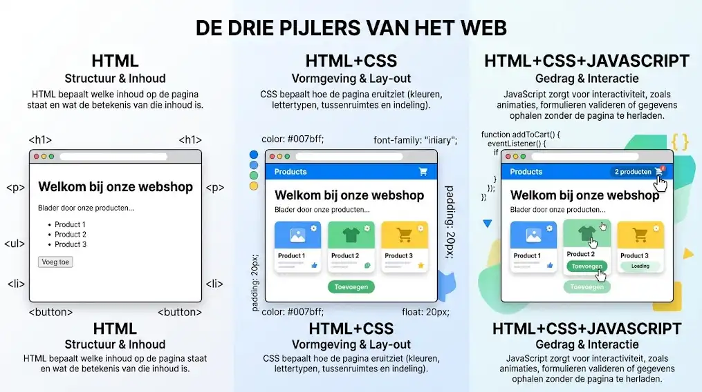

# Introductie in HTML5

## Leerdoelen

Na dit hoofdstuk kan je:

- Uitleggen wat HTML is en wat de rol ervan is in een webpagina
- Het belang van webstandaarden en HTML-validatie toelichten
- De ontstaansgeschiedenis en evolutie van HTML kort schetsen
- De basisstructuur van een HTML5-document herkennen en opbouwen
- Een eerste eenvoudige webpagina schrijven en opslaan
- De werking van tags, elementen en attributen beschrijven

## Wat is HTML?

HTML staat voor **HyperText Markup Language** (opmaaktaal voor hypertext). Het is de standaardtaal waarmee je de structuur en inhoud van webpagina's vastlegt.

HTML is geen programmeertaal. In een programmeertaal schrijf je logica, lussen en berekeningen. HTML is een **opmaaktaal** (markup language). Dat betekent dat je platte tekst markeert met speciale codes om aan te duiden welke functie die tekst heeft. Zo geef je aan wat een hoofding is, wat een alinea is, waar een afbeelding staat en waar een link naar een andere pagina leidt.

## Waarom HTML?

Wanneer je een website bouwt, wil je dat jouw inhoud aan twee belangrijke voorwaarden voldoet:

- **Consistente weergave op alle apparaten:** Je inhoud moet correct en betrouwbaar worden getoond in elke webbrowser (zoals Google Chrome, Mozilla Firefox, Safari en Microsoft Edge) en op elk mogelijk schermformaat (desktopmonitoren, laptops, tablets en smartphones).
- **Duidelijke scheiding van inhoud en vormgeving:** Door je inhoud uitsluitend in HTML te structureren en de vormgeving over te laten aan CSS, blijft je code overzichtelijk, onderhoudbaar en eenvoudig aan te passen.

## Webstandaarden en het W3C

Om ervoor te zorgen dat elke browser HTML-code op exact dezelfde manier interpreteert en toont, zijn er duidelijke afspraken en **webstandaarden** nodig.

- **Het World Wide Web Consortium (W3C):** Deze internationale organisatie stelt de officiële standaarden voor het web op. Webontwikkelaars en browserbouwers baseren zich op deze regels zodat websites overal hetzelfde werken. Op [www.w3.org](https://www.w3.org) vind je alle goedgekeurde standaarden en documenten die momenteel in ontwikkeling zijn.
- **De rol van de webontwikkelaar:** Niet alleen browserfabrikanten moeten de standaarden naleven. Als professioneel webontwikkelaar ben je verplicht om geldige, standaardconforme HTML-code te schrijven. Dit voorkomt weergavefouten en zorgt ervoor dat zoekmachines en schermlezers voor personen met een beperking jouw pagina vlot kunnen ontleden.

::: warning Valideer altijd je HTML-code
Voor elke webpagina die je bouwt, controleer je of de code aan de standaarden voldoet met de officiële [W3C HTML5 Validator](https://validator.w3.org/nu/). Je kan ook gebruikmaken van handige browser-extensies zoals **Validify** (zie het hoofdstuk [Handige Extensions](/tools/extensions)) om je pagina rechtstreeks tijdens het ontwikkelen met een enkele klik te valideren.
:::

## Geschiedenis van HTML

De taal HTML ontstond in **1991** en werd bedacht door de Britse wetenschapper **Tim Berners-Lee** aan het onderzoeksinstituut **CERN** (het Europees laboratorium voor deeltjesfysica in Genève).

### Het oorspronkelijke doel

Wetenschappers bij CERN wilden vlotter met elkaar samenwerken en onderzoeksresultaten delen. Ze hadden een formaat nodig om documenten elektronisch aan elkaar te linken: **hypertext**. Door in een document op een trefwoord of knop te klikken, sprong de lezer meteen naar een ander gerelateerd document of onderzoeksnotitie.

De allereerste versie van HTML bevatte slechts [18 elementen](http://info.cern.ch/hypertext/WWW/MarkUp/Tags.html). Heel wat van die oorspronkelijke tags, zoals `<p>` voor alinea's, `<h1>` tot en met `<h6>` voor titels en `<a>` voor hyperlinks, gebruiken we vandaag nog steeds in HTML5.

### De evolutie naar HTML5

Door de jaren heen heeft HTML een grote evolutie doorgemaakt:

- **HTML 1.0 (1993):** De eerste informele beschrijving van de taal op het prille internet.
- **HTML 2.0 (1995):** De eerste officiële internetstandaard (gepubliceerd als RFC 1866).
- **HTML 3.2 (Januari 1997):** De eerste versie die als officiële aanbeveling (Recommendation) werd uitgegeven door het W3C.
- **HTML 4.01 (December 1999):** Een uiterst stabiele standaard die jarenlang de basis vormde voor vrijwel alle websites op het internet.
- **HTML5 (2014 tot heden):** De moderne standaard die we vandaag gebruiken. HTML5 bracht ondersteuning voor audio en video zonder externe plugins, nieuwe semantische structuurtags en krachtige browser-API's. Vandaag wordt HTML beheerd als een **Living Standard** door de WHATWG en het W3C, wat betekent dat de specificatie continu meegroeit met nieuwe mogelijkheden op het web.

## De drie pijlers van het web

Een moderne webpagina bestaat uit drie verschillende technologieën, elk met een eigen verantwoordelijkheid:

1. **HTML (structuur en inhoud):** HTML bepaalt welke inhoud op de pagina staat en wat de betekenis van die inhoud is.
2. **CSS (vormgeving en lay-out):** CSS bepaalt hoe de pagina eruitziet (kleuren, lettertypen, tussenruimtes en indeling).
3. **JavaScript (gedrag en interactie):** JavaScript zorgt voor interactiviteit, zoals animaties, formulieren valideren of gegevens ophalen zonder de pagina te herladen.



In dit onderdeel van de cursus focus je volledig op de eerste pijler: HTML.

## Tags, elementen en attributen

Om HTML te begrijpen, moet je het verschil kennen tussen drie basisbegrippen: tags, elementen en attributen.

### Tags

Een tag (markering) is een trefwoord tussen punthaken (`<` en `>`). De meeste onderdelen in HTML hebben twee tags:

- Een **openende tag**: geeft aan waar een element begint, bijvoorbeeld `<p>`.
- Een **sluitende tag**: geeft aan waar een element eindigt, met een schuine streep voor de tagnaam, bijvoorbeeld `</p>`.

### Elementen

Een HTML-element is het complete geheel: de openende tag, de tussenliggende inhoud en de sluitende tag.

```html
<p>Dit is een alinea met tekst.</p>
```

In dit voorbeeld is `<p>` de openende tag, `Dit is een alinea met tekst.` de inhoud, en `</p>` de sluitende tag. Samen vormen ze een `<p>`-element (alinea-element).

Er bestaan ook elementen zonder inhoud en zonder sluitende tag. Deze noem je **lege elementen** (void elements). Een voorbeeld is het regeleinde-element:

```html
<br>
```

### Attributen

Attributen geven extra eigenschappen of instellingen mee aan een element. Je plaatst attributen altijd in de **openende tag**. Een attribuut bestaat uit een naam en een waarde:

```html
<p title="Extra toelichting over deze tekst">Beweeg je muis over deze alinea.</p>
```

In dit voorbeeld is `title` de attribuutnaam en `"Extra toelichting over deze tekst"` de attribuutwaarde. Wanneer een bezoeker in de browser met de muis over de tekst beweegt, verschijnt deze toelichting in een klein pop-upvenstertje (een tooltip). De waarde van een attribuut staat altijd tussen dubbele aanhalingstekens.

::: tip Schrijfstijl in HTML
HTML is niet hoofdlettergevoelig: `<P>` en `<p>` werken allebei. De industriestandaard is echter om tags en attributen altijd met **kleine letters** te schrijven.
:::

## De basisstructuur van een HTML5-document

Elk geldig HTML5-document volgt dezelfde vaste basisstructuur. Hieronder zie je het minimale skelet van een webpagina:

```html
<!DOCTYPE html>
<html lang="nl">
<head>
  <meta charset="UTF-8">
  <meta name="viewport" content="width=device-width, initial-scale=1.0">
  <title>Mijn eerste webpagina</title>
</head>
<body>
  <h1>Welkom bij Web Essentials</h1>
  <p>Dit is de inhoud van mijn webpagina.</p>
</body>
</html>
```

Laten we deze onderdelen regel voor regel bekijken:

### 1. `<!DOCTYPE html>`

De documenttype-declaratie staat helemaal bovenaan op de eerste regel. Dit is strikt genomen geen HTML-tag, maar een instructie aan de webbrowser. Het vertelt de browser dat dit document geschreven is volgens de HTML5-standaard.

### 2. `<html lang="nl">`

Het `<html>`-element is het hoofdelement (root element) van de pagina. Alle andere elementen bevinden zich binnen dit element. Met het attribuut `lang="nl"` geef je aan dat de hoofdtaal van de inhoud Nederlands is. Dit is belangrijk voor zoekmachines en schermlezers voor slechtzienden.

### 3. `<head>`

Het `<head>`-element bevat metadata (gegevens over het document). De inhoud van het `<head>`-gedeelte wordt niet rechtstreeks in het browservenster getoond, met uitzondering van de paginatitel.

Binnen het `<head>`-element plaats je minstens:

- `<meta charset="UTF-8">`: bepaalt de tekencodering. Met UTF-8 worden alle letters, cijfers en speciale tekens (zoals letters met accenten) correct weergegeven.
- `<meta name="viewport" content="width=device-width, initial-scale=1.0">`: zorgt ervoor dat de pagina schaalt naar de schermbreedte van mobiele apparaten.
- `<title>`: definieert de titel van de webpagina. Deze tekst verschijnt op het tabblad van de browser en fungeert als titel in zoekresultaten.

### 4. `<body>`

Het `<body>`-element bevat alle zichtbare inhoud van de webpagina. Alles wat een bezoeker op het scherm te zien krijgt (tekst, afbeeldingen, hyperlinks, tabellen en formulieren) staat binnen het `<body>`-element.

## Een HTML-bestand aanmaken en openen

Om een webpagina te maken, volg je deze stappen:

1. **Bestand aanmaken in je editor:** Maak in PhpStorm een nieuw bestand aan en geef het de extensie `.html`, bijvoorbeeld `index.html`.
2. **De naam `index.html`:** Webservers zijn zo geconfigureerd dat ze automatisch naar een bestand met de naam `index.html` zoeken wanneer iemand naar een map surft. Daarom geef je de startpagina van een website altijd deze naam.
3. **Openen in de browser:** Je kan een lokaal HTML-bestand rechtstreeks openen in Google Chrome of Firefox door te dubbelklikken op het bestand, of via de ingebouwde browserknoppen in PhpStorm.

## Codevoorbeelden

### Een compleet basisdocument

Hieronder zie je een werkend voorbeeld van een eenvoudige webpagina met een hoofding en twee alinea's:

```html
<!DOCTYPE html>
<html lang="nl">
<head>
  <meta charset="UTF-8">
  <meta name="viewport" content="width=device-width, initial-scale=1.0">
  <title>Welkom bij Thomas More</title>
</head>
<body>
  <h1>Eerstejaars ICT</h1>
  <p>Welkom bij de opleiding Toegepaste Informatica aan Thomas More.</p>
  <p>In het vak Web Essentials leer je hoe je websites bouwt vanaf nul.</p>
</body>
</html>
```

In dit voorbeeld zie je dat de tekst binnen de `<h1>`-tag als grote kop wordt getoond. De `<p>`-tags bakenen twee afzonderlijke alinea's af.

### Live codevoorbeeld

Hieronder kan je de HTML-code rechtstreeks bekijken, bewerken en uitproberen in een interactieve omgeving:

<CodeSandbox
  title="Basisstructuur van een HTML5-pagina"
  html="<!DOCTYPE html>
<html lang=&quot;nl&quot;>
<head>
  <meta charset=&quot;UTF-8&quot;>
  <meta name=&quot;viewport&quot; content=&quot;width=device-width, initial-scale=1.0&quot;>
  <title>Welkom bij Thomas More</title>
</head>
<body>
  <h1>Eerstejaars ICT</h1>
  <p>Welkom bij de opleiding Toegepaste Informatica aan Thomas More.</p>
  <p>In het vak Web Essentials leer je hoe je websites bouwt vanaf nul.</p>
</body>
</html>"
  height="420px"
/>

## Oefeningen

### Oefening 1: Je eerste webpagina bouwen

Maak zelf je allereerste HTML-document aan volgens de regels van de kunst.

1. Open PhpStorm en maak een nieuw leeg project aan met de naam `labo-01`.
2. Maak in dit project een nieuw HTML-bestand aan met de naam `index.html`.
3. Typ de volledige basisstructuur over (gebruik geen knip- en plakwerk, zodat je vertrouwd raakt met de tags).
4. Stel de taal van het document in op Nederlands met `lang="nl"`.
5. Geef de pagina als titel: `Mijn eerste pagina - [Jouw Naam]`.
6. Voeg in het `<body>`-element een hoofding `<h1>` toe met de tekst: `Mijn profiel`.
7. Voeg daaronder twee alinea's (`<p>`) toe:
   - Een alinea waarin je vertelt wie je bent en welke opleiding je volgt.
   - Een alinea waarin je beschrijft wat je verwacht te leren in Web Essentials.
8. Sla het bestand op en open het in Google Chrome. Controleer of de paginatitel op het tabblad verschijnt en of de tekst netjes onder elkaar staat.

### Oefening 2: Elementen en attributen ontleden

Bekijk het onderstaande stuk HTML-code:

```html
<p title="Inleiding" class="inleiding">Welkom op onze website.</p>
<hr>
<a href="https://thomasmore.be" target="_blank">Bezoek Thomas More</a>
```

Beantwoord voor jezelf de volgende vragen:

1. Welke elementen herken je in dit fragment?
2. Welk element is een leeg element (void element)?
3. Noem alle attributen op die in dit fragment worden gebruikt, inclusief hun waarde.
4. Wat is de inhoud van het `<p>`-element?

### Oefening 3: Foutzoeken in HTML

Een medestudent heeft onderstaande code geschreven, maar de pagina werkt niet zoals verwacht. Er zitten vier fouten in de code.

```html
<!DOCTYPE html>
<html lang="nl">
<head>
  <meta charset="UTF-8">
  <title>Foutzoekopdracht</title>
</head>
<body>
  <h1>Webontwikkeling is leuk<h1/
  <p>Dit is een alinea met een <strong>belangrijk woord</p></strong>
  <p lang=nl>Vergeet de aanhalingstekens niet.
</body>
</html>
```

**Opdracht:**

1. Kopieer deze code naar een bestand `fouten.html`.
2. Zoek de vier fouten en leg uit wat er mis is.
3. Verbeter de code zodat het document weer aan alle standaarden voldoet.
