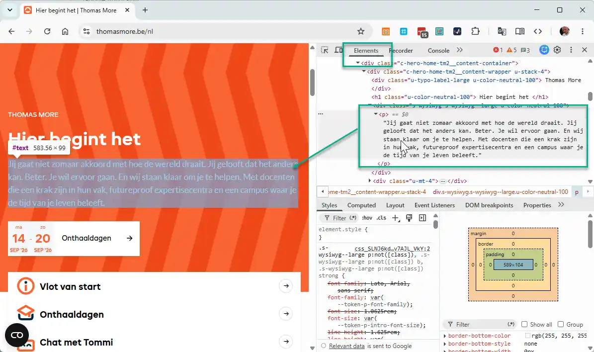
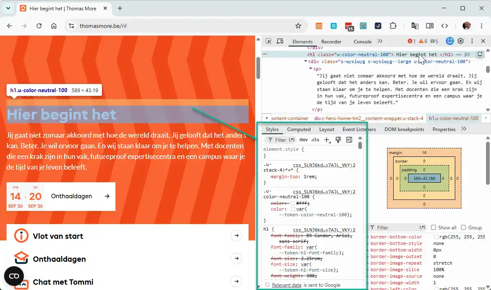
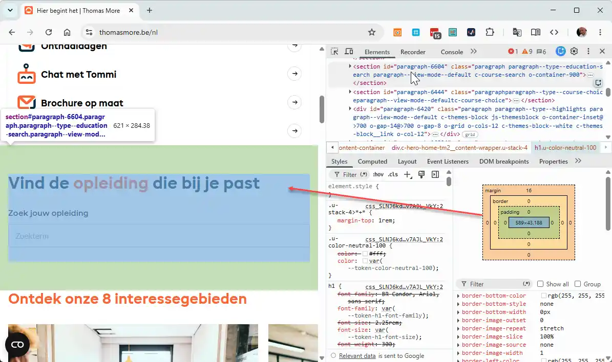
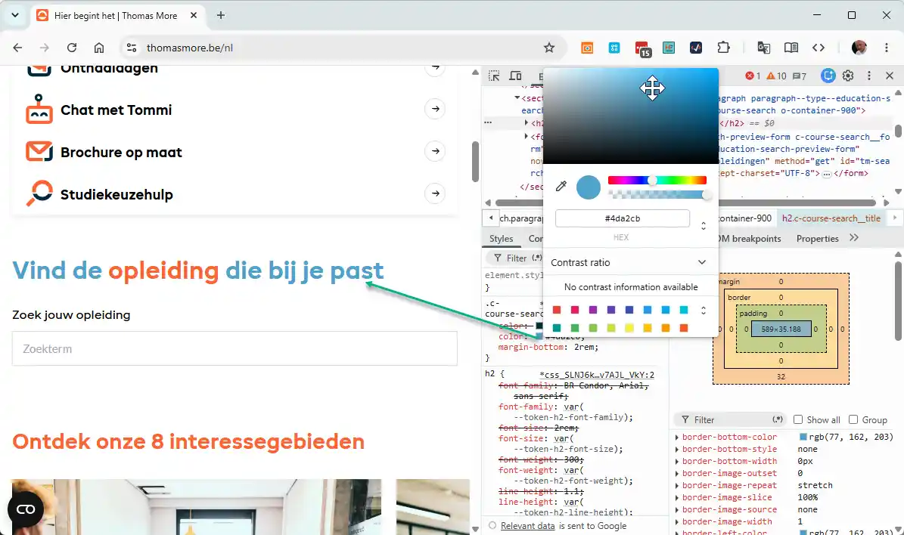
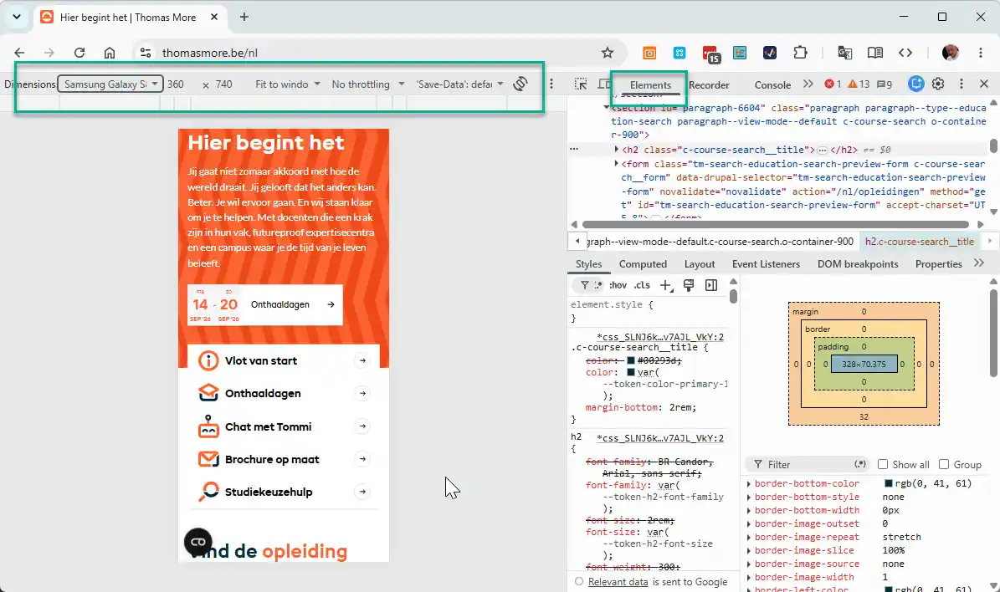

# Browser DevTools

Tijdens het bouwen van een webpagina typ je HTML- en CSS-code in je editor (zoals PhpStorm) en bekijk je het resultaat in de browser. Maar wat doe je als een knop net niet op de juiste plek staat, een rand niet verschijnt, of een stijlregel overschreven lijkt te worden? Zonder de juiste hulpmiddelen ben je aangewezen op gissen.

Moderne webbrowsers beschikken over krachtige, ingebouwde ontwikkelaarshulpprogramma's: de **Browser DevTools** (Developer Tools). DevTools fungeert als de röntgenbril van de webontwikkelaar. Je kijkt er rechtstreeks mee onder de motorkap van elke webpagina, inspecteert de HTML-boomstructuur, experimenteert live met CSS-regels en spoort fouten razendsnel op.

## Leerdoelen

Na dit hoofdstuk kan je:

- De DevTools openen in Google Chrome via verschillende methoden (F12, contextmenu en sneltoetsen)
- De HTML-structuur inspecteren en live bewerken in het **Elements**-paneel
- Toegepaste, overschreven en doorgehaalde CSS-regels analyseren in het **Styles**-paneel
- Live nieuwe CSS-eigenschappen testen en tijdelijk aanpassen zonder je broncode in PhpStorm te wijzigen
- Het interactieve **Box Model diagram** aflezen in het Styles- en Computed-paneel om afmetingen, padding en marges te controleren
- Kleuren en WCAG-contrastverhoudingen inspecteren met de ingebouwde kleurenkiezer
- Schermformaten en mobiele apparaten simuleren via de **Device Mode** (apparaatemulator)
- Foutmeldingen (zoals ontbrekende bestanden en 404-fouten) opsporen in het **Console**-paneel

## DevTools Openen

In deze cursus focussen we op **Google Chrome**, de industriestandaard voor webontwikkeling. Andere moderne browsers zoals Mozilla Firefox, Microsoft Edge en Safari beschikken over nagenoeg identieke ontwikkelaarshulpmiddelen.

Je kan DevTools in Google Chrome op drie manieren openen:

1. **Rechtermuisklik -> Inspecteren (Aanbevolen):**  
   Klik met de rechtermuisknop rechtstreeks op het onderdeel van de pagina dat je wil onderzoeken en kies **Inspecteren** (*Inspect*). DevTools opent onmiddellijk en selecteert exact dat element in de code.
2. **De functietoets F12:**  
   Druk op `F12` op je toetsenbord om DevTools te openen of te sluiten.
3. **De universele sneltoets:**  
   - Windows & Linux: `Ctrl + Shift + I`
   - macOS: `Cmd + Option + I`

::: tip Plaatsing van het DevTools-venster (Docking)
Rechtsboven in het DevTools-venster vind je een knop met drie verticale puntjes (`⋮`). Onder **Dock side** kan je kiezen waar DevTools getoond wordt: vastgemaakt aan de rechterkant van je scherm, onderaan, links of als een afzonderlijk zwevend venster. Voor brede beeldschermen is docken aan de rechterkant meestal het prettigst.
:::

## Het Elements-paneel: HTML Inspecteren

Wanneer DevTools opent, staat het tabblad **Elements** standaard actief. Dit paneel toont de actuele **DOM-boomstructuur** (Document Object Model) van de pagina.

### Belangrijke basisfuncties in het Elements-paneel:

1. **Het inspectiepijltje (Select an element):**  
   Helemaal linksboven in DevTools vind je een icoontje met een muisaanwijzer in een vierkantje (sneltoets: `Ctrl + Shift + C`). Klik hierop en beweeg vervolgens over de webpagina. De browser licht elk element blauw/oranje/groen op en toont direct de bijbehorende tag en afmetingen. Klik op een element om het vast te zetten in de DOM-boom.
2. **In- en uitklappen:**  
   Met de kleine driehoekjes voor de HTML-tags vouw je geneste elementen (zoals een `<ul>` met meerdere `<li>`'s) eenvoudig open of dicht.
3. **Live tekst en attributen aanpassen:**  
   Dubbelklik op een stuk tekst, een klassenaam (`class="..."`) of een linkadres (`href="..."`) om dit direct in de browser aan te passen. Druk op `Enter` om het resultaat meteen te zien.

::: warning Wijzigingen in DevTools zijn tijdelijk
Alles wat je in DevTools aanpast, gebeurt enkel in het tijdelijke werkgeheugen van je browser. Zodra je de pagina vernieuwt (`F5` of `Ctrl + R`), verdwijnen je aanpassingen en laadt de browser opnieuw de originele bestanden. DevTools dient om te testen en te experimenteren; definitieve wijzigingen sla je altijd op in je bronbestanden in PhpStorm.
:::

## Het Styles-paneel: CSS Live Debuggen

Rechts van (of onder) de HTML-structuur vind je het tabblad **Styles**. Dit is het zenuwcentrum voor elke webdesigner. Hier zie je exact welke CSS-stijlregels van toepassing zijn op het element dat je op dat moment geselecteerd hebt.

### Handige trucjes in het Styles-paneel:

- **Eigenschappen in- en uitschakelen:**  
  Zweef over een declaratie in het Styles-venster. Er verschijnt een klein selectievakje voor de regel. Vink het vakje uit om de eigenschap tijdelijk uit te schakelen. Zo ontdek je in één seconde welke regel verantwoordelijk is voor een ongewenste witruimte of rand.
- **Waarden live aanpassen:**  
  Klik op een waarde (bijvoorbeeld `1.25rem` of `#1e2d5a`) om deze aan te passen. Je kan getallen rechtstreeks verhogen of verlagen met de pijltoetsen omhoog (`↑`) en omlaag (`↓`) op je toetsenbord!
- **Nieuwe eigenschappen toevoegen:**  
  Klik in een bestaand declaratieblok net achter een puntkomma. Er verschijnt een invoerveld waarin je direct een nieuwe eigenschap en waarde kan intypen, compleet met automatische codeaanvulling.
- **Doorgestreepte tekst (Overschreven CSS):**  
  Zie je een eigenschap met een streep erdoorheen? Dat betekent dat deze stijlregel door de **CSS-cascade** of specificiteit is overschreven door een andere, meer specifieke of later gedefinieerde regel.
- **De selector `element.style`:**  
  Bovenaan in het Styles-paneel staat altijd `element.style`. Regels die je hier intypt, worden als inline CSS rechtstreeks op het geselecteerde element toegepast. Ideaal voor een snelle test.

## Het Box Model Diagram & Kleurenkiezer

### Het Box Model inspecteren

Scroll in het Styles-tabblad helemaal naar beneden, of klik op het tabblad **Computed**. Daar vind je een interactief diagram van het **CSS Box Model**:

1. **Afmetingen in één oogopslag:** Je ziet exact hoeveel pixels de browser heeft berekend voor de inhoud (*content*), de binnenruimte (*padding*), de rand (*border*) en de buitenruimte (*margin*).
2. **Interactieve markering op de pagina:** Beweeg je muis over de verschillende kleurzones van dit diagram. De browser kleurt het element op je webpagina direct in:
   - **Blauw:** De eigenlijke inhoud van het element.
   - **Groen:** De `padding` (binnenruimte).
   - **Geel:** De `border` (rand).
   - **Oranje:** De `margin` (buitenruimte).

### De geïntegreerde Kleurenkiezer (Color Picker)

In het Styles-paneel toont DevTools voor elke kleurwaarde een klein gekleurd vierkantje. Klik op dit vierkantje om de interactieve **Color Picker** te openen:

- Kies visueel een nieuwe tint met het kleurenpalet en de transparantie-schuifbalk.
- Klik op de pijltjes naast de kleurcode om direct te schakelen tussen **HEX**, **RGB**, **HSL** en **OKLCH**.
- **WCAG Contrast-controle:** De kiezer berekent automatisch de contrastratio ten opzichte van de achtergrond. Een groen vinkje geeft aan dat je voldoet aan de AA-norm (minstens 4.5:1) voor toegankelijkheid.

## Mobiele Weergave Testen: Device Mode

Tijdens het ontwerpen wil je weten hoe je website eruitziet op smartphones en tablets, zonder dat je je pagina telkens naar je eigen telefoon moet uploaden. Hiervoor gebruik je de **Device Mode** (apparaatemulator).

Klik linksboven in de balk van DevTools op het icoontje met de smartphone en tablet (sneltoets: `Ctrl + Shift + M` op Windows, `Cmd + Shift + M` op macOS).

- **Vooraf ingestelde toestellen:** Kies in het dropdown-menu uit populaire apparaten zoals iPhone 14, Samsung Galaxy of iPad Air.
- **Vrij verslepen:** Kies **Responsive** en versleep de handgrepen aan de rechter- en onderkant van het scherm om elk denkbaar schermformaat traploos te testen.
- **Draaien:** Klik op het rotatie-icoontje om te wisselen tussen staand (*portrait*) en liggend (*landscape*).

::: tip Geen mobiele weergave? Controleer je viewport!
Ziet je pagina er in Device Mode uit als een piepklein verkleinde desktopweergave? Dan ben je vergeten de verplichte viewport-metatag op te nemen in de `<head>` van je HTML-document:
`<meta name="viewport" content="width=device-width, initial-scale=1.0">`.
:::

## Eerste Hulp bij Fouten: De Console

Het tabblad **Console** registreert meldingen, waarschuwingen en fouten die optreden tijdens het laden en uitvoeren van de pagina.

Als er een probleem is, verschijnt er rechtsboven in DevTools een **rood rondje met een wit kruisje** en een cijfer dat aangeeft hoeveel fouten er zijn opgetreden.

### Typische beginnersfouten opsporen:

1. **Foutief gekoppeld stijlblad:**  
   `GET http://localhost:5674/css/stijlen.css net::ERR_FILE_NOT_FOUND (404 Not Found)`  
   *Betekenis:* De browser vindt het CSS-bestand niet. Controleer de bestandsnaam in je `<link href="...">` en let op hoofdletters en relatieve mappen.
2. **Ontbrekende afbeelding:**  
   `GET http://localhost:5674/images/foto.webp 404 (Not Found)`  
   *Betekenis:* Het `src`-attribuut van een ``-tag verwijst naar een pad dat niet bestaat.

## Zelf experimenteren: De Inspecteerbare Oefen-Sandbox

In de onderstaande sandbox zie je een informatiekaart van **Thomas More Campus Geel**. Open nu zelf de browser DevTools (`F12`), klik op het inspectiepijltje en inspecteer de elementen binnen deze preview:

<CodeSandbox
  title="Oefen-sandbox voor DevTools inspectie"
  height="450px"
  activeCodeTab="css"
  css='/* Universele resetter */
* {
  box-sizing: border-box;
  margin: 0;
  padding: 0;
}
/* Paginastijl */
body {
  font-family: Verdana, Geneva, sans-serif;
  line-height: 1.5;
  padding: 1.5rem;
  background-color: #f1f5f9;
  color: #222222;
}
/* Campuskaart */
.campus-kaart {
  max-width: 24rem;
  background-color: #ffffff;
  border: 2px solid #1e2d5a;
  border-radius: 0.5rem;
  padding: 1.5rem;
}
/* Titel */
.campus-kaart h3 {
  color: #1e2d5a;
  margin-bottom: 0.75rem;
}
/* Adres */
.adres {
  color: #64748b;
  font-size: 0.9rem;
  margin-bottom: 1rem;
}
/* Knop */
.actie-knop {
  display: inline-block;
  background-color: #EC6639;
  color: #ffffff;
  padding: 0.6rem 1.2rem;
  border: none;
  border-radius: 0.35rem;
  font-size: 0.9rem;
}'
  html='<!DOCTYPE html>
<html lang="nl">
<head>
  <meta charset="UTF-8">
  <meta name="viewport" content="width=device-width, initial-scale=1.0">
  <title>DevTools Oefenkaart</title>
  <link rel="stylesheet" href="stijl.css">
</head>
<body>
  <!-- Inspecteer deze kaart in je browser DevTools -->
  

    <h3>Thomas More Campus Geel</h3>
    
Kleinhoefstraat 4, 2440 Geel

    
Ontdek onze IT-opleidingen en ervaar praktijkgericht onderwijs op een moderne campus.

    <button class="actie-knop">Bezoek de campus</button>
  

</body>
</html>'
/>

<PageSummary>

### Sneltoetsen & acties in een oogopslag

| Actie | Sneltoets (Windows) | Sneltoets (macOS) | Doel |
|---|---|---|---|
| DevTools openen / sluiten | `F12` of `Ctrl + Shift + I` | `Cmd + Option + I` | Paneel openen of sluiten |
| Element direct inspecteren | `Ctrl + Shift + C` | `Cmd + Option + C` | Klik een pagina-element aan |
| Device Mode (mobiel) | `Ctrl + Shift + M` | `Cmd + Option + M` | Responsieve weergave testen |
| Console openen | `Ctrl + Shift + J` | `Cmd + Option + J` | Foutmeldingen bekijken |
| Broncode vernieuwen | `F5` of `Ctrl + R` | `Cmd + R` | DevTools-wijzigingen resetten |

### Belangrijkste tabbladen

- **Elements:** Toont de actuele DOM-boomstructuur en stelt je in staat HTML-attributen en tekst live aan te passen.
- **Styles:** Toont alle CSS-regels die van toepassing zijn op het geselecteerde element, inclusief doorstreepte overschreven eigenschappen.
- **Computed:** Geeft de uiteindelijke berekende pixelwaarden en toont het interactieve Box Model diagram (margin, border, padding, content).
- **Console:** Toont JavaScript-foutmeldingen en ontbrekende bestanden (zoals ontbrekende afbeeldingen of stylesheets met 404-fouten).

### Regels en tips bij het testen

- **Wijzigingen zijn tijdelijk:** Aanpassingen in DevTools worden direct getoond in het weergavevenster, maar worden nooit opgeslagen in je originele bronbestand. Vernieuw je pagina met `F5` om met een schone lei te herstarten.
- **Breng definitieve code altijd over:** Heb je via DevTools de perfecte CSS-regel of tussenruimte gevonden? Kopieer de eigenschap onmiddellijk naar je eigen stylesheet in PhpStorm.
- **Controleer doorstreepte eigenschappen:** Een doorstreepte regel in het Styles-venster betekent dat de eigenschap ongeldig is (geel uitroepteken) of dat een meer specifieke CSS-regel voorrang krijgt.
- **Gebruik de interactieve kleurenkiezer:** Klik op het kleurvierkantje naast een CSS-kleur om snel tinten te testen en direct de WCAG-contrastverhouding met de achtergrond te controleren.

### Veelgemaakte fouten

- Vergeten om geteste CSS-aanpassingen over te nemen in PhpStorm, waardoor al het werk na een paginavernieuwing (`F5`) verdwenen is.
- In Elements naar de originele HTML-code zoeken in plaats van te beseffen dat je kijkt naar de dynamisch opgebouwde DOM in het browsergeheugen.
- Een doorstreepte CSS-regel aanzien voor een actieve regel, zonder te controleren waarom de eigenschap overschreven of genegeerd wordt.
- Vergeten om na het testen in Device Mode de mobiele emulatie weer uit te schakelen (`Ctrl + Shift + M`).

</PageSummary>

## Oefeningen

### Oefening 1: Elementen inspecteren en het Box Model aflezen

Open de DevTools (`F12`) en inspecteer de bovenstaande `.campus-kaart`:

1. Klik op het inspectiepijltje (`Ctrl + Shift + C`) en klik op de oranje knop "Bezoek de campus".
2. Zoek in het tabblad **Styles** of **Computed** het Box Model diagram op.
3. Noteer de exacte berekende waarden in pixels voor de inhoudsbreedte, de padding en de marges van de knop.
4. Schakel in het Styles-venster het selectievakje voor `background-color` uit. Wat gebeurt er visueel met de knop?

### Oefening 2: Live CSS aanpassen via de Kleurenkiezer

1. Selecteer de titel `<h3>` van de campuskaart via DevTools.
2. Klik in het Styles-paneel op het donkerblauwe kleurvierkantje naast `color: #1e2d5a;`.
3. Sleep de kleurenkiezer naar een felrode tint en controleer de berekende WCAG-contrastratio.
4. Druk op `F5` om de pagina te vernieuwen en stel vast dat je wijziging weer netjes hersteld is naar het origineel.

### Oefening 3: Mobiele weergave simuleren

1. Schakel de **Device Mode** in met de sneltoets `Ctrl + Shift + M`.
2. Selecteer in de bovenste werkbalk het toestel **iPhone SE** (375 pixels breed).
3. Controleer of de kaart netjes binnen het scherm past zonder dat er een horizontale schuifbalk ontstaat.
4. Versleep de rechterrand van het weergavevenster langzaam naar links en rechts en observeer hoe de breedte van de container reageert.

