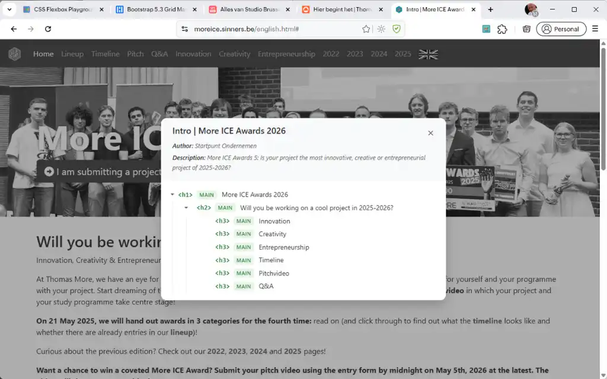
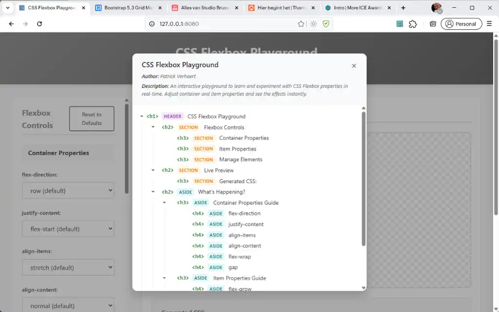
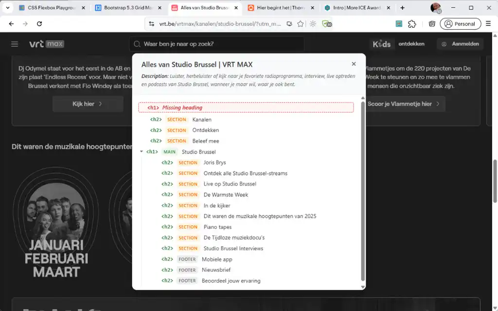
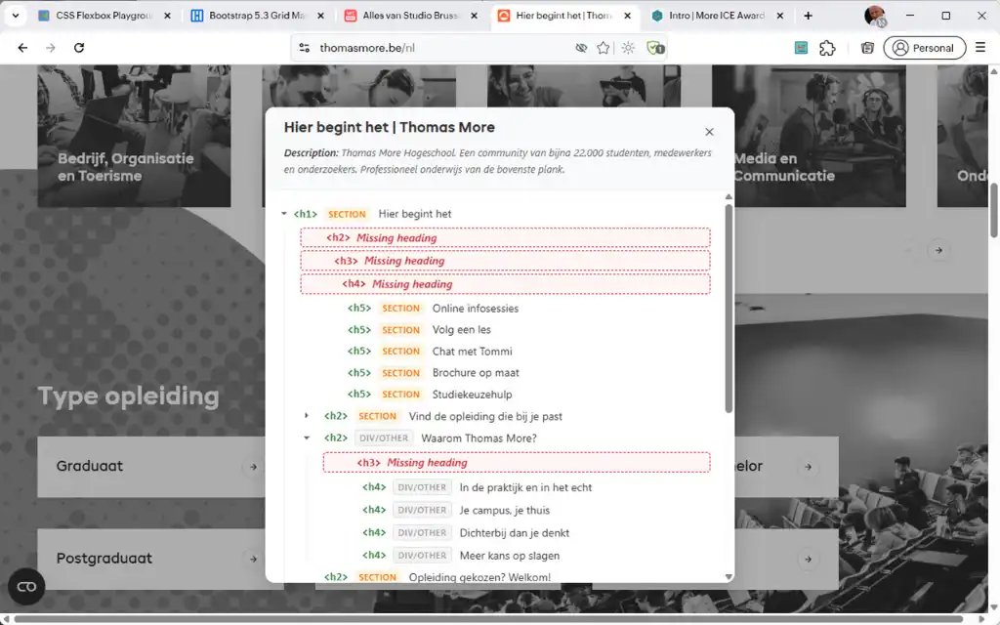
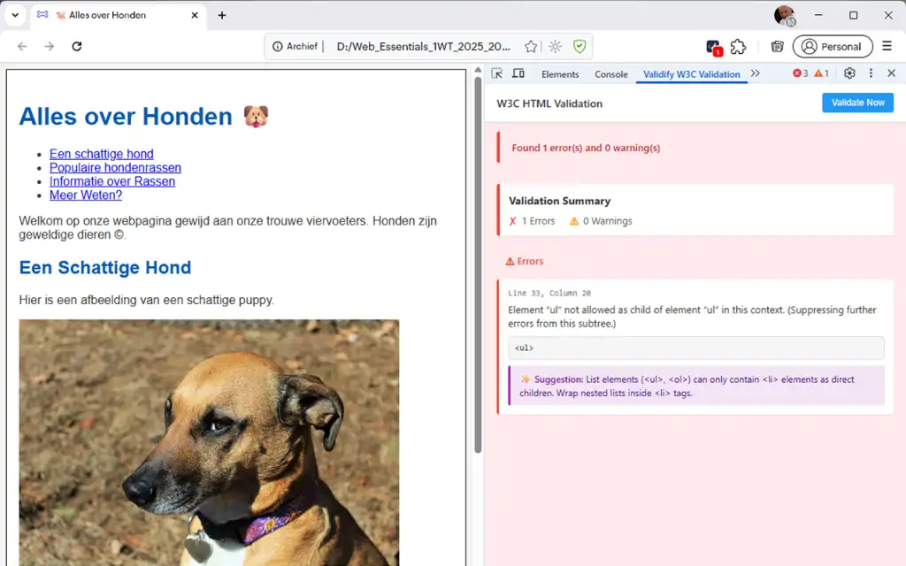
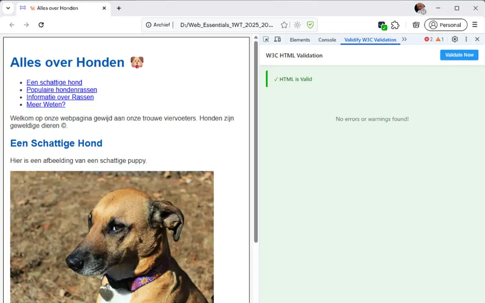
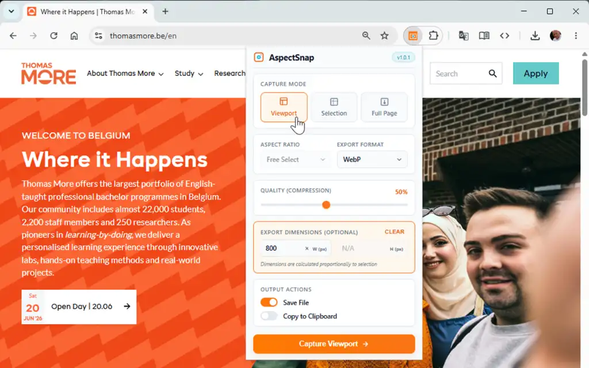
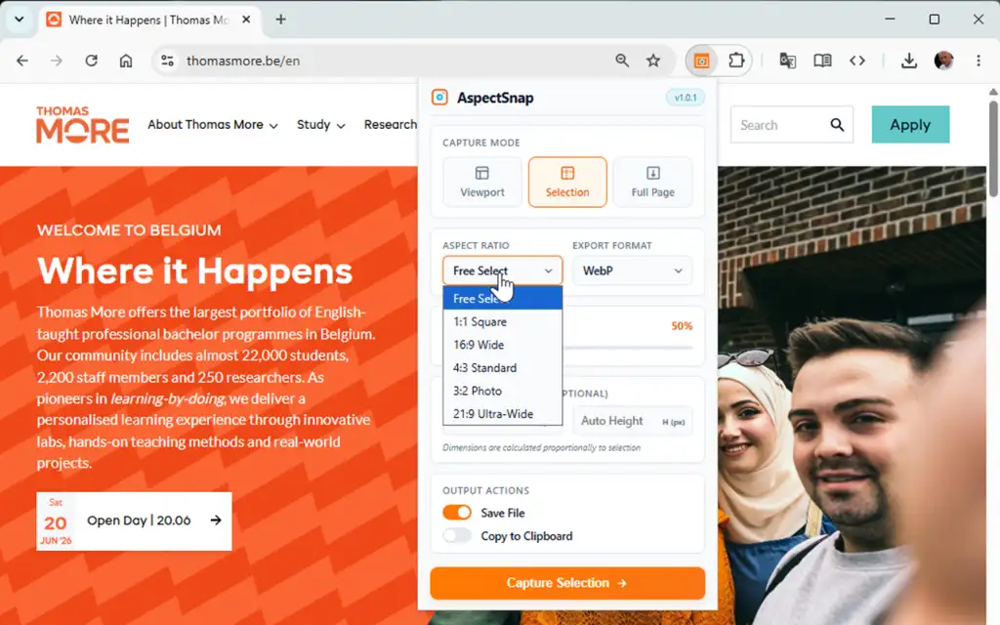
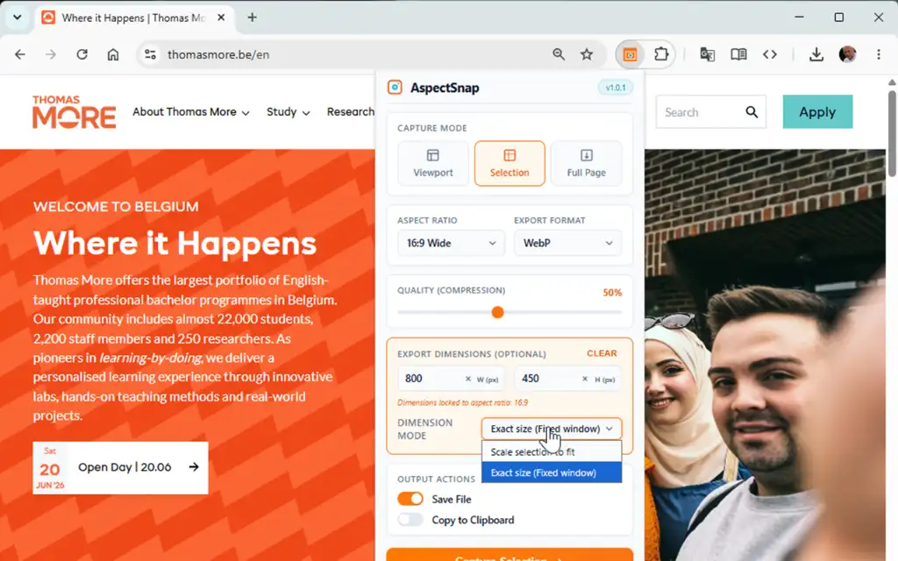
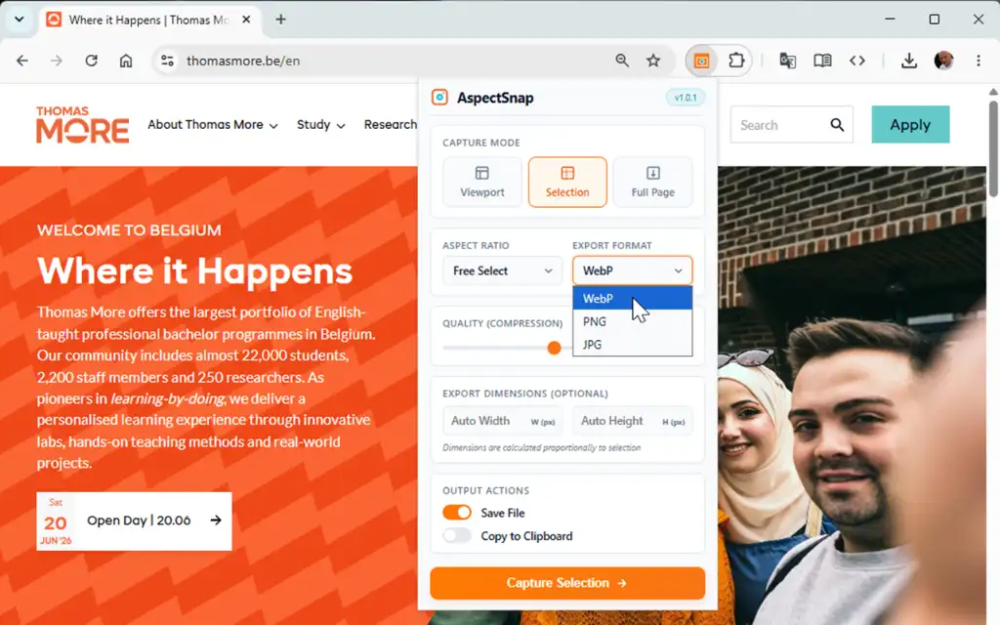

# Browser Extensies

## Semantiscope

**Semantiscope** brengt de semantische structuur van een webpagina visueel in kaart.

- **Koppenhiërarchie:** De extensie bouwt een interactieve boomstructuur van alle koppen (`<h1>` tot en met `<h6>`) op de pagina.
- **Semantische context:** Bij elke kop toont Semantiscope het bovenliggende semantische element, zoals `<header>`, `<nav>`, `<main>`, `<article>`, `<section>`, `<aside>` of `<footer>`.
- **Foutdetectie:** Als je een niveau in de koppenstructuur overslaat (bijvoorbeeld van `<h2>` meteen naar `<h4>`), plaatst Semantiscope een waarschuwingsmarkering zodat je de fout direct ziet.

Installeer de extensie via de [Chrome Web Store pagina van Semantiscope](https://chromewebstore.google.com/detail/semantiscope/bfjbbdpfodmgbkoeliepdimkmijifele).

<ImageCarousel
  title="Semantiscope Chrome Extensie"
  :thumbnails="true"
  :nav="true"
  :dots="true"
  :auto="true"
  aspectRatio="16/10"
>
  
  
  
  
  
</ImageCarousel>

## Validify

**Validify** brengt de officiële W3C Nu HTML Checker rechtstreeks naar je browserbalk.

- **Snelle controle met een klik:** Zodra je op het icoon van Validify in je werkbalk klikt, stuurt de extensie de HTML van de huidige pagina naar de W3C-validator.
- **Directe feedback:** Het icoontje toont meteen het aantal gevonden fouten en waarschuwingen.
- **Details in DevTools:** Open je de Chrome DevTools (met `F12`), dan zie je in het Console-paneel of in het speciale Validify-paneel exact op welke regel de fout zit en wat de officiële W3C-oplossing is.

Installeer de extensie via de [Chrome Web Store pagina van Validify](https://chromewebstore.google.com/detail/validify/mcodhpijcbmcbeaobimpfoinafinojde).

::: tip Waarom valideren belangrijk is
Een geldige HTML-pagina wordt consistenter weergegeven in verschillende browsers, laadt sneller en is beter toegankelijk voor zoekmachines en bezoekers met een beperking.
:::

<ImageCarousel
  title="Validify Chrome Extensie"
  :thumbnails="true"
  :nav="true"
  :dots="true"
  :auto="true"
  aspectRatio="16/10"
>
  
  
</ImageCarousel>

## AspectSnap

**AspectSnap** is een handige extensie om de beeldverhouding (aspect ratio) en de afmetingen van afbeeldingen en containers op elke webpagina direct te inspecteren.

- **Meteen meten:** Klik op het AspectSnap-icoon en selecteer een afbeelding op de pagina. De extensie toont meteen de exacte breedte en hoogte in pixels.
- **Beeldverhouding controleren:** AspectSnap berekent automatisch de beeldverhouding (zoals 16:9, 4:3 of 1:1). Zo ontdek je meteen of een foto per ongeluk vervormd of platgedrukt is.
- **Handig bij responsief ontwerpen:** Je ziet direct hoe de afmetingen van een afbeelding veranderen wanneer je het browservenster smaller of breder maakt.

Installeer de extensie via de [Chrome Web Store pagina van AspectSnap](https://chromewebstore.google.com/detail/aspectsnap/oijgbaccdlnbjjhpbjgofkmbdpefabog).

<ImageCarousel
  title="AspectSnap Chrome Extensie"
  :thumbnails="true"
  :nav="true"
  :dots="true"
  :auto="true"
  aspectRatio="16/10"
>
  
  
  
  
  
  
</ImageCarousel>

