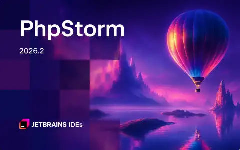
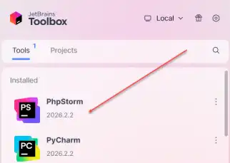
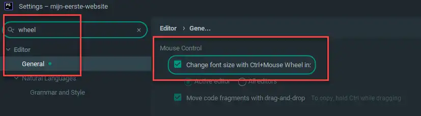
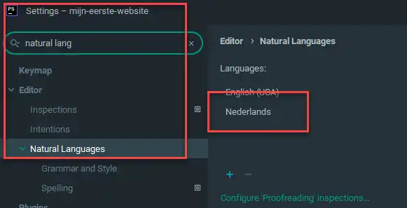
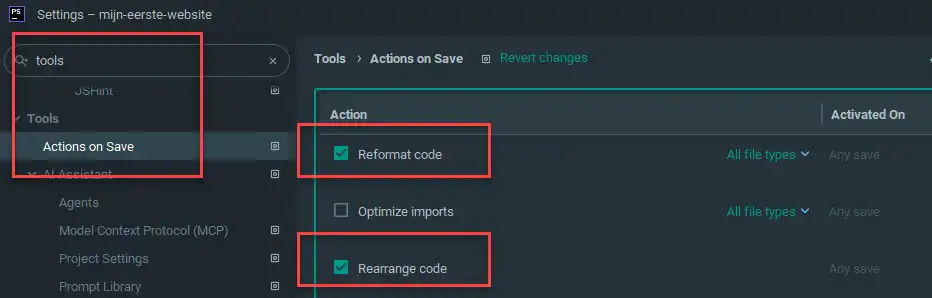
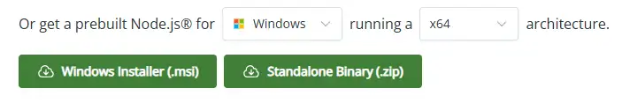
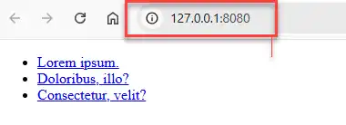
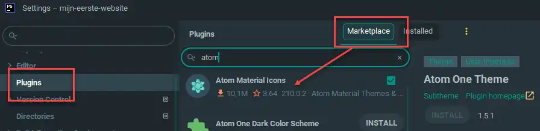

# PhpStorm Setup

Tijdens het ontwikkelen van websites is een betrouwbare, krachtige werkomgeving onmisbaar. Een eenvoudige teksteditor zoals Kladblok volstaat niet voor professioneel werk: je hebt een ontwikkelomgeving nodig die fouten direct signaleert, code automatisch aanvult en je projectbestanden overzichtelijk beheert.

Binnen de cursus gebruiken we daarom <dfn title="Een uitgebreide softwaretoepassing die ontwikkelaars alle benodigde tools biedt voor het schrijven, testen, debuggen en beheren van code">PhpStorm</dfn>, een professionele <abbr title="Integrated Development Environment: een softwaretoepassing die ontwikkelaars uitgebreide faciliteiten biedt voor softwareontwikkeling">IDE</abbr> van JetBrains. PhpStorm werkt identiek op Windows, macOS en Linux en biedt eersteklas ondersteuning voor HTML5, CSS3, JavaScript en Git.



## Leerdoelen

Na dit hoofdstuk kan je:

- Een gratis educatieve JetBrains-studentenlicentie aanvragen en activeren met je Thomas More-account
- PhpStorm installeren en up-to-date houden via de JetBrains Toolbox App
- Een nieuw webproject aanmaken met een heldere mappenstructuur
- De belangrijkste editor-instellingen configureren voor efficiënte webontwikkeling
- Een lokale ontwikkelserver starten met de tool `live-server` vanuit de ingebouwde terminal
- Essentiële sneltoetsen in PhpStorm toepassen om sneller en netter code te schrijven

## Waarom PhpStorm?

PhpStorm is veel meer dan een gewone teksteditor:

- **Slimme code-aanvulling (autocompletion):** Zodra je een HTML-tag of CSS-eigenschap begint te typen, toont PhpStorm passende suggesties en documentatie.
- **Ingebouwde foutdetectie:** Maak je een typefout in een tagnaam, vergeet je een sluittag of sluit je een accolade niet, dan onderlijnt de editor dit meteen met een duidelijke melding.
- **Geïntegreerde tools:** Een ingebouwde terminal, Git-versiebeheer en ondersteuning voor Emmet zitten kant-en-klaar in het programma zonder ingewikkelde configuratie.
- **Consistente leerervaring:** Doordat iedereen binnen de cursus dezelfde editor gebruikt, kunnen docenten en medestudenten je altijd snel en gericht helpen bij vragen of problemen.

::: warning Vrijheid van editor
Je bent niet verplicht om PhpStorm te gebruiken voor je eigen projecten, maar tijdens de lessen en praktijkoefeningen is PhpStorm de enige ontwikkelomgeving waarvoor de docenten ondersteuning bieden.
:::

## Installatie en educatieve licentie

Als student aan Thomas More heb je recht op een **gratis JetBrains Educational Pack**. Daarmee gebruik je PhpStorm (en alle andere professionele JetBrains-pakketten) kosteloos zolang je studeert.

### Stap 1: Educatieve studentenlicentie aanvragen

1. Surf naar de educatieve pagina van JetBrains: [jetbrains.com/student](https://www.jetbrains.com/student/)
2. Klik op de knop **Apply for a Student Pack**.
3. Kies bij *Apply with* voor **University email address**.
4. Vul je officiële Thomas More-studentenmailadres in (bijvoorbeeld `r0123456@student.thomasmore.be`) en vul je voor- en achternaam in.
5. Ga akkoord met de voorwaarden en klik op **Submit Application**.
6. Open je Thomas More-studentenmailbox. Je ontvangt een e-mail van JetBrains met een bevestigingslink. Klik op deze link om je account te activeren en een wachtwoord in te stellen.

### Stap 2: JetBrains Toolbox App installeren

JetBrains biedt tientallen ontwikkeltools aan. De eenvoudigste manier om PhpStorm te installeren en automatisch te voorzien van updates, is via de **JetBrains Toolbox App**:

1. Download de app via [jetbrains.com/toolbox-app](https://www.jetbrains.com/toolbox-app/).
2. Installeer en open de Toolbox App op je computer.
3. Log in met je zojuist aangemaakte JetBrains-studentenaccount (klik op het tandwielicoon rechtsboven > *Log in*).
4. Zoek in de lijst met applicaties naar **PhpStorm** en klik op **Install**.
5. Zodra de installatie is voltooid, start je PhpStorm rechtstreeks op vanuit de Toolbox.



::: tip Automatische updates
Laat de JetBrains Toolbox op de achtergrond draaien. Zo ontvang je automatisch meldingen zodra er een nieuwe, stabiele update van PhpStorm beschikbaar is en installeer je die met één enkele klik.
:::

## Een nieuw webproject starten

In webontwikkeling werk je altijd binnen een **projectmap**. Alle bestanden van een website (HTML-pagina's, stijlbladen, afbeeldingen) horen samen in één centrale map thuis.

### Een projectmap aanmaken en openen

In moderne versies van PhpStorm is de betrouwbaarste en meest overzichtelijke manier om een nieuw project te starten:

1. **Maak eerst een projectmap aan op je computer:**
   - Open je bestandsverkenner (Windows Verkenner of Finder op macOS).
   - Maak op een vaste plek (bijvoorbeeld in een hoofdmap `Sites` of `WebDevelopment`) een nieuwe map aan.
   - Geef de map een herkenbare naam in kleine letters zonder spaties, bijvoorbeeld:
     ```text
     C:\Sites\mijn-eerste-website
     ```
2. **Open de map in PhpStorm:**
   - Start PhpStorm op.
   - Klik in het welkomstscherm op **Open** (of kies in het hoofdmenu voor **File > Open...**).
   - Blader naar de zojuist aangemaakte map `mijn-eerste-website` en klik op **OK** (of **Open**).
   - Krijg je de vraag *Trust Project*? Kies dan voor **Trust Project**.
3. PhpStorm opent nu je lege projectmap met links het **Project-paneel** (de bestandsboom), klaar voor gebruik.

### Aanbevolen mappen- en bestandsstructuur

Een verzorgde mappenstructuur voorkomt chaos en foutieve bestandspaden. Richt je project vanaf de start als volgt in:

```text
mijn-eerste-website/
├── css/
│   └── stijl.css
├── images/
│   └── logo.webp
└── index.html
```

#### Bestanden en mappen toevoegen in PhpStorm

1. Klik met de rechtermuisknop op de hoofdmap van je project in het Project-paneel links.
2. Kies **New > Directory** en noem deze `css`. Herhaal dit voor een map `images`.
3. Klik met de rechtermuisknop op de projectmap, kies **New > HTML File**, typ `index` (PhpStorm voegt `.html` automatisch toe) en druk op <kbd>Enter</kbd>.
4. Klik met de rechtermuisknop op de map `css`, kies **New > Stylesheet**, typ `stijl` en druk op <kbd>Enter</kbd>.

::: warning Naamgevingsregels voor bestanden en mappen
Gebruik op het web **nooit spaties**, hoofdletters of speciale tekens (zoals `ë`, `é`, `&`) in bestands- en mapnamen. Gebruik altijd kleine letters en scheid woorden met een liggend streepje (`-`), bijvoorbeeld `over-ons.html` en `product-foto.webp`. De hoofdpagina van elke website heet altijd verplicht `index.html`.
:::

## Belangrijke editor-instellingen

PhpStorm staat standaard goed afgesteld, maar met enkele gerichte aanpassingen maak je je workflow aanzienlijk aangenamer. Open het instellingenvenster via **File > Settings** (op Windows/Linux) of **PhpStorm > Settings** (op macOS met <kbd>Cmd</kbd> + <kbd>,</kbd>).

### 1. Zoomen met het muiswiel

Wil je snel de lettergrootte van je code kunnen aanpassen tijdens het coderen of wanneer je iets aan een medestudent toont?

- Navigeer naar: **Editor > General**
- Vink de optie aan: **Change font size with Ctrl+Mouse Wheel in** (kies voor *Active editor*).
- Klik op **Apply**. Je kan nu op elk moment inzoomen of uitzoomen door <kbd>Ctrl</kbd> ingedrukt te houden en aan je muiswiel te draaien.



### 2. Nederlands woordenboek toevoegen

PhpStorm bevat standaard een Engelse spellingscontrole. Zonder Nederlands woordenboek wordt elk Nederlands woord in je HTML-teksten met een groene kronkellijn onderlijnd als mogelijke typefout.

- Navigeer naar: **Editor > Natural Languages**
- Klik op het **`+`**-icoon bij *Installed languages*.
- Selecteer **Nederlands** in de lijst en download het woordenboek.
- Klik op **Apply**. Nederlandstalige teksten en alinea's worden nu correct herkend en gecontroleerd.



### 3. Automatische code-opmaak bij opslaan (Actions on Save)

Een van de belangrijkste gewoontes voor beginners is het consequent en netjes inspringen van code. PhpStorm kan je code automatisch perfect structureren telkens wanneer je een bestand opslaat:

- Navigeer naar: **Tools > Actions on Save**
- Vink de optie aan: **Reformat code**
- Vink optioneel ook aan: **Optimize imports** en **Rearrange code**
- Klik op **OK**.

Telkens wanneer je nu op <kbd>Ctrl</kbd> + <kbd>S</kbd> (<kbd>Cmd</kbd> + <kbd>S</kbd> op macOS) drukt, lijnt PhpStorm alle tags en stijlen automatisch netjes uit volgens de officiële coderichtlijnen.



## Sneller coderen met Emmet

PhpStorm bevat standaard ingebouwde ondersteuning voor **Emmet**. Met Emmet hoef je niet langer elke HTML-tag handmatig letter voor letter uit te typen.

Typ bijvoorbeeld in een leeg HTML-bestand:

```text
!
```

Druk aansluitend op de <kbd>Tab</kbd>-toets. PhpStorm tovert dit uitroepteken direct om tot een volledig <abbr title="HyperText Markup Language: de standaard opmaaktaal voor webpagina's">HTML5</abbr>-skelet met doctype, `<head>`, meta-tags en `<body>`.

Wil je bijvoorbeeld een geneste navigatielijst met drie links maken? Typ:

```text
nav>ul>li*3>a[#]>lorem2
```

Druk op <kbd>Tab</kbd> en je complete navigatiestructuur staat kant-en-klaar op je scherm.

::: tip Meer over Emmet
In het hoofdstuk [Emmet](/tools/emmet) vind je een uitgebreid overzicht van alle Emmet-snelkoppelingen, operatoren en handige trucs voor zowel HTML als CSS.
:::

## Live weergave met `live-server`

Wanneer je een webpagina bouwt, wil je het resultaat direct in je browser bekijken. 

### Waarom geen ingebouwde browserpreview van PhpStorm?

PhpStorm beschikt rechtsboven over knopjes met browserpictogrammen om een pagina te openen. In de praktijk raden we deze methode echter af:
1. De ingebouwde preview injecteert eigen JavaScript-code in de pagina om de verbinding met de editor in stand te houden. Hierdoor faalt de officiële <abbr title="World Wide Web Consortium: de officiële internationale standaardiseringsorganisatie voor het web">W3C</abbr>-validator omdat die vreemde code opmerkt.
2. Relatieve hyperlinks en paden naar submappen werken in die ingebouwde weergave soms anders dan op een echte webserver.

De standaard in professionele webontwikkeling is daarom het gebruik van een lichte, lokale ontwikkelserver: **`live-server`**.

### `live-server` eenmalig globaal installeren via npm

`live-server` is een klein programmaatje dat draait op Node.js. Heb je Node.js geïnstalleerd op je computer? Dan installeer je `live-server` in één enkele stap:

1. Open de ingebouwde terminal van PhpStorm onderaan het scherm (via de tab **Terminal** of de sneltoets <kbd>Alt</kbd> + <kbd>F12</kbd>).
2. Voer het volgende commando uit:
   ```bash
   npm install -g live-server
   ```
3. Druk op <kbd>Enter</kbd>. Het programma wordt nu globaal op je computer geïnstalleerd.

::: info Node.js nog niet op je computer?
Indien het commando `npm` niet herkend wordt, moet je eerst Node.js installeren. Surf naar [nodejs.org](https://nodejs.org/) en download de aanbevolen LTS-versie (*Long Term Support*). Installeer deze en herstart PhpStorm.


:::

### Je website live testen

Telkens wanneer je aan je project werkt:

1. Open de terminal in PhpStorm (<kbd>Alt</kbd> + <kbd>F12</kbd>). De terminal staat automatisch al in de hoofdmap van je geopende project.
2. Typ het commando:
   ```bash
   live-server
   ```
3. Druk op <kbd>Enter</kbd>. Er gebeuren nu twee dingen:
   - Er start een lokale webserver op (standaard op adres `http://127.0.0.1:8080`).
   - Je standaardbrowser opent automatisch met je `index.html`.

Het grote voordeel van `live-server` is **Live Reloading**: zodra je een wijziging aanbrengt in je HTML- of CSS-bestand en opslaat, ververst de browser de pagina onmiddellijk automatisch zonder dat je zelf op <kbd>F5</kbd> hoeft te drukken.



Wil je de server stoppen? Klik in het terminalvenster en druk op <kbd>Ctrl</kbd> + <kbd>C</kbd>.

## Onmisbare sneltoetsen in PhpStorm

Het leren van sneltoetsen bespaart je uren repetitief muiswerk. Dit zijn de meest gebruikte sneltoetsen voor HTML en CSS:

| Handeling | Windows / Linux | macOS | Wat gebeurt er? |
|---|---|---|---|
| **Code herformatteren** | <kbd>Ctrl</kbd> + <kbd>Alt</kbd> + <kbd>L</kbd> | <kbd>Cmd</kbd> + <kbd>Option</kbd> + <kbd>L</kbd> | Lijn inspringing en spaties direct netjes uit |
| **Regel dupliceren** | <kbd>Ctrl</kbd> + <kbd>D</kbd> | <kbd>Cmd</kbd> + <kbd>D</kbd> | Dupliceert de huidige regel of selectie direct eronder |
| **Regel verwijderen** | <kbd>Ctrl</kbd> + <kbd>Y</kbd> | <kbd>Cmd</kbd> + <kbd>Backspace</kbd> | Verwijdert de huidige regel volledig |
| **Regel verplaatsen** | <kbd>Shift</kbd> + <kbd>Alt</kbd> + <kbd>↑</kbd> / <kbd>↓</kbd> | <kbd>Option</kbd> + <kbd>Shift</kbd> + <kbd>↑</kbd> / <kbd>↓</kbd> | Verschuift de regel omhoog of omlaag |
| **Commentaar in/uitschakelen** | <kbd>Ctrl</kbd> + <kbd>/</kbd> | <kbd>Cmd</kbd> + <kbd>/</kbd> | Zet geselecteerde regels in commentaar (`<!-- -->` of `/* */`) |
| **Blokcommentaar** | <kbd>Ctrl</kbd> + <kbd>Shift</kbd> + <kbd>/</kbd> | <kbd>Cmd</kbd> + <kbd>Option</kbd> + <kbd>/</kbd> | Plaatst een commentaarblok rondom de selectie |
| **Inpakken in tag** *(Surround)* | <kbd>Ctrl</kbd> + <kbd>Alt</kbd> + <kbd>T</kbd> | <kbd>Cmd</kbd> + <kbd>Option</kbd> + <kbd>T</kbd> | Omgordt geselecteerde tekst met een tag naar keuze |
| **Zoeken in bestand** | <kbd>Ctrl</kbd> + <kbd>F</kbd> | <kbd>Cmd</kbd> + <kbd>F</kbd> | Zoekt woorden of codefragmenten in het actieve bestand |
| **Vervangen in bestand** | <kbd>Ctrl</kbd> + <kbd>R</kbd> | <kbd>Cmd</kbd> + <kbd>R</kbd> | Zoekt en vervangt tekst in het actieve bestand |
| **Bestand snel openen** | <kbd>Ctrl</kbd> + <kbd>Shift</kbd> + <kbd>N</kbd> | <kbd>Cmd</kbd> + <kbd>Shift</kbd> + <kbd>O</kbd> | Zoekt razendsnel een bestand op naam in je hele project |
| **Terminal openen** | <kbd>Alt</kbd> + <kbd>F12</kbd> | <kbd>Option</kbd> + <kbd>F12</kbd> | Opent of sluit het ingebouwde terminalvenster |

## Handige plugins (optioneel)

PhpStorm bevat out-of-the-box vrijwel alles wat je nodig hebt. Via **File > Settings > Plugins** kan je in de *Marketplace* optionele uitbreidingen installeren:

- **Atom Material Icons:** Vervangt de standaard bestandspictogrammen in de projectboom door kleurrijke, herkenbare iconen voor HTML, CSS, JavaScript, afbeeldingen en configuratiebestanden. Zo zie je in één oogopslag welk type bestand je voor je hebt.



<PageSummary>

### Syntaxis in een oogopslag

| Handeling | Sneltoets (Win/Linux) | Sneltoets (macOS) |
|---|---|---|
| Code herformatteren | <kbd>Ctrl</kbd> + <kbd>Alt</kbd> + <kbd>L</kbd> | <kbd>Cmd</kbd> + <kbd>Option</kbd> + <kbd>L</kbd> |
| Regel dupliceren | <kbd>Ctrl</kbd> + <kbd>D</kbd> | <kbd>Cmd</kbd> + <kbd>D</kbd> |
| Regel verwijderen | <kbd>Ctrl</kbd> + <kbd>Y</kbd> | <kbd>Cmd</kbd> + <kbd>Backspace</kbd> |
| Regel verplaatsen | <kbd>Shift</kbd> + <kbd>Alt</kbd> + <kbd>↑</kbd>/<kbd>↓</kbd> | <kbd>Option</kbd> + <kbd>Shift</kbd> + <kbd>↑</kbd>/<kbd>↓</kbd> |
| Commentaar wisselen | <kbd>Ctrl</kbd> + <kbd>/</kbd> | <kbd>Cmd</kbd> + <kbd>/</kbd> |
| Terminal tonen/verbergen | <kbd>Alt</kbd> + <kbd>F12</kbd> | <kbd>Option</kbd> + <kbd>F12</kbd> |
| Live server starten | `live-server` in terminal | `live-server` in terminal |

### Regels en naamgeving

- **Projectmap:** Werk altijd binnen een vaste projectmap; sla nooit losse `.html`-bestanden verspreid op je bureaublad op.
- **Kleine letters:** Gebruik consequent uitsluitend kleine letters (`kebab-case`) voor alle map- en bestandsnamen.
- **Geen spaties:** Gebruik nooit spaties of leestekens in bestandsnamen; vervang spaties door een liggend streepje (`-`).
- **Startpagina:** De hoofdpagina van elke website heet altijd exact `index.html`.
- **Inspringen:** Zorg dat je code consistent 2 spaties per niveau inspringt; gebruik hiervoor <kbd>Ctrl</kbd> + <kbd>Alt</kbd> + <kbd>L</kbd>.

### Veelgemaakte fouten

- Vergeten de licentie te koppelen via het Thomas More-studentenmailadres, waardoor de 30-dagen proefversie verloopt.
- Bestanden openen via dubbelklikken in Windows Verkenner (`file:///...`) in plaats van via `live-server`, waardoor links en paden niet betrouwbaar functioneren.
- De terminal sluiten of vergeten dat `live-server` nog actief is op een andere poort.
- Spaties in bestandsnamen gebruiken (zoals `mijn pagina.html`), wat leidt tot verbroken hyperlinks en `%20`-fouten in webbrowsers.

### Tips voor beginners

- Zet **Reformat on Save** direct aan via *Settings > Tools > Actions on Save*; zo blijft je code altijd automatisch netjes.
- Gebruik <kbd>Ctrl</kbd> + <kbd>D</kbd> om snel meerdere identieke elementen (zoals navigatielinks of tabelrijen) aan te maken zonder knip- en plakwerk.
- Open de ingebouwde terminal met <kbd>Alt</kbd> + <kbd>F12</kbd> om snel `live-server` te starten zonder PhpStorm te hoeven verlaten.

</PageSummary>

## Oefeningen

### Oefening 1: Projectopzet en instellingen controleren

In deze oefening zet je je eerste officiële webproject op in PhpStorm en controleer je of al je instellingen naar behoren werken.

1. Maak in je bestandsverkenner op een vaste plek (zoals `C:\Sites\`) een nieuwe map aan met de naam `web-oefening-1`.
2. Start PhpStorm op, klik op **Open** (of **File > Open...**) en open de zojuist aangemaakte map `web-oefening-1`.
3. Maak in PhpStorm de standaard mappenstructuur aan:
   - Een map `css`
   - Een map `images`
4. Maak in de hoofdmap een bestand genaamd `index.html` aan.
5. Maak in de map `css` een bestand genaamd `stijl.css` aan.
6. Controleer of de zoomfunctie werkt: houd <kbd>Ctrl</kbd> ingedrukt en draai aan je muiswiel. Vergroot en verklein het lettertype in de editor.
7. Open de ingebouwde terminal met <kbd>Alt</kbd> + <kbd>F12</kbd>, typ `live-server` en druk op <kbd>Enter</kbd>. Controleer of je browser vanzelf opent op `http://127.0.0.1:8080`.

### Oefening 2: Sneltoetsen in de praktijk

Plak het onderstaande, opzettelijk slordig ingesprongen codefragment in de `<body>` van je `index.html`:

```html
<header>
<h1>Mijn Favoriete Technologieën</h1>
<nav>
<ul>
<li><a href="#html">HTML5</a></li>
</ul>
</nav>
</header>
```

Voer nu de volgende handelingen uitsluitend uit met **sneltoetsen** (raak je muis niet aan):

1. **Herformatteer de code:** Druk op <kbd>Ctrl</kbd> + <kbd>Alt</kbd> + <kbd>L</kbd> (<kbd>Cmd</kbd> + <kbd>Option</kbd> + <kbd>L</kbd> op macOS). Zie hoe PhpStorm alle tags direct strak en overzichtelijk inspringt.
2. **Dupliceer links:** Plaats je cursor op de regel met `<li><a href="#html">HTML5</a></li>`. Druk twee keer op <kbd>Ctrl</kbd> + <kbd>D</kbd> (<kbd>Cmd</kbd> + <kbd>D</kbd>) om twee extra lijstitems te genereren. Pas de teksten aan naar `CSS3` en `JavaScript`.
3. **Commentaar toevoegen:** Selecteer het volledige `<header>`-blok en druk op <kbd>Ctrl</kbd> + <kbd>/</kbd> (<kbd>Cmd</kbd> + <kbd>/</kbd>) om het in commentaar te zetten. Druk nogmaals op dezelfde combinatie om het commentaar weer te verwijderen.
4. **Opslaan en verifiëren:** Druk op <kbd>Ctrl</kbd> + <kbd>S</kbd>. Kijk in je geopende browser en stel vast dat `live-server` de pagina direct heeft bijgewerkt zonder herlaadknop.
